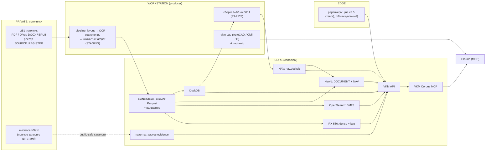
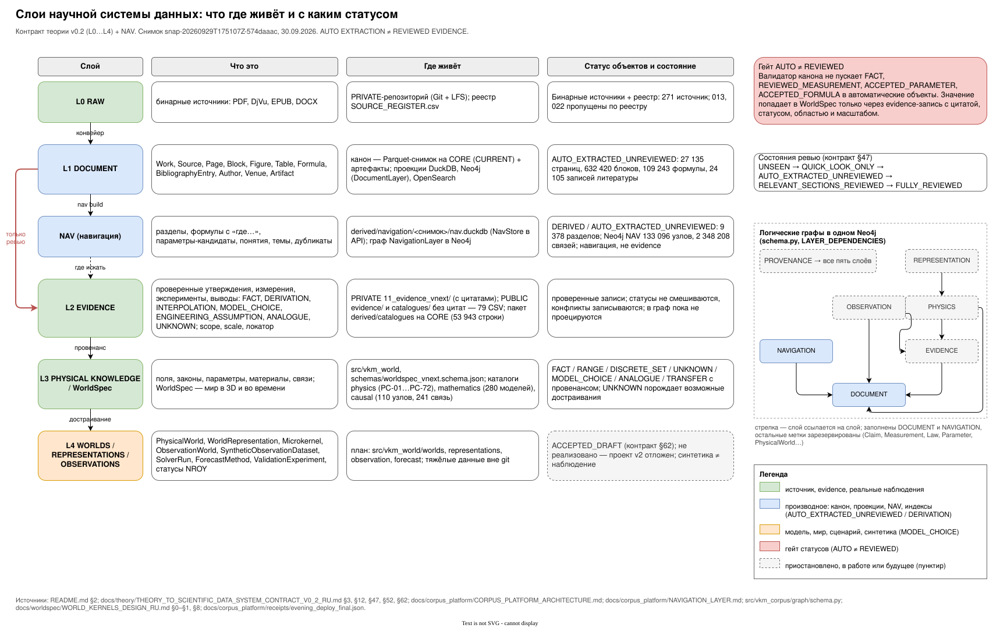
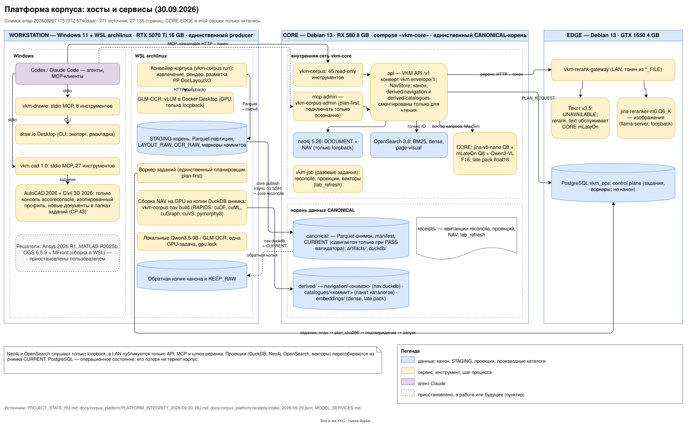
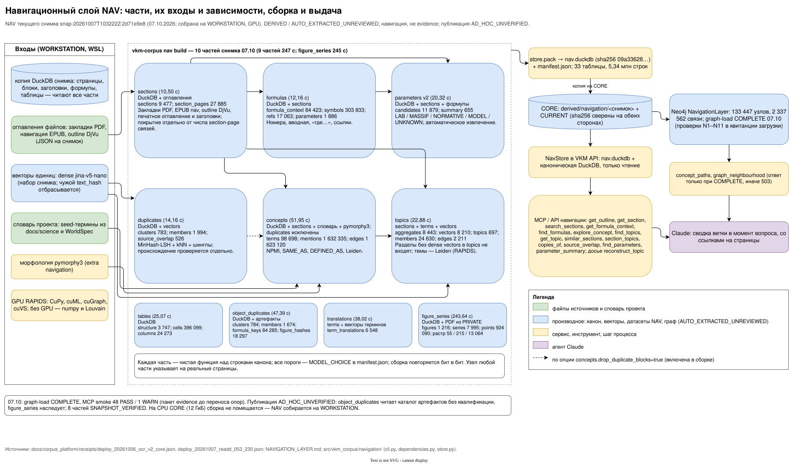

# ВКМ / СКРУ-1: научный корпус, evidence-backed мир и прогноз оседаний

Дипломная работа — «Горные и маркшейдерские работы при разработке Верхнекамского месторождения».
Специальная часть — «Алгоритм прогнозирования оседаний земной поверхности на ВКМ на основе маркшейдерских
измерений». Названия фиксированы.

Репозиторий — **PUBLIC**-часть проекта: код, схемы данных, public-safe каталоги evidence (без дословных цитат),
документы, тесты, бенчмарки и квитанции (receipts). Источники (PDF/DjVu/DOCX), OCR и полные evidence-записи с цитатами
лежат в **PRIVATE**-репозитории `SUKUNA-AI/vkm-subsidence-forecasting_resourses` и сюда не попадают.

> **Состояние на 29.09.2026.**
> - Phase 1 (информация и архитектура) завершена.
> - Платформа корпуса развёрнута. Навигационный слой, граф и досье тем работают через MCP.
> - Phase 2 (октябрь–ноябрь): расчёты и прогноз.
>
> Каноническое состояние — [PROJECT_STATE_RU.md](PROJECT_STATE_RU.md). Итог платформы —
> [V0_FINAL_REPORT.md](docs/corpus_platform/V0_FINAL_REPORT.md). План —
> [PHASE2_PLAN_OCT_NOV_2026_RU.md](docs/planning/PHASE2_PLAN_OCT_NOV_2026_RU.md).

---

## Содержание

1. [Научное направление](#1-научное-направление)
2. [Архитектура верхнего уровня](#2-архитектура-верхнего-уровня)
3. [Инфраструктура](#3-инфраструктура)
4. [Платформа корпуса (слой DOCUMENT)](#4-платформа-корпуса-слой-document)
5. [Поиск](#5-поиск)
6. [Навигационный слой (NAV) и граф](#6-навигационный-слой-nav-и-граф)
7. [Досье темы «от А до Я»](#7-досье-темы-от-а-до-я)
8. [MCP-серверы для Claude](#8-mcp-серверы-для-claude)
9. [Научный слой: WorldSpec, evidence, досье, теория](#9-научный-слой-worldspec-evidence-досье-теория)
10. [Инженерные программы и решатели](#10-инженерные-программы-и-решатели)
11. [Бенчмарки](#11-бенчмарки)
12. [Структура репозитория](#12-структура-репозитория)
13. [Быстрый старт](#13-быстрый-старт)
14. [Научные правила](#14-научные-правила)
15. [Дорожная карта и история](#15-дорожная-карта-и-история)

---

## 1. Научное направление

После научного reset 26.09.2026 исследование строится так:

```
корпус (PRIVATE) → evidence vNext → WorldSpec (3D + время, провенанс, UNKNOWN)
  → мир из evidence без интерполяций → производные представления
  → решатели как адаптеры → операторы наблюдения → предрегистрированный бенчмарк
```

**Решения пользователя** (полные тексты — [PHASE1_DESIGN_DECISIONS_RU.md](docs/governance/PHASE1_DESIGN_DECISIONS_RU.md)):

- **D-18.** Канонический физический слой — evidence-backed WorldSpec в 3D и во времени, независимый от решателя. 2D-сечения —
  только производные представления для проверок.
- **D-19.**
  - Данных предприятия нет, работаем по корпусу и evidence.
  - Ansys (MAPDL / Mechanical) — основной решатель геомеханики; OGS + MFront — проверка на согласованных сценариях.
  - Прогноз оседаний — нейросеть, обученная на ансамбле физических миров.
  - Миры строятся по теории пользователя v0.2 ([docs/theory/](docs/theory/)): WorldSpec → PhysicalWorld →
    представление (Ansys; OGS; World-0 — граф микроядер) → ObservationWorld.
  - До обучения проверяются покрытие ансамбля и NROY по реальным наблюдениям корпуса.
  - Синтетика никогда не называется наблюдением.

Проект миров — [WORLD_KERNELS_DESIGN_RU.md](docs/worldspec/WORLD_KERNELS_DESIGN_RU.md). Его реализация отложена до
отдельного проектирования.

## 2. Архитектура верхнего уровня



Слои научной системы данных (контракт теории v0.2); все схемы проекта — [docs/diagrams/](docs/diagrams/README.md):



| Слой | Что это | Где | Статус объектов |
|---|---|---|---|
| L1 DOCUMENT | страницы, блоки, рисунки, таблицы, формулы, списки литературы | CANONICAL на CORE | `AUTO_EXTRACTED_UNREVIEWED` |
| NAV | разделы, формулы с «где…», параметры-кандидаты, понятия, темы, дубликаты | `derived/navigation/<снимок>` | DERIVED, навигация, не evidence |
| L2 EVIDENCE | записи evidence со статусами FACT … UNKNOWN, scope, scale, локатор | PRIVATE `11_evidence_vnext/` + public-safe каталоги | проверенные записи |
| L3 WorldSpec | мир в 3D и во времени: геология, выработки, закладка, свойства, реология, начальное состояние, неопределённость | `src/vkm_world/`, `schemas/` | с провенансом и UNKNOWN |

Правило, которое держится во всех слоях: **AUTO EXTRACTION ≠ REVIEWED EVIDENCE**. Валидатор не пускает FACT,
REVIEWED_MEASUREMENT, ACCEPTED_PARAMETER или ACCEPTED_FORMULA в автоматические объекты.

## 3. Инфраструктура



| Хост | Роль | Что работает |
|---|---|---|
| **WORKSTATION** (Windows 11 + WSL `archlinux`, RTX 5070 Ti 16 GB, 28 потоков) | единственный producer | конвейер корпуса (STAGING), сборка NAV на GPU (RAPIDS: cuDF, cuML, cuGraph, cuVS), кодирование на GPU для бенчмарков, локальные MCP `vkm-cad` / `vkm-drawio`; AutoCAD 2026 + Civil 3D 2026, Ansys 2026 R1, MATLAB R2025b, OGS 6.5.9 + MFront (сборка из исходников в WSL) |
| **CORE** (Debian 13, RX 580 8 GB) | единственный CANONICAL-корень | compose `vkm-core`: Neo4j 5.26, OpenSearch 3.8, VKM API, VKM Corpus MCP (read, admin), сервис `rx580-retrieval` (llama.cpp / Vulkan: jina-v5-nano + mLateOn резидентно), разовые задания `vkm-job` (reconcile, projections, обновление векторов) |
| **EDGE** (Debian 13, GTX 1650 4 GB) | модели реранка, operational state | шлюз реранка (jina-reranker-v3.5 текст, jina-reranker-m0 визуальный), PostgreSQL `vkm_ops` |

Публикация: producer пишет неизменяемые партиции в STAGING. `vkm-corpus core publish` переносит на CORE только новые
файлы. `vkm-corpus core reconcile` выполняет по порядку:
1. допуск коммитов;
2. снимок и валидатор — `CURRENT` сдвигается только при PASS;
3. DuckDB;
4. Neo4j (DOCUMENT, проверки C1–C16);
5. OpenSearch.

Векторы обновляет `infra/core/lab_refresh.sh --snapshot <ID>`: dense, затем late interaction; счётчики обязаны
сойтись.

Ночные задания ([OPERATIONS.md §8](docs/corpus_platform/OPERATIONS.md)):
- 02:00 CORE — манифест SHA-256 набора копии;
- 02:30 EDGE — копия корня данных снимками с жёсткими ссылками и сверкой SHA-256;
- 04:00 CORE — проверки (валидатор, C1–C16, N1–N7, поиск, MCP, векторы), досье 117 тем, topic_v1; утренняя сводка —
  `receipts/nightly/<дата>/summary.md`.

Секреты — только через `*_FILE`. Машинные пути, адреса и логины в отслеживаемые файлы не пишутся. Подробно:
[DEPLOYMENT.md](docs/corpus_platform/DEPLOYMENT.md), [OPERATIONS.md](docs/corpus_platform/OPERATIONS.md),
[MODEL_SERVICES.md](docs/corpus_platform/MODEL_SERVICES.md).

## 4. Платформа корпуса (слой DOCUMENT)

Код — пакет `src/vkm_corpus/`. Архитектура — [CORPUS_PLATFORM_ARCHITECTURE.md](docs/corpus_platform/CORPUS_PLATFORM_ARCHITECTURE.md).
Конвейер — [PIPELINE.md](docs/corpus_platform/PIPELINE.md). Контракты данных —
[DATA_CONTRACTS.md](docs/corpus_platform/DATA_CONTRACTS.md), JSON Schema — [schemas/corpus/](schemas/corpus/).

**Путь документа:**
1. Реестр и sha256.
2. Определение формата по сигнатуре; перечисление страниц двумя методами.
3. Нативное извлечение в первую очередь: PyMuPDF, DjVuLibre, EPUB XHTML, DOCX XML + рендер LibreOffice. Векторная графика
   PDF сохраняется как `VECTOR_PATHS_JSON` / `VECTOR_SVG`.
4. Разметка страниц PP-DocLayoutV3 (сырые детекции хранятся).
5. OCR только там, где нужно: GLM-OCR через vLLM для сканов, формул и таблиц; сырые ответы хранятся.
6. Нормализация: документные объекты с устойчивыми ID.
7. Коммит источника (Parquet), снимок.

**Снимок `snap-20260928T193550Z-738eebee`:**

| Объекты | Число |
|---|---|
| зарегистрированные источники | 251: обработано 249 (COMPLETE 221, PARTIAL 28), 2 пропущены по реестру |
| страницы | 26 483 |
| блоки | 621 497 |
| рисунки / таблицы / формулы | 17 784 / 3 391 / 108 904 |
| записи списков литературы | 23 682; авторы разобраны у 94,6 % |
| связи «запись → работа корпуса» | 232 принятых (72 по DOI/ISBN, 160 сильных совпадений) + 3 кандидата; 193 ребра CITES |
| поисковые единицы | 205 784 |

Списки литературы разбирает `bib-segmenter` 0.3.0 (правила `bib_rules_v3`):
- зоны строятся по блокам `REFERENCE_LIST` и заголовкам;
- поддерживаются нумерованные и «авторские» списки;
- понимает оформление ГОСТ, «автор–год» и английский стиль с номерами;
- исправляет OCR-омоглифы и разрывы фамилий;
- распознаёт частицы (van der, де, фон);
- различает корпоративных авторов и редакторов.

Подробно — [BIBLIOGRAPHY.md](docs/corpus_platform/BIBLIOGRAPHY.md).

## 5. Поиск

Гибридный поиск (`/v1/search/hybrid`, MCP `search_hybrid`):

```
запрос ─┬─ BM25 (OpenSearch) ─────────────┐
        └─ dense: jina-v5-nano, Q8_0, RX580 ┴─ RRF → top-100 ─ late interaction: mLateOn MaxSim ─ ответ
             (+ маршрут библиографических запросов: скан записей литературы как третья ветка RRF)
             (+ реранкеры EDGE — по запросу: текстовый v3.5, визуальный m0)
```

- **Late interaction** хранит 205 784 единицы: 24,3 млн токенов в пакете float16 через memmap, ≈ 6,2 ГБ, с горячей
  заменой. По умолчанию включён. Задержка на прогретом индексе: гибрид p50 76 мс; с late p50 148 мс.
- **Библиографический маршрут** включается детектором (фамилии с инициалами и годом, «et al.», «и др.», DOI/ISBN,
  «список литературы»): +0,195 nDCG@10 на библиографических запросах, остальные без изменений.
- **Номер рисунка** («рис. 3.1») усиливается только среди кандидатов своей темы. В ответах есть подписи объектов
  (`object_label`).
- **Визуальный маршрут** Qwen3-VL-Embedding-2B (эмбеддинги изображений страниц) в работе. В V2 он дал +0,109 nDCG@10 на
  визуальных запросах.
- **Словарь терминов:** с поздней стадией запрос ищется и на другом языке — ветви RRF для перевода из NAV
  `term_translations` (флаг `translate`). TERM_DICTIONARY_V1: nDCG@10 и R@50 не хуже, у межъязыковых запросов R@50
  +0,09.

## 6. Навигационный слой (NAV) и граф

Дерево и граф корпуса без генерации текста — идея RAPTOR без LLM. Каждый узел указывает на реальные страницы. Сводку
по ветке делает Claude в момент вопроса. Дизайн и поля датасетов — [NAVIGATION_LAYER.md](docs/corpus_platform/NAVIGATION_LAYER.md).



| Часть | Датасеты | Как строится | Снимок 738eebee |
|---|---|---|---|
| разделы | `sections`, `section_pages` | закладки PDF, EPUB nav, outline DjVu, печатное оглавление, нумерация и разметка заголовков | 9 105 разделов, 98,3 % страниц покрыто |
| формулы | `formula_context`, `formula_symbols`, `formula_refs`, `formula_parameters` | номер «(3.2)», раздел, вводная, блок «где …» с определениями символов и единицами, ссылки «по формуле (3.2)» | 108 904 формулы, 338 625 символов, 16 112 ссылок |
| параметры-кандидаты | `parameter_candidates`, `parameter_summary` | значения из таблиц и текста: свойство, материал, масштаб (LAB / MASSIF / NORMATIVE / MODEL), участок, единица как напечатано и в СИ, локатор | 10 538 кандидатов; значение верно в 100 %, единица в 98 %, свойство в 92 % выборки |
| дубликаты | `dup_clusters`, `dup_members`, `source_overlap` | MinHash-LSH + kNN на GPU, проверка пересечения шинглов, первоисточник как подсказка | 697 групп |
| повторы рисунков, таблиц, формул | `object_dup_clusters`, `object_dup_members`, `formula_keys`, `figure_hashes` | pHash/dHash изображений с поворотами и подписи; шинглы ячеек и числа таблиц; канонический LaTeX и форма без имён символов; первоисточник как подсказка; только CPU | 831 группа: рисунки 382, таблицы 105, формулы 344 |
| понятия | `terms`, `term_mentions`, `term_edges` | леммы pymorphy3, C-value / TF-IDF, NPMI по разделам, SAME_AS (аббревиатуры, переводы), DEFINED_AS, сообщества Leiden; копии текста не учитываются | 94 597 терминов, 1,54 млн рёбер |
| темы | `topics`, `topic_members`, `topic_edges`, `section_vectors`, `section_aggregates` | векторы разделов → kNN → Leiden на трёх уровнях (cuGraph), центрирование по языку, метки c-TF-IDF | 720 тем (610 / 91 / 19) |
| словарь терминов | `term_translations` | пары RU ↔ EN (DE), синонимы и аббревиатуры со свидетельствами корпуса: переводы в скобках, ключевые слова и аннотации одной статьи, двуязычные подписи, определения символов, взаимные соседи векторов jina-v5-nano, варианты написания, замены слов, 305 курированных сидов (`REVIEWED_BY_AGENT`) | 6 541 пара (переводов 4 452, синонимов 1 357, аббревиатур 732); точность выборки 459 пар 0,86 / 0,99 (строго / мягко) |

- **Сборка:** `vkm-corpus nav build --part all --vectors <набор векторов>` на WORKSTATION (GPU), около 2 минут.
- **Упаковка и выдача:** `store.pack` → `nav.duckdb`. `NavStore` в API подключает его вместе с канонической DuckDB,
  только на чтение.
- **Граф NAV в Neo4j** ([схема графа](docs/diagrams/graph_schema.svg)) — отдельный слой `NAVIGATION` поверх DOCUMENT:
  111 922 узла, 2,2 млн связей, проверки N1–N7.
  Узлы: разделы, символы формул, параметры, термины, темы. Рёбра: NAV_CHILD_OF, COVERS_PAGE, IN_SECTION, DEFINED_FOR,
  NAV_REFERS_TO, CO_OCCURS, MENTIONED_IN, SYMBOL_OF, IN_TOPIC, RELATED_TOPIC… Инструменты: пути между понятиями и
  окрестность любого узла.

## 7. Досье темы «от А до Я»

`reconstruct_topic` (API `GET/POST /v1/topic`, MCP-инструмент) за один вызов (~3–4 с) возвращает бюджетированную карту
темы с ID и страницами. Состав:

- **Поиск:** до 5 формулировок (запрос, перефразы, запрос на другом языке из словаря терминов, синонимы и соседи
  понятия), слитых через RRF.
- **Разделы в два яруса:** ядро ВКМ (источники каталогов evidence и области ВКМ/СКРУ) отдельно от остального корпуса.
- **Формулы и параметры:** формулы с расшифровками «где…», параметры-кандидаты, подписи рисунков и таблиц рядом с
  найденными страницами.
- **Понятия и темы.**
- **Провенанс источников:** автор, год, тип, область; CITES внутри набора.
- **Каталоги:** процессы PC-xx с уравнениями, требуемыми параметрами, записями evidence (status / scope / scale),
  моделями, конфликтами и причинными связями.
- **Пробелы:** явный список UNKNOWN; значения не подставляются.

Пример использования — досье в [docs/science/topic_dossiers/](docs/science/topic_dossiers/).

## 8. MCP-серверы для Claude

| Сервер | Где | Транспорт | Инструменты |
|---|---|---|---|
| `vkm-corpus` | CORE | streamable HTTP, токен | 39 инструментов чтения (группы ниже; `translate_term` — после развёртывания ветки агента TR) |
| `vkm-corpus-admin` | CORE | HTTP, отдельный токен | переобработка plan-first: `reprocess_source`, `reprocess_page`, `get_job`, `cancel_job` |
| `vkm-cad` 1.0 | WORKSTATION | stdio | 27 инструментов: AutoCAD / Civil 3D (§10) |
| `vkm-drawio` | WORKSTATION | stdio | 8 инструментов: детерминированные схемы draw.io |

Группы инструментов `vkm-corpus`:

- **Поиск:**
  - `search_text`, `search_hybrid`, `search_objects`;
  - `retrieval_trace` (объясняет ранжирование);
  - `rerank_text`, `rerank_visual`.
- **Объекты и провенанс:**
  - `get_source`, `get_work`, `get_page`, `get_page_image`, `get_figure`, `get_table`, `get_formula`, `get_object`;
  - `get_document_neighbors`, `get_citations`, `list_source_pages`, `get_artifact`;
  - `trace_document_provenance`, `get_processing_status`, `get_corpus_status`.
- **Навигация:**
  - `get_outline`, `get_section`, `search_sections`;
  - `get_formula_context`, `find_formulas`, `explore_concept`;
  - `find_topics`, `get_topic`, `similar_sections`, `section_topics`;
  - `copies_of`, `source_overlap`;
  - `find_parameters`, `parameter_summary`;
  - `translate_term` (словарь терминов RU ↔ EN, синонимы, аббревиатуры).
- **Граф:** `concept_paths`, `graph_neighbourhood`.
- **Досье:** `reconstruct_topic`.

**Подключение к Claude Code:** локальный неотслеживаемый `.mcp.json`; шаблон — [MCP_TOOLS.md §6](docs/corpus_platform/MCP_TOOLS.md).
- Адреса и токены передаются только переменными окружения: `VKM_MCP_TOKEN`, `VKM_API_TOKEN_FILE` и т. д.
- `.mcp.json`, `.claude/worktrees/` и `.claude/settings.local.json` перечислены в `.gitignore`.
- Все ответы идут в конверте `vkm.envelope/1`: ID, источник и страница, `review_status`, origin (NATIVE / EMBEDDED_OCR / OCR),
  провенанс.

## 9. Научный слой: WorldSpec, evidence, досье, теория

- **`src/vkm_world/`** — типизированный фундамент WorldSpec (pydantic):
  - провенанс, иерархия;
  - скважины, хронология, горные объекты;
  - материалы, процессы, наблюдения, валидация.

  JSON Schema — [schemas/worldspec_vnext.schema.json](schemas/worldspec_vnext.schema.json). Архитектура —
  [WORLD_SPEC_VNEXT_RU.md](docs/worldspec/WORLD_SPEC_VNEXT_RU.md).
- **`evidence/`** — public-safe каталоги evidence: источники и покрытие, скважины, геология, координаты, горные работы,
  закладка, материалы, гидро/термо, геофизика, мониторинг, жизненный цикл информации. Строятся только скриптами
  `scripts/build_public_catalogues.py` и `scripts/build_evidence_from_legacy.py`: цитаты удаляются, машинные пути
  заменяются логическими именами.
- **`catalogues/`:**
  - физика: 72 процесса PC-xx, 492 ссылки на evidence, конфликты;
  - реестр математических моделей и конфликты формул;
  - причинный граф;
  - дизайн операторов наблюдения.

  На CORE каталоги лежат пакетом `derived/catalogues/<коммит>/` для досье темы.
- **[docs/science/](docs/science/)** — предметные отчёты синтеза. В [topic_dossiers/](docs/science/topic_dossiers/) —
  досье тем, восстановленные по корпусу, формулам и внешней литературе:
  - **Начальное напряжённое состояние массива.** 10 гипотез, 16 формул, 53 параметра, 11 конфликтов; λ для СКРУ-1 —
    UNKNOWN; пять помеченных сценариев IS-SC-A…E.
  - **Механика закладки.** 24 группы формул, 71 параметр, 13 конфликтов; закон уплотнения — UNKNOWN; 19 внешних аналогов
    с условиями переноса.
- **[docs/theory/](docs/theory/)** — теория пользователя v0.2: физические миры, представления, микроядра, контракт
  научной системы данных.

## 10. Инженерные программы и решатели

| Программа | Статус | Что есть |
|---|---|---|
| AutoCAD 2026 + Civil 3D 2026 | **работает** (`vkm-cad` 1.0, решение CP-43: только консоль, скрытый полный экземпляр выключен) | Консольный режим `accoreconsole` с изолированным профилем, всегда новые документы в папках заданий с квитанциями. Универсальный канал `cad_exec`: `.scr`, AutoLISP, C# с полным .NET API AutoCAD / Civil 3D через Roslyn. Операции: точки COGO из таблиц, TIN, горизонтали, мульды (разностные поверхности с объёмами), трассы и профили, листы A4–A0 с упрощённым штампом по ГОСТ 2.104 → PDF, импорт PDF, DXF↔DWG. Запасной путь на Python (scipy). Результаты — производные (TIN — INTERPOLATION), CRS UNKNOWN без явного преобразования. Отчёты о сбоях в Autodesk не отправляются |
| OpenGeoSys 6.5.9 + MFront | приостановлено пользователем | Лестница решателя S1–S6 пройдена на сборке из исходников (эталоны OGS, Гук, столб под гравитацией, λ-состояние, Кирш, ползучесть соли). Игрушечный разрез S7 посчитан. Матрица гипотез — 11 из 76 прогонов. Ветка `claude/agent-ogs-quick-checks-2026-09-28`. Дальше — расчёты на GPU (нужна сборка с PETSc/CUDA) |
| Ansys 2026 R1 (MAPDL, Mechanical, Workbench, optiSLang, Rocky, ROM) | приостановлено | MAPDL: лестница S01–S09 пройдена в пробных прогонах, от упругости до ползучести Нортона с аналитической проверкой. Модули Mechanical / Workbench / optiSLang написаны. План MCP — [ENGINEERING_TOOLS_MCP_PLAN_RU.md](docs/planning/ENGINEERING_TOOLS_MCP_PLAN_RU.md). Ветки `claude/agent-ans*`, `claude/agent-rr*` |
| MATLAB R2025b | приостановлено | Общий слой заданий `vkm_jobs` с квитанциями, лицензионной блокировкой и асинхронными заданиями; официальный MATLAB MCP Server. Ветка `claude/agent-mat-matlab-mcp-2026-09-28` |

Любой решатель запускается по лестнице из [CLAUDE.md](CLAUDE.md):
1. установка;
2. минимальная механика;
3. зоны;
4. гравитация;
5. граничные и начальные условия;
6. шаги по времени;
7. реология;
8. извлечение результатов;
9. интегрированный toy-кейс;
10. адаптер к WorldSpec.

На каждом шаге сохраняются вход, команда, лог, код выхода, проверка и квитанция.

## 11. Бенчмарки

Все бенчмарки предрегистрируются до первого прогона: набор, метрики и правило решения фиксируются с sha256.

| Бенчмарк | Что измеряет | Главный результат |
|---|---|---|
| [retrieval_v0](benchmarks/retrieval_v0/) | выбор моделей на canary | dense: jina-v5-nano ≈ Qwen3-0.6B; late interaction mLateOn даёт главный прирост (CP-39) |
| [retrieval_v1](benchmarks/retrieval_v1/) | поиск на полном корпусе, 186 запросов, пул-метки + ревью пользователя (60 меток, κ взв. 0,91 / 0,95) | развёрнутая схема E: 0,725 nDCG@10 на тексте против 0,551 у BM25; реранкер по запросу; маршрут для библиографических запросов |
| [retrieval_v2](benchmarks/retrieval_v2/) | 10 dense-моделей и эмбеддинги изображений страниц, кодирование на RTX | ни одна модель не обходит nano в схеме E; Qwen3-VL для визуальных запросов: +0,109 nDCG@10 (Holm p = 0,032) |
| [topic_v1](benchmarks/topic_v1/) | досье «от А до Я» против каталогов evidence: 117 тем, 351 запрос, 886 страниц | гибрид R@50 0,303 по всему корпусу и 0,559 в ядре ВКМ; слияние формулировок 0,446; приёмка пока не пройдена, причины разобраны |
| [term_dictionary_v1](benchmarks/term_dictionary_v1/) | словарь терминов в поиске, предрегистрация: формулировка-перевод в досье (117 тем) и ветви перевода в гибриде (144 запроса) | досье: полнота @50 без изменений, MRR@50 +0,016 — включено; гибрид с поздней стадией не хуже, межъязыковые запросы R@50 +0,09 — включено; без неё ветви вредят |

## 12. Структура репозитория

```
src/
  vkm_world/      WorldSpec: типы, провенанс, валидация, страж утечки (governance.leakage)
  vkm_corpus/     платформа корпуса: pipeline, extract (+ bibliography), ocr, layout, parquet (каноника, валидатор),
                  duckdb, graph (DOCUMENT + NAV), search, embeddings, retrieval_service, retrieval_lab,
                  navigation (sections, formulas, parameters, duplicates, concepts, topics, term_dictionary, store),
                  catalogues, api (FastAPI /v1), mcp (read / admin), publish, ops, cli
  vkm_cad/        мост Autodesk: чтение открытых чертежей, scratch DXF, задания в консоли, Civil 3D, плагин VkmCadHost
  vkm_drawio/     схемы draw.io
schemas/          JSON Schema: WorldSpec, контракты корпуса
evidence/         public-safe каталоги evidence
catalogues/       физика (PC-xx), математика, причинность, наблюдения
benchmarks/       retrieval_v0/v1/v2, topic_v1, term_dictionary_v1: наборы, скрипты, результаты
infra/            core (compose, API, RX 580, lab_stage2/3, lab_refresh), edge (реранк), models (пины), workstation
docs/             corpus_platform, science (+ topic_dossiers), worldspec, theory, governance, planning,
                  implementation_work (отчёты агентов, журнал решений), diagrams, reset_2026_09, legacy
tests/            world (фундамент, каталоги, утечка) и corpus (платформа, API, MCP, NAV, CAD, бенчмарки)
scripts/          сборка public-каталогов, проверка репозитория, модели
```

## 13. Быстрый старт

```bash
git clone https://github.com/SUKUNA-AI/vkm-subsidence-forecasting.git && cd vkm-subsidence-forecasting
python -m venv .venv && . .venv/bin/activate            # Python 3.13
pip install -r requirements/worldspec.lock.txt
pip install -e ".[test,corpus,corpus-services,navigation]"   # + desktop для vkm-cad / vkm-drawio на Windows
python -m pytest -q tests/world tests/corpus            # живые тесты сервисов пропускаются без адресов
VKM_RESOURCES_ROOT=<клон PRIVATE> python scripts/verify_canonical_repository.py
```

Частые команды:

```bash
vkm-corpus canon status                                  # состояние корня данных
vkm-corpus nav build --duckdb <снимок.duckdb> --out <каталог> --part all --vectors <векторы>
vkm-corpus catalogues pack --repo . --out <каталог>      # пакет каталогов evidence для досье
vkm-corpus mcp serve --kind read                         # MCP поверх VKM API (на CORE — в compose)
python -m vkm_cad.mcp_server                             # локальный мост AutoCAD / Civil 3D (stdio)
```

Extras в `pyproject.toml`:

| Extra | Для чего |
|---|---|
| `test` | тесты |
| `corpus` | экстракторы конвейера |
| `corpus-services` | API и MCP |
| `corpus-layout` | разметка и OCR |
| `retrieval-lab` | стенд бенчмарков |
| `navigation` | pymorphy3 для понятий |
| `models` | загрузка пинов моделей |
| `desktop` | `mcp`, `ezdxf`, `pywin32`, `scipy` для локальных мостов |

## 14. Научные правила

Кратко; полностью — [SCIENTIFIC_RULES_RU.md](docs/governance/SCIENTIFIC_RULES_RU.md),
[VALIDATION_POLICY_RU.md](docs/governance/VALIDATION_POLICY_RU.md),
[DATA_AND_PATH_POLICY_RU.md](docs/governance/DATA_AND_PATH_POLICY_RU.md).

- **Статусы не смешиваются.** FACT, DERIVATION, INTERPOLATION, MODEL_CHOICE, ENGINEERING_ASSUMPTION, ANALOGUE и UNKNOWN
  держатся раздельно; UNKNOWN остаётся UNKNOWN.
- **Провенанс у каждого числа:** источник с локатором или явный статус допущения, плюс scope и scale.
- **Не путать виды знания:**
  - LAB ≠ MASSIF;
  - аналог ≠ СКРУ-1, перенос только через явный `Transfer`;
  - норматив ≠ измерение;
  - модельный результат ≠ наблюдение;
  - вторичная ссылка ≠ первоисточник.
- **Не усреднять.** Диапазоны и конкурирующие гипотезы не схлопываются в точку; конфликты записываются.
- **Производные объекты — новые записи** со статусом INTERPOLATION/DERIVATION и списком MODEL_CHOICE. К ним относятся
  поверхности, сетки, срезы, результаты решателей, NAV и CAD.
- **Доступность во времени:** для прогноза в момент t0 используются только сведения с `available_from ≤ t0`.
- **Страж утечки:** в PUBLIC не попадают цитаты из PRIVATE (фрагменты ≥ 25 слов), машинные пути, адреса и секреты.
  Проверяют `vkm_world.governance.leakage` и тесты hygiene.

## 15. Дорожная карта и история

**Октябрь–ноябрь 2026** ([PHASE2_PLAN_OCT_NOV_2026_RU.md](docs/planning/PHASE2_PLAN_OCT_NOV_2026_RU.md)):
1. Таблицы параметров и законов из корпуса через досье и NAV.
2. Проект миров и микроядер вместе с пользователем.
3. Конвейер решателя.
4. Ансамбль миров, покрытие и NROY.
5. Нейросеть прогноза.
6. Предрегистрированная оценка: на отложенных мирах и отдельно на реальных наблюдениях корпуса (InSAR, нивелирование).
7. Текст диплома и графическая часть (Civil 3D).

**История:**
- Старая архитектура целиком сохранена в ветке **`legacy`** (`d54025d`): synthetic stress lab v2/v2.1,
  Gate A/B/C (Kalman/IMM), реконструкции, документы Physical World v1.
- Frozen-релизы проверяются из git-объектов без checkout (`scripts/frozen_references.json`).
- Что сохранено и как это воспроизвести — [LEGACY_INDEX_RU.md](docs/legacy/LEGACY_INDEX_RU.md).
- Журнал решений платформы (CP-01…CP-43) — [COORDINATOR_DECISIONS.md](docs/implementation_work/COORDINATOR_DECISIONS.md).
