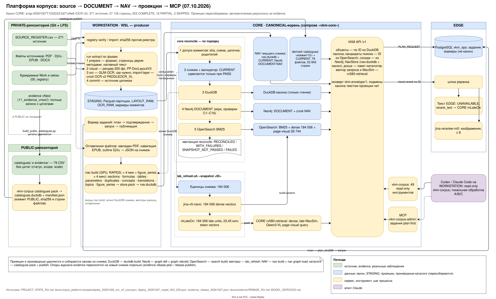

# VKM Corpus Platform v0 — архитектура

Платформа делает 251 зарегистрированный источник (`VKM-SRC-001…251`) воспроизводимым, интерпретируемым и
расширяемым научным корпусом, доступным агентам через API и MCP. Это слой L1 DOCUMENT научной системы данных
(контракт v0.2 §2–§5); доказательства (L2), физическое знание (L3), миры, представления и наблюдения (L4) строятся
позже поверх стабильных ID этого слоя.

Главное правило: **AUTO EXTRACTION ≠ REVIEWED EVIDENCE**. Всё, что создано автоматически, имеет
`review_status = AUTO_EXTRACTED_UNREVIEWED`; валидатор не допускает FACT, REVIEWED_MEASUREMENT, ACCEPTED_PARAMETER,
ACCEPTED_FORMULA в автоматических объектах.

Решения и их основания — [журнал координатора](../implementation_work/COORDINATOR_DECISIONS.md); контракты данных —
[DATA_CONTRACTS.md](DATA_CONTRACTS.md); документный pipeline — [PIPELINE.md](PIPELINE.md); развёртывание —
[DEPLOYMENT.md](DEPLOYMENT.md); эксплуатация — [OPERATIONS.md](OPERATIONS.md); инструменты MCP —
[MCP_TOOLS.md](MCP_TOOLS.md); сервисы моделей — [MODEL_SERVICES.md](MODEL_SERVICES.md).



## 1. Одна технология — одна роль

| Технология | Роль | Источник истины? |
|---|---|---|
| PRIVATE Git + LFS + `SOURCE_REGISTER.csv` | сырые источники, реестр, курируемые таблицы Work | **да — сырьё** |
| Arrow / Parquet в `$VKM_DATA_ROOT/canonical/` (CORE) + content-addressed артефакты | канонический документный слой: Work, Source, Page, Block, Figure, Table, Formula, BibliographyEntry, Author, Venue, Artifact, ProcessingRun | **да — структура** |
| DuckDB (`duckdb/vkm_corpus.duckdb`) | SQL-слой над снимком; все производные правила (CITES, дубли страниц, порядок страниц, citing work, текст для реранка) — только здесь | нет, пересобирается |
| Neo4j Community 5.26 | DOCUMENT graph (label `:DocumentLayer`), только ID, статусы, структура | нет, пересобирается |
| OpenSearch 3.8 | retrieval-индексы (BM25, фильтры, бусты; позже — векторы как проекция derived-артефактов) | нет, пересобирается |
| PostgreSQL (EDGE, БД `vkm_ops`) | операционное состояние: прогоны, задания plan-first, воркеры, heartbeat, ошибки воркеров, задачи ревью, состояние сервисов | нет; потеря не теряет корпус |
| GLM-OCR (`zai-org/GLM-OCR`, vLLM) | распознавание сканов, формул, таблиц | нет; сырые ответы хранятся как артефакты |
| PP-DocLayoutV3 | разметка страниц (регионы рисунков, таблиц, формул) | нет; сырые детекции хранятся как `LAYOUT_RAW` |
| Jina reranker v3.5 / m0 (EDGE) | текстовый и визуальный реранк кандидатов | нет |
| VKM API + VKM Corpus MCP (CORE) | доступ агентов через семантические операции; запись — только постановка заданий | нет |
| Мост Autodesk и MCP draw.io (WORKSTATION) | производные CAD/векторные операции в scratch; схемы | нет; выходы — DERIVED |

## 2. Топология (producer / publisher, CP-15)


| Хост | Роль | Что работает |
|---|---|---|
| WORKSTATION (Windows 11, WSL `archlinux`, RTX 5070 Ti 16 GB) | единственный **producer** | pipeline (`vkm-corpus run …`) в WSL, STAGING-корень; GLM-OCR (Docker Desktop, loopback, без выхода в сеть); layout; мост CAD и MCP draw.io; архив и бэкап |
| CORE (Debian 13, Ryzen 7 5800X, RX 580 8 GB) | единственный **CANONICAL**-корень | `$VKM_DATA_ROOT` = `/srv/vkm/data`; compose `vkm-core`: Neo4j, OpenSearch, VKM API, VKM MCP; разовые задания reconcile; retrieval-ускоритель RX580 (лаборатория) |
| EDGE (Debian 13, GTX 1650 4 GB) | модели реранка, control plane | text-реранкер v3.5 (существующий сервис, не перезапускается), визуальный m0 + gateway; PostgreSQL (`vkm_ops`) |

Поток публикации: producer пишет неизменяемые партиции и артефакты в STAGING → `vkm-corpus core publish` (rsync,
только новые файлы, маркеры коммитов последними) → на CORE `vkm-corpus core reconcile`: допуск коммитов (sha, схема,
цепочка родителей) → снимок + валидатор (`CURRENT` сдвигается только при PASS) → DuckDB → Neo4j (wipe) → OpenSearch.
Проекции строятся только из `CURRENT` CANONICAL-корня; на STAGING эти операции отказываются работать (маркер корня).

## 3. Путь документа

```
реестр + sha256 → контейнер → формат по сигнатуре → перечисление страниц (два метода) → классификация страниц
  → нативное извлечение (PyMuPDF / DjVuLibre / EPUB XHTML / DOCX XML + рендер LibreOffice)
  → рендер там, где нужно → layout (PP-DocLayoutV3, LAYOUT_RAW) → OCR только где нужно (GLM-OCR, OCR_RAW)
  → нормализация → документные объекты → коммит источника (Parquet) → публикация → снимок
```

- **Native first**: текстовый слой PDF и векторная графика извлекаются нативно; растеризация целиком ради OCR не
  делается. Векторы сохраняются как `VECTOR_PATHS_JSON` и `VECTOR_SVG`.
- **Встроенные чужие OCR-слои** (сканы с распознанным кем-то текстом, текстовый слой DjVu) — `origin = EMBEDDED_OCR`,
  не NATIVE (H-02).
- **OCR-бюджет** (CP-22): обязательно — страницы без пригодного текста, регионы формул и таблиц, формулы-картинки EPUB;
  переOCR встроенных слоёв — по выборке и CER, в пределах бюджета; аварийная остановка по аномалиям ответа.
- **Idempotency** (H-05): `stage_signature` решает, пересчитывать ли строки; `call_signature` (модель, ревизия, веса,
  промпт, параметры, пиксельный хеш входа) — вызывать ли модель. Повторный прогон неизменённых страниц не вызывает
  модели. `--force` пересчитывает строки с кешем модели; повторный вызов модели — только `--recall-model` через
  `--plan-only`.
- **Нет тихих потерь**: число страниц документа известно заранее; каждая страница получает строку со статусом
  (`NATIVE_OK, EMBEDDED_TEXT_OK, OCR_OK, OCR_REQUIRED, PARTIAL, UNSUPPORTED, FAILED, NEEDS_REVIEW,
  SKIPPED_BY_REGISTER, NOT_PROCESSED`); 013 и 022 — `SKIPPED_BY_REGISTER` по реестру.

## 4. Интерпретируемость объекта (§50 постановки)

Для любого объекта канона `provenance_trace(object_id)` отвечает: что это; где оригинал (source, sha256, page); кто
создал (extractor/model + ревизии, `processing_run_id`); native / embedded OCR / OCR; auto или reviewed; версия
pipeline; revision модели; можно ли пересобрать (сырые `LAYOUT_RAW`/`OCR_RAW` сохранены, рендеры — по рецепту); можно
ли удалить проекцию (да: DuckDB, Neo4j и OpenSearch строятся из снимка).

## 5. Пересборка (rebuildability)

| Удалено | Как восстановить | Нужна ли GPU |
|---|---|---|
| DuckDB | `vkm-corpus duckdb build` из `CURRENT` | нет |
| Neo4j | `vkm-corpus graph ddl && vkm-corpus graph rebuild --mode wipe` | нет |
| OpenSearch | `vkm-corpus search build` | нет |
| PostgreSQL `vkm_ops` | `vkm-corpus ops init` (история заданий теряется, корпус — нет) | нет |
| канон на CORE | из обратной копии на WORKSTATION или повторной публикацией STAGING | нет |
| канон целиком | pipeline из сырья PRIVATE + сохранённых `LAYOUT_RAW`/`OCR_RAW` (кеш вызовов модели) | нет (при сохранённом сырье моделей) |

## 6. Точки расширения (контракт v0.2 §51–53)

Будущие слои (Claim, Measurement, Experiment, Law, Parameter, PhysicalEntity, PhysicalWorld, WorldRepresentation,
ObservationWorld, SolverRun) добавляются новыми узлами и рёбрами к стабильным document ID (`page_id`, ID объектов,
`work_id`) без перестройки документного слоя; каждый слой пересобирается из своего канона; зависимости слоёв — DAG
(OBSERVATION → {DOCUMENT, EVIDENCE}; REPRESENTATION — только у синтетики через SolverRun). Разделение
PhysicalWorld ≠ WorldRepresentation ≠ ObservationWorld и PhysicalEntity ≠ Microkernel в документном слое не нарушается:
в нём нет ни физических сущностей, ни представлений.

## 7. Что сознательно не входит в v0

Physics graph, World-0 и генерация миров, OGS/MFront/ANSYS, PhysicsNeMo/GNN, алгоритм прогноза, научный evidence
sweep, автоматическое повышение статуса объектов, Kafka/Airflow/Spark/Flink/ClickHouse/Kubernetes/Celery/Redis/Milvus/
Qdrant.
