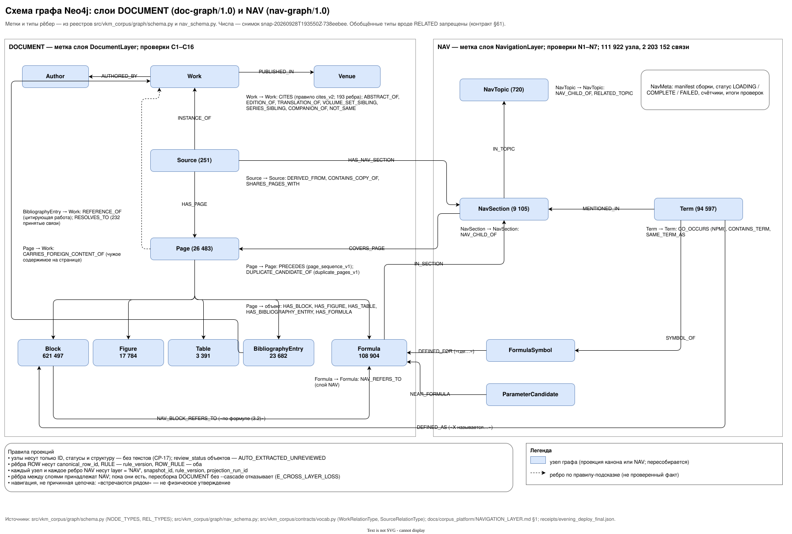
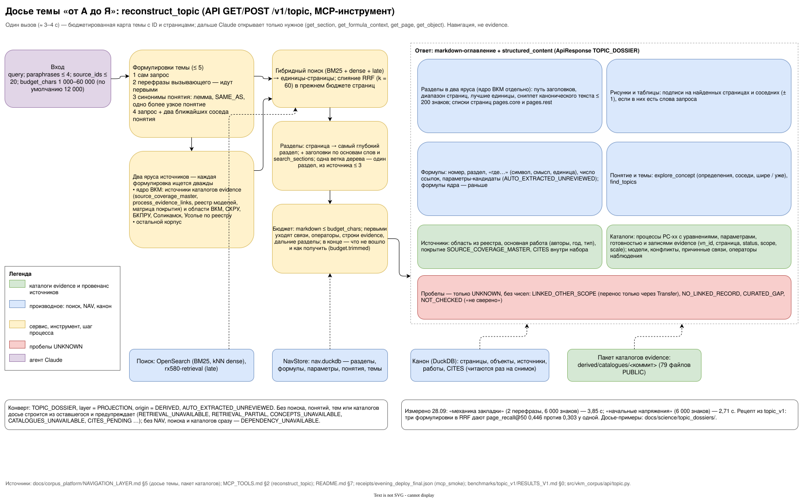

# Навигационный слой корпуса (NAV): разделы, формулы, понятия — без LLM

Задача пользователя (28.09, вечер): древовидная и графовая структура корпуса, по которой поиск и Claude через MCP
быстро находят нужное — «кто откуда и чего». Это идея дерева RAPTOR без генерации текста. Узлы строятся только из
канона: блоков, заголовков, оглавлений, формул и векторов. Любой узел указывает на реальные страницы. Сводку по
веткам делает Claude в момент вопроса, со ссылками на страницы.

Статус слоя: **DERIVED**, `AUTO_EXTRACTED_UNREVIEWED`. Это навигация, а не свидетельства: связь «встречаются рядом»
или «формула ссылается на (3.2)» — не физическое утверждение (правила `SCIENTIFIC_RULES_RU.md`). Утверждения, законы
и параметры — будущий слой L2 (Claim / Law / Parameter) по правилам evidence.

## 1. Где живёт

- Код — пакет `src/vkm_corpus/navigation/`. Каждая часть — чистая функция над строками канона (DuckDB текущего
  снимка), результат — таблицы Arrow.
- Данные — производный каталог `$VKM_DATA_ROOT/derived/navigation/<snapshot_id>/<dataset>.parquet` + `manifest.json`
  (правило, версия, счётчики, sha256). Собирается командой `vkm-corpus nav build --part all` из копии DuckDB снимка,
  без моделей. Сейчас сборка идёт на WORKSTATION: там стоят морфология (extra `navigation`) и GPU для сообществ
  понятий. Затем `store.pack` упаковывает датасеты в `nav.duckdb`, каталог копируется на CORE, и файл `CURRENT`
  указывает снимок.
- Выдача (с 28.09): API монтирует `derived/navigation` только для чтения; `NavStore` подключает `nav.duckdb` и
  каноническую DuckDB. Квитанция — [nav_deploy.json](receipts/nav_deploy.json).
- Оглавления из файлов источников (закладки PDF, навигация EPUB, outline DjVu) снимаются на WORKSTATION (там лежат
  файлы PRIVATE). Результат — один JSON на снимок, публикуется в тот же каталог на CORE.
- Оцифрованные графики (часть `figure_series`, §11) тоже собираются только на WORKSTATION: маршрут A читает векторы и
  текстовый слой исходных PDF. На CORE датасеты не пересобираются, а переносятся байт в байт
  (`python -m vkm_corpus.navigation.figure_series import`).
- Граф — отдельная проекция `NAV` в Neo4j со своими метками и проверками. Слой DOCUMENT она не трогает, а к его
  узлам (`Page`, `Block`, `Formula`, `BibliographyEntry`, `Source`, `Work`) цепляется по стабильным ID.
- Поиск — индекс разделов в OpenSearch (BM25 по пути заголовков, терминам и центральным фразам) и векторы разделов.
- MCP — инструменты чтения слоя (раздел 5).

### Граф NAV в Neo4j (`nav-graph/1.0`)

Код — `vkm_corpus.graph.nav_schema` (реестр), `nav_rows` (строки из Parquet), `nav` (загрузка и проверки),
`nav_query` (пути и окрестности). Слой — `NAVIGATION` с меткой `NavigationLayer` и префиксом DDL `nav_`; зависит только
от DOCUMENT. Каждый узел и каждое ребро несут `layer = 'NAV'`, `snapshot_id`, `rule_version` и `projection_run_id`
(загрузка, которая их записала). Один узел `NavMeta` хранит manifest сборки, статус (`LOADING` / `COMPLETE` /
`FAILED`), счётчики и итоги проверок.

| Узел | ID | Из чего |
|---|---|---|
| `NavSection` | `section_id` | `sections` (+ поля `section_aggregates`, если есть) |
| `FormulaSymbol` | `symbol_id` | строки `formula_symbols` с определением (символ живёт в пространстве источника) |
| `ParameterCandidate` | `parameter_id` | `formula_parameters` |
| `Term` | `term_id` | `terms`; ребра SAME_AS к невошедшему термину — свойство `same_as_refs` |
| `NavTopic` | `topic_id` | `topics` агента T, подпись — первые `label_terms` (часть пропускается, если файлов нет или колонки не опознаны) |

| Ребро | Откуда → куда | Правило |
|---|---|---|
| `NAV_CHILD_OF` | `NavSection` → родитель; `NavTopic` → родитель | деревья |
| `HAS_NAV_SECTION` | `Source` → `NavSection` верхнего уровня | |
| `COVERS_PAGE` | `NavSection` → `Page` | `covers_page_v1`: все страницы диапазона раздела; `deepest` — самый глубокий раздел страницы |
| `IN_SECTION` | `Formula` → `NavSection` | номер формулы, вид, число символов и ссылок — на ребре |
| `DEFINED_FOR` | `FormulaSymbol` → `Formula` | определение и единица из «где …», блок-источник |
| `NAV_REFERS_TO` / `NAV_BLOCK_REFERS_TO` | `Formula` / `Block` → `Formula` | текстовая ссылка «по формуле (3.2)», тип MENTION / SUBSTITUTION / DERIVATION_HINT |
| `NEAR_FORMULA` | `ParameterCandidate` → `Formula` | кандидат значения рядом с формулой |
| `CO_OCCURS` | `Term` — `Term` (одно ребро на пару) | NPMI, `n_units`, `n_sources`, примеры страниц |
| `CONTAINS_TERM`, `SAME_TERM_AS` | `Term` → `Term` | лексическое вложение; перевод или аббревиатура в скобках |
| `DEFINED_AS` | `Term` → `Block` | «X называется …», «под X понимается …» |
| `MENTIONED_IN` | `Term` → `NavSection` | `mentions_top_v1`: окна раздела суммируются; пара остаётся, если раздел в топ-5 термина или термин в топ-20 раздела по tf-idf |
| `SYMBOL_OF` | `Term` → `FormulaSymbol` | `symbol_of_v1`: ключ термина (морфология сборки) — всё определение, его начало или (≥ 2 слов) начинается в первых трёх словах; не больше двух на определение; одно общее слово — только целиком или затравка проекта |
| `IN_TOPIC`, `RELATED_TOPIC` | `NavSection` → `NavTopic`; `NavTopic` — `NavTopic` | близость и косинус агента T |

Рёбра NAV принадлежат NAV при любом направлении: их создаёт и удаляет только загрузчик. Пока они есть, пересборка
DOCUMENT без `--cascade` отказывает (`E_CROSS_LAYER_LOSS`): `graph rebuild --cascade` (или `nav graph-drop --yes`)
сначала удаляет слой NAV; `core reconcile` пересобирает граф с `--cascade`. После сборки NAV нового снимка — снова
`nav graph-load`. Проверки C6/C7 слоя DOCUMENT считают узлы и типы NAV зарегистрированным слоем.

Команды (на CORE — в `vkm-job`):

- `vkm-corpus nav graph-ddl` — ограничения и индексы (`--print` — показать);
- `vkm-corpus nav graph-load --nav-dir $VKM_DATA_ROOT/derived/navigation/<snapshot_id>` — загрузка; `--dry-run` считает
  строки без базы (`--canon-duckdb <файл>` — ещё и сверяет ID DOCUMENT с каноном), `--out` пишет полную квитанцию;
- `vkm-corpus nav graph-verify --nav-dir …` — проверки без записи; `vkm-corpus nav graph-drop --yes` — удалить слой.

Загрузка: сверка manifest (sha256, строки) → preflight P1–P7 → DDL → DOCUMENT должен быть READY и собран из того же
снимка (иначе отказ; `--allow-snapshot-mismatch`) → `NavMeta = LOADING` → пачки UNWIND/MERGE по ID (узлы, затем
рёбра) → удаление узлов и рёбер NAV, которые эта загрузка не записала (другой снимок или прежние правила) → проверки
N1–N7 → `NavMeta = COMPLETE | FAILED` → квитанция `receipts/projections/neo4j-nav/<run>.json`. API и MCP отвечают по
графу NAV только при `COMPLETE`, иначе 503. Сухой прогон по полной сборке снимка `snap-20260928T160616Z-5d669f09`:
112 811 узлов и 2 207 135 рёбер (без тем), все ID DOCUMENT найдены в каноне (`receipts/nav_graph.json`).

## 2. Разделы (дерево документа)

**Датасет `sections`:**

| Поле | Тип | Смысл |
|---|---|---|
| `section_id` | string | `SEC-<16 hex>` от (`source_id`, `method`, `level`, `ordinal`, нормализованного заглавия) |
| `source_id`, `work_id` | string | источник и его произведение |
| `parent_section_id` | string, null | родитель; NULL — верхний уровень |
| `level` | int16 | 1 — часть или глава, 2 — раздел, … |
| `ordinal` | int32 | порядок в источнике (сквозной, в порядке чтения) |
| `numbering` | string, null | «3.2.1», «Глава 3» как напечатано |
| `title` | string | заглавие как напечатано; `title_path` — путь «Глава 3 › 3.2 …» |
| `page_start_id`, `page_end_id` | string | первая и последняя страница (включительно) |
| `method` | string | `PDF_OUTLINE` / `EPUB_NAV` / `DJVU_OUTLINE` / `PRINTED_TOC` / `HEADING_NUMBERING` / `HEADING_LAYOUT` / `WHOLE_SOURCE` (источник без структуры — один раздел) |
| `confidence` | float64 | уверенность метода (согласие источников) |
| `heading_block_id` | string, null | блок заголовка, если найден на странице |
| `rule_version` | string | `sections_v1` |

**Датасет `section_pages`:** `section_id`, `page_id` — какие страницы покрывает раздел нижнего уровня.

**Правила:**
- дети лежат внутри диапазона родителя;
- разделы одного уровня не пересекаются;
- приоритет методов: закладки > печатное оглавление (через печатные номера страниц) > нумерованные заголовки >
  заголовки разметки.

**Агрегаты раздела, без LLM** (датасеты `section_aggregates` и `section_vectors`, §7):
- `key_terms` — топ терминов по TF-IDF относительно корпуса;
- `central_passages` — 3–5 блоков, ближайших к центроиду векторов раздела (ID блоков, не текст);
- счётчики рисунков, таблиц, формул и записей литературы;
- вектор раздела — нормированное среднее векторов его единиц.

## 3. Формулы (контекст, символы, ссылки)

- **`formula_context`**:
  - `formula_id`;
  - номер «(3.2)» — из блока номера `FORMULA_NUMBER` рядом или из LaTeX `\tag`;
  - `section_id`;
  - блок-вводная перед формулой;
  - блок «где …» после неё;
  - `kind` (INLINE/DISPLAY);
  - `latex_len`.
- **`formula_symbols`**:
  - `formula_id`, `symbol` (нормализованный: `\sigma_{1}` → `σ_1`), `role` (`LHS` / `RHS` / `UNKNOWN`);
  - `definition` — из «где σ — напряжение, МПа»: описание и единица, со ссылкой на блок;
  - символы живут в пространстве источника, а не глобально: σ в двух книгах может значить разное.
- **`formula_refs`**:
  - текстовые ссылки на формулы: «по формуле (3.2)», «подставляя (2.1) в (2.4)»;
  - блок-источник → формула с тем же номером в том же источнике (ближайшая по порядку чтения);
  - тип `MENTION` / `SUBSTITUTION` / `DERIVATION_HINT` по глаголу;
  - это текстовая связь, а не проверенный вывод.
- **`formula_parameters`** — кандидаты значений параметров рядом с формулой: `n = 4,5`, `A = 2·10⁻⁵ 1/сут` (символ,
  значение, единица, блок). Это кандидаты уровня L2: только `AUTO_EXTRACTED_UNREVIEWED`.
- **Связь формул между книгами** — только через понятие из определения («скорость ползучести»), никогда по голому
  символу.

## 4. Понятия (граф терминов)

Единица счёта — раздел нижнего уровня из N1 (`section_pages`). Без разделов берутся группы страниц по заголовкам.
Поэтому поля называются `df_units` / `n_units`.

- **`terms`**:
  - `term_id` (`TRM-<hex>` от ключа лемм), `lemma`, `lemma_key`, `surface_forms`, `kind`;
  - `df_units`, `df_sources`, `language`, `cvalue`, `idf`;
  - `community` — сообщество Leiden по графу NPMI (сборка на GPU; на CPU поле пустое);
  - `morphology` — чем лемматизировано (`pymorphy3`, иначе `snowball`/`crude`: другие ID, поэтому в образе API
    стоит extra `navigation`);
  - `seed` — термин из словаря проекта (docs/science, WorldSpec).
- **`term_mentions`** — термин ↔ единица (tf, лучшие блоки).
- **`term_edges`** (`edge_id`, `rule`, `example_block_ids`):
  - `CO_OCCURS` — NPMI ≥ 0,2, ≥ 3 общих единиц, ≥ 2 источников, до 30 лучших соседей на термин, с `n_units`,
    `n_sources`;
  - `CONTAINS` — лексическое вложение («закладка» ⊃ «гидравлическая закладка»); такие пары не попадают в
    `CO_OCCURS`;
  - `SAME_AS` — аббревиатура и перевод в скобках («водозащитная толща (ВЗТ)»);
  - `DEFINED_AS` — из «X называется…», «под X понимается…», с блоком-источником;
  - `SYMBOL_OF` (термин из определения символа формулы) пока не строится: связь формул с понятиями идёт через
    `find_formulas(concept)` по определениям «где…».
- Термины извлекаются без LLM: лемматизация (pymorphy3), статистика словосочетаний (C-value, TF-IDF) и словарь
  проекта как опора. Запрос `explore_concept` лемматизируется так же. Для редкой фразы (меньше 10 единиц) соседи
  берутся от главного термина — это видно в поле `focus`.
- Снимок 28.09: 96 205 терминов, 1,58 млн упоминаний, 1,56 млн рёбер, 26 сообществ. Ручная проверка соседей по
  10 темам — 0,97 осмысленных ([nav_concepts.json](receipts/nav_concepts.json)).

### Словарь терминов (`term_translations`, агент TR)

Решение пользователя 29.09: понятия называются по-разному и на разных языках, искать нужно по всем названиям. Часть
`translations` (правило `term_translations_v1`) собирает пары эквивалентов без LLM: русский ↔ английский и немецкий,
синонимы и аббревиатуры внутри языка. Каждая автоматическая пара несёт свидетельства корпуса: метод, источник,
страницу, ID блоков и оценку. Выдуманных пар нет.

- **Методы:**
  - перевод в скобках («эффект ракурса (англ. foreshortening)»);
  - аббревиатуры SAME_AS N3;
  - списки ключевых слов RU и EN одной статьи и её аннотации;
  - двуязычные подписи рисунков;
  - определения одного символа формулы на двух языках;
  - взаимные ближайшие соседи векторов терминов на разных языках (jina-v5-nano, центрирование по языку, CSLS);
  - варианты написания («inter-chamber pillar» / «interchamber pillar»);
  - шаблоны «X (или Y)»;
  - повторяющиеся замены слова («изучение / исследование») со страховкой от противопоставлений («горизонтальные и
    вертикальные» — не синонимы; «образец» и «массив» не сливаются);
  - общий перевод (два русских термина с одним английским).
- **Сиды:** 305 строк курированного списка ядра проекта (`term_dictionary_seeds.py`) — статус `REVIEWED_BY_AGENT`,
  проверены агентом, не пользователем.
- **Поля:** `pair_id` (`TTR-…`), `relation` (TRANSLATION / SYNONYM / ABBREVIATION), `term_id_a/b` (ID N3 по ключу
  лемм), `lemma_*`, `key_*`, `lang_*`, `in_terms_*`, `methods`, `evidence`, `n_sources`, `cosine`, `score` (ожидаемая
  точность по ручной выборке), `status`.
- **Сборка:**
  1. `vkm-corpus nav term-phrases` — фразы для кодирования;
  2. `nav term-vectors` — векторы (RTX с ограничением памяти или CPU);
  3. `nav build --part translations --inputs <NAV> --option translations.term_vectors=<файл>`.
- **Запросы** (`term_dictionary_query.py`, `store.QUERY_FUNCTIONS`):
  - `translate_term(term)` — эквиваленты, в том числе через синонимы и аббревиатуры; фраза без пары переводится по
    частям;
  - `synonyms(term)`;
  - `translate_query(text)` — запрос на другом языке: пары с оценкой ≥ 0,8, покрыто ≥ половины слов.
- **Выдача:** API `GET /v1/nav/translate`, MCP `translate_term`.
- **Поиск** (значения по умолчанию — по предрегистрированному измерению
  [TERM_DICTIONARY_V1](../../benchmarks/term_dictionary_v1/RESULTS.md)):
  - формулировка `translation` в `reconstruct_topic` — включена (`topic.TRANSLATE_DEFAULT`): полнота страниц @50 без
    изменений, MRR@50 +0,016;
  - флаг `translate` гибридного поиска (ветви RRF для перевода) — включён, когда работает поздняя стадия: nDCG@10 и
    R@50 не хуже, у межъязыковых запросов R@50 +0,09, но R@100 −0,026 (разведочно). Без поздней стадии ветви
    разбавляют запросы на одном языке, там флаг по умолчанию выключен. `VKM_HYBRID_TRANSLATE_DEFAULT=0` выключает
    его без пересборки.
- **Снимок 738eebee:** 6 541 пара ([nav_term_dictionary.json](receipts/nav_term_dictionary.json)):
  - переводов 4 452 (RU–EN 4 285, с DE 167);
  - синонимов 1 357;
  - аббревиатур 732.

  Ручная проверка 459 пар: точность по всем парам 0,86 строго (эквивалент) и 0,99 мягко (с частичными).

## 5. MCP (для Claude) и API

| Инструмент | Что возвращает |
|---|---|
| `get_outline(source_id)` | дерево разделов с диапазонами страниц и методами |
| `get_section(section_id)` | путь, родители и дети, страницы, термины, центральные блоки, формулы и рисунки раздела |
| `search_sections(query)` | разделы, в заглавиях которых (и в `key_terms`, если собраны) есть леммы запроса (морфология графа понятий, pymorphy3); при равном счёте глубокие разделы раньше глав; нет совпадений — пустой список (200) |
| `get_formula_context(formula_id)` | номер, раздел, вводная, «где…» с символами, ссылки на неё и из неё, параметры-кандидаты |
| `find_formulas(concept \| symbol, source?)` | формулы по понятию (через определения) или символу внутри источника |
| `explore_concept(term)` | соседние понятия (со счётчиками и примерами страниц), определения, разделы и формулы |
| `concept_paths(term_a, term_b, max_len, limit, via)` | кратчайшие пути в графе NAV через термины, символы, формулы, разделы и темы; у каждого шага — ID страниц |
| `graph_neighbourhood(node_id, depth, limit)` | соседи любого узла NAV или DOCUMENT по типам рёбер со счётчиками; `depth = 2` — соседи соседей |
| `reconstruct_topic(query, budget_chars?, source_ids?, paraphrases?)` | досье темы «от А до Я» одним вызовом (ниже) |
| `find_topics(terms, limit?, level?)` / `get_topic(topic_id)` | темы §7: поиск по фразам и карточка темы |
| `similar_sections(section_id, k?, other_sources_only?)` / `section_topics(section_id)` | похожие разделы других книг; темы раздела |
| `copies_of(ref)` / `source_overlap(source_id)` | дубликаты и перепечатки §9 |
| `find_parameters(property?, material?, site?, scale?, source_id?)` / `parameter_summary(property, material?)` | параметры-кандидаты §8 |
| `translate_term(term, target?, limit?)` | эквиваленты термина на других языках, синонимы и аббревиатуры словаря §4 с методами, оценкой и страницами-примерами |
| `get_table_structured(table_id)` / `find_tables(property?, material?, source_id?, text?)` | структурированные таблицы §10 (функции `store`; инструменты MCP и API подключаются отдельно) |
| `find_figure_series(text?, unit?, source_id?, time_series?, calibrated_only?, clean_only?, include_raster?)` / `get_figure_series(ref, max_points?)` | оцифрованные ряды графиков §11: поиск по словам подписи, осей и подписей рядов, единице, источнику, рядам во времени, без подозрительной калибровки; точки с погрешностями, калибровка и провенанс ряда или рисунка |

### Досье темы (`reconstruct_topic`, `GET/POST /v1/topic`)

Один вызов — компактная карта того, что корпус и публичные каталоги evidence содержат по теме («гипотезы начальных
напряжений», «механика закладки», «ползучесть каменной соли»). Это навигация: у каждого пункта есть ID и страницы, дальше
Claude открывает только нужное (`get_section`, `get_formula_context`, `get_page`, `get_object`). Код —
`src/vkm_corpus/api/topic.py`.

- **Формулировки.** Поиск идёт по формулировкам темы (не больше пяти):
  - сам запрос;
  - перефразы вызывающего (аргумент `paraphrases`, до четырёх; они идут раньше автоматических);
  - запрос на другом языке из словаря терминов §4 (аргумент `translate`, по умолчанию включено —
    `topic.TRANSLATE_DEFAULT` по измерению TERM_DICTIONARY_V1; что сделано — в `inputs.translation`);
  - синонимы понятия (его лемма, `SAME_AS`, одно более узкое понятие);
  - запрос с двумя ближайшими соседями понятия.

  Ранжированные списки сливаются RRF (k = 60) в прежнем бюджете страниц. Понятие только расширяет запрос и усиливает
  уже найденные разделы, своего списка разделов оно не даёт.
- **Два яруса источников.**
  - Ядро ВКМ — источники, на которые ссылаются каталоги evidence (`source_coverage_master`, `process_evidence_links`,
    реестр моделей, матрица покрытия), и источники с областью ВКМ, СКРУ, БКПРУ, Соликамск, Усолье по реестру.
  - Остальное — другие источники.

  Каждая формулировка ищется дважды: внутри ядра и по всему корпусу. Разделы, источники и список страниц (`pages.core`,
  `pages.rest`) показываются по ярусам раздельно.
- **Разделы.**
  - Гибридный поиск (BM25 + dense + late interaction) даёт единицы-страницы; они группируются по источнику и разделу
    (`section_of_page`). Поиск — внедряемая зависимость (в тестах и пробном прогоне — заглушка).
  - Добавляются разделы по заголовкам (основы слов с чередованиями к/ч/ц и idf; частичное совпадение весит меньше) и
    `search_sections` (леммы).
  - В тексте раздела проверяется, встречаются ли слова запроса на одной странице.
  - Из одной ветки дерева берётся один раздел, из источника — не больше трёх.
  - У раздела: путь заголовков, диапазон страниц, лучшие единицы с формулировками, которые их нашли, сниппет
    канонического текста ≤ 200 знаков (только в ответе).
- **Рисунки и таблицы** — подписи рисунков и заголовки таблиц на найденных страницах и соседних с ними (± 1 страница),
  если в них есть слова запроса. «Где…» формул рядом с найденными страницами попадает в раздел формул.
- **Формулы** — на страницах выбранных разделов, рядом с найденными страницами (слова запроса в «где…») и по смыслу
  символов (`find_formulas(concept=…)`; фраза целиком ценнее разрозненных слов): номер, раздел, «где…» (символ, смысл,
  единица), число ссылок, параметры-кандидаты (`AUTO_EXTRACTED_UNREVIEWED`). Длинный раздел (глава) поднимает только
  формулы рядом со своими найденными страницами; формулы разделов ядра идут раньше формул остального корпуса.
- **Понятие и темы** — `explore_concept` (совпадение, определения, соседи, шире/уже) и `find_topics`, если сборка их
  содержит.
- **Источники** — область из реестра (область источника, объектами унаследована), основная работа (название, авторы, год,
  тип), покрытие по `SOURCE_COVERAGE_MASTER`; CITES внутри набора и чаще всего цитируемые набором работы (CITES
  читается один раз на снимок).
- **Каталоги** (пакет ниже):
  - процессы PC-xx с уравнениями, параметрами, готовностью, пробелами и записями evidence (`vn_id`, источник,
    страница, status, scope, scale, confidence). Процесс выбирается по словам запроса, перефраз и синонимов, по
    найденным источникам и по своим страницам evidence среди найденных страниц;
  - модели реестра формул, конфликты (физика, формулы, механика/реология, горные работы, хронология, мониторинг,
    стратиграфия), причинные связи, операторы наблюдения, строки каталогов evidence.
- **Пробелы** — только UNKNOWN; значения не подставляются, в строках параметров — имя без чисел из ячейки:
  - `LINKED_OTHER_SCOPE` — с процессом связаны лишь записи других участков (перенос только через Transfer);
  - `NO_LINKED_RECORD` — распознанный параметр без связанной записи (с подсказкой, в каком каталоге искать);
  - `CURATED_GAP` — кураторский `data_gaps` процесса, как он записан в каталоге;
  - нераспознанные параметры — одна строка «не сверено» (`NOT_CHECKED`), а не «нет данных».
- **Бюджет** — жёсткий предел `budget_chars` (по умолчанию 12 000) для markdown. Первыми уходят пункты с наименьшим
  приоритетом (связи, операторы, строки evidence, дальние разделы); в конце — что не вошло и как получить. JSON содержит
  только оставшиеся пункты и `budget.trimmed` (ID и способ получить).
- **Конверт** — `TOPIC_DOSSIER`, `layer = PROJECTION`, `origin = DERIVED`, `AUTO_EXTRACTED_UNREVIEWED`; проекция
  `navigation` (без NAV — `opensearch` или `catalogues`). Без поиска, понятий, тем или каталогов досье строится из
  оставшегося и предупреждает (`RETRIEVAL_UNAVAILABLE`, `RETRIEVAL_PARTIAL`, `CONCEPTS_UNAVAILABLE`,
  `CATALOGUES_UNAVAILABLE`, `CITES_PENDING` …); без NAV, поиска и каталогов сразу — `DEPENDENCY_UNAVAILABLE`.

**Пакет каталогов.** `vkm-corpus catalogues pack --repo <PUBLIC> --out <каталог>` собирает все CSV из `catalogues/` и
`evidence/` в один `catalogues.duckdb` (таблица на файл, ячейки как в CSV, без вывода типов) и `manifest.json` (коммит
PUBLIC, sha256 и строки каждого файла). `vkm-corpus catalogues publish --pack <каталог>` кладёт пакет в
`$VKM_DATA_ROOT/derived/catalogues/<коммит12>/` и атомарно переключает `CURRENT`; `catalogues status` показывает
обслуживаемый пакет. Записи каталогов сохраняют свой статус, scope и scale; пакет — производная копия для чтения,
источник истины — файлы репозитория.

## 6. Проверки

- Разделы:
  - вложенность и покрытие страниц;
  - нет пересечений на одном уровне;
  - каждый раздел ≥ 1 страницы;
  - согласие методов (закладки против заголовков) в квитанции.
- Формулы: доля найденных номеров и «где…»; ссылки указывают на существующие формулы своего источника.
- Понятия: пороги NPMI; ручная выборка связей.
- Граф (preflight по Parquet — P1–P7, после загрузки — N1–N7):
  - P1 уникальные ID; P2 родители есть, диапазоны страниц верны; P3 деревья без циклов; P4 у раздела ≥ 1 страницы;
    P5 каждая строка датасета загружена, свёрнута или пропущена по названному правилу; P6 ссылки между датасетами
    (WARN); P7 колонки тем опознаны (WARN);
  - N1 все ребра к узлам DOCUMENT указывают на существующие узлы (строки без конца — FAIL с примерами);
  - N2 слой DOCUMENT не изменён: счётчики меток и типов до и после равны и совпадают со счётчиками его сборки;
  - N3 деревья разделов и тем без циклов, один родитель; N4 у каждого `NavSection` есть `COVERS_PAGE`;
  - N5 число узлов и рёбер в графе равно числу строк по правилам проекции;
  - N6 метки и типы NAV не пересекаются с DOCUMENT (реестр и живой граф);
  - N7 у каждого узла и ребра NAV есть `layer = 'NAV'`, загруженный `snapshot_id`, `rule_version` и
    `projection_run_id` последней загрузки (остатков прежних загрузок нет).
- Темы: каждый раздел с вектором входит ровно в одну тему каждого уровня; члены родителя — объединение детей;
  повторная сборка даёт те же таблицы и ID; ручная проверка тем по выборке и по пяти предметам.

## 7. Темы (дерево RAPTOR без LLM)

Карта корпуса поперёк книг: какие разделы каких источников говорят об одном, даже без общих слов. Узлы — разделы
N1 с векторами их единиц; тема — группа близких разделов; уровни вложены (1 — мелкие темы, 2, 3 — крупные). Текст
не генерируется: вместо сводки RAPTOR — центроид и метки-термины, сводку по теме Claude делает в момент вопроса по
страницам разделов-членов. Часть `topics`, правило `topics_v1`.

**Датасеты:**

| Датасет | Поля |
|---|---|
| `section_aggregates` | `section_id`, `source_id`, `language` (ru / en / und по буквам), `n_pages`, `n_units`, `n_text_units`; `central_unit_ids` с `central_page_ids` и `central_object_ids` (3–5 единиц ближе всего к центроиду, только ID); `key_terms` / `key_term_ids`; `n_formulas`, `n_figures`, `n_tables`, `n_bib_entries` |
| `section_vectors` | `section_id`, `source_id`, `n_units`, `vector` (list<float32>, 768) — нормированное среднее векторов единиц |
| `topics` | `topic_id` (`TOP-<16 hex>` от уровня, отсортированных ID разделов и версии правила), `level`, `parent_topic_id`, `n_children`, `n_sections`, `n_sources`, `source_ids`, `label_terms` / `label_term_ids`, `central_section_ids`, `coherence` (средний попарный косинус в пространстве тем) |
| `topic_members` | `topic_id`, `section_id`, `level`, `source_id`, `similarity` (косинус с центроидом), `rank` |
| `topic_edges` | `topic_id_a`, `topic_id_b`, `level`, `cosine` центроидов, `n_links` (связи kNN между их разделами) |

**Построение:**
- Единицы — правило `vkm-units-v1`, пересчитываются из канона снимка. Вектор берётся, только если его единица есть в
  снимке и хеш текста совпадает; векторы прошлых снимков отсеиваются и считаются в квитанции. `BIB_ENTRY`, текст из
  списков литературы и оглавлений (≥ 50 % символов) и одинокие заголовки таких страниц в векторы не входят.
- Единица → страница → самый глубокий раздел (`section_pages`). Страница нескольких разделов делится по их
  заголовкам: текст — по большинству символов в порядке чтения, формулы, рисунки и таблицы — по блоку над ними.
- Вектор раздела — нормированное среднее векторов его единиц, формулы с весом 0,5 (их 58 %, они повторяют окружающий
  текст). Агрегаты и векторы считаются по собственным страницам раздела; у главы без своих страниц их нет.
- Пространство тем: вектор раздела минус средний вектор его языка (ru / en). Так русские и английские разделы
  одной темы сближаются: связей RU→EN в kNN в 4 раза больше, согласованность терминов внутри тем выше.
- Уровень 1: точный kNN по косинусу (k = 16) → Leiden (разрешение 90) → темы меньше 3 разделов присоединяются к
  самой связанной соседней. Уровни 2 и 3 — то же над центроидами тем уровня ниже (k = 10 / 8, разрешение 20 / 6).
- Метки — c-TF-IDF терминов N3 (`term_mentions`) по разделам темы; термин должен встречаться хотя бы в двух разделах,
  вложенные термины пропускаются. Без N3 — частоты слов и пар слов текста.
- Центральные разделы темы — ближайшие к центроиду, не больше двух от одного источника. Соседи темы — её три
  ближайших центроида и до восьми с косинусом ≥ 0,6.
- GPU (RAPIDS: CuPy, cuGraph Leiden) или CPU (numpy, детерминированный Louvain). Векторы округляются к двоичной
  сетке 2⁻²⁴, веса рёбер к 2⁻²⁰: все суммы точные, сборка повторяется бит в бит. Векторы и агрегаты на GPU и CPU
  совпадают, темы различаются (Leiden и Louvain): бэкенд записан в манифест. Все MODEL_CHOICE с параметрами — в
  `manifest.json` (`parts.topics.stats`).

**Сборка:**
`vkm-corpus nav build --duckdb <канон> --out <каталог> --part topics --vectors <каталог векторов> --inputs <NAV снимка>`.
- `--vectors` — каталог `part-*.parquet` одной конфигурации эмбеддингов (+ `config.json`).
- `--inputs` — готовые датасеты того же снимка (`sections`, `section_pages`, `terms`, `term_mentions`); читаются, не
  копируются.
- Без векторов часть получает статус `SKIPPED_NO_INPUT`.

**Запросы** (`navigation/topics_query.py`, зарегистрированы в `store.QUERY_FUNCTIONS`):
- `get_topic(topic_id)` — путь к корню, дети, разделы-члены (источник, заглавие, страницы; лучшие первыми),
  центральные разделы, источники с заглавиями работ, соседние темы.
- `find_topics(terms, limit=10)` — по леммам N3 и их SAME_AS («ВЗТ» ↔ «водозащитная толща»), по префиксам слов в
  метках и по ключевым терминам разделов-членов; несколько фраз — все должны совпасть.
- `similar_sections(section_id, k=10, other_sources_only=True)` — точный косинус векторов в DuckDB (десятки мс);
  для главы без своих страниц — среднее её подразделов.
- `section_topics(section_id)` — темы раздела на всех уровнях.

**Снимок `snap-20260928T160616Z-5d669f09`** (квитанция `receipts/nav_topics.json`):
- векторы у 7869 из 9105 разделов (86 %);
- тем 610 / 91 / 19, медиана 12 / 73 / 375 разделов;
- 78 % тем уровня 1 собраны из нескольких источников, 27 % смешивают русские и английские разделы;
- сборка около 24 с на GPU (пик около 0,8 ГиБ видеопамяти), около 32 с на CPU.

**Ограничения:**
- Тема — навигация, а не утверждение.
- Метки наследуют ошибки OCR в терминах N3.
- Русская и английская литература о ползучести пока в разных ветках (общий родитель уровня 2 — один).
- Раздела «начальные напряжения» в корпусе нет: тема находится по «природное поле напряжений» и «in situ stress».

## 8. Параметры-кандидаты

Часть `parameters` (правило `parameters_v2`) находит напечатанные в корпусе значения свойств пород, горной геометрии,
оседаний и напряжений. Для каждого значения сохраняется точный локатор. Это навигация «где напечатан модуль
деформации сильвинита», а не свидетельство и не рекомендуемое значение: статус `AUTO_EXTRACTED_UNREVIEWED`. В WorldSpec
значение попадает только через evidence-запись с цитатой, статусом, областью и масштабом.

**Датасет `parameter_candidates`** — одна строка на одно напечатанное значение:

| Поле | Смысл |
|---|---|
| `candidate_id` | `PRM-<16 hex>` от (блок, таблица или формула; локатор; свойство; текст значения) |
| `property_key`, `property_label`, `property_group` | свойство словаря: 59 свойств в 8 группах |
| `symbol` | символ как напечатан («σсж», «Dпр») |
| `material`, `material_raw`, `material_group` | материал словаря (30) и фрагмент-основание; `UNKNOWN`, если не назван или неоднозначен |
| `value_text`, `value_min`, `value_max`, `value_pm`, `qualifier` | число как напечатано; `=`, `range`, `±`, `≤`, `≥`, `<`, `>`, `≈`, `mean`, `min`, `max` |
| `unit_raw`, `unit_canonical`, `unit_si`, `value_si_*` | единица как напечатана и перевод в СИ; пусто при множителе в шапке и при неразобранной составной единице |
| `scale_hint`, `scale_basis`, `scale_cues` | `LAB` / `MASSIF` / `NORMATIVE` / `MODEL` / `UNKNOWN` и основание: слова при значении, шапка таблицы, класс источника |
| `site_hint`, `site_basis` | ВКМ, СКРУ-1/2/3, БКПРУ-1…4, участки; другие месторождения — `ANALOGUE:<имя>`; иначе `UNKNOWN` |
| `method` | `TEXT` / `TABLE` / `NEAR_FORMULA` |
| локатор | `source_id`, `page_id`, `section_id`; `block_id` + `char_start`/`char_end` (и фраза `mention_*`), или `table_id` + `table_row`/`table_col`, или `formula_id`. Текста корпуса в датасете нет |
| `confidence`, `flags` | эвристика 0–1 и причины: `UNIT_FROM_HEADER`, `SYMBOL_DEFINED_IN_SOURCE`, `MATERIAL_AMBIGUOUS`, `SCALE_CONFLICT`, `JOINED_LINES` и др. |

**Датасет `parameter_summary`** — по (свойство, материал, масштаб, единица СИ): число кандидатов, источников и страниц,
min/max напечатанного в СИ, площадки, методы и список источников. Это указатель «где искать». Диапазоны не
усредняются, и из них не выбирается значение.

**Правила:**
- Разбирается только напечатанное: десятичная запятая, диапазоны («от…до», «÷», «~», «to»), «±», степени (в том числе
  потерянные при OCR верхние индексы), перечисления с общей единицей, «соответственно».
- Значение относится к ближайшей фразе свойства того же предложения, если совпадает размерность единицы. Не
  берутся ссылки и номера, годы, относительные изменения («на 20 %»), положения («78 м от кровли»), подписи осей,
  значения чужих символов.
- Таблицы: многострочные шапки, групповые строки и строки-оси; единица из шапки или колонки «Ед. изм.»; статистики
  min/max/среднее. Колонки коэффициента вариации и отклонения пропускаются. Символ шапки читается по словарю или по
  определению в том же источнике («Dпр — предельный модуль деформации»).
- С `parameters_v2` таблица читается по сетке части `tables` (§10), если сетка есть в сборке: по блокам, без строк
  разброса и числа опытов, осей и чужих шапок. Строки текстового слоя внутри области таблицы (`covers_region`)
  пропускаются: раньше из них получались «сплющенные» строки таблицы. Текст внутри ячеек читается правилами текста
  (флаг `CELL_TEXT`). Без сетки таблица читается по ячейкам канона, как в `parameters_v1`.
- Единица сразу после отдельного числа — условие, а не единица колонки («ГПа at 293 K» → ГПа; «при 20 °C» → нет).
  Колонка «Range» / «Диапазон» — колонка значений, а не символ. «м/мин» — не статистика min. «На пределе прочности» —
  не определение прочности.
- Материал берётся из той же фразы, строки или подписи таблицы. Масштаб берётся только из слов при самом значении
  или из шапки его таблицы. Неизвестное остаётся `UNKNOWN`, противоречия отмечаются флагом.
- Аналоги (Старобинское, Германия, WIPP…) помечаются `ANALOGUE:`; СКРУ-1 вместо них не подставляется.

**Запросы** (`parameters_query.py`, зарегистрированы в `store.QUERY_FUNCTIONS`):
- `find_parameters(con, property=None, material=None, site=None, scale=None, source_id=None, limit=50)`;
- `parameter_summary(con, property, material=None)`.

Свойство и материал задаются ключом, названием, символом или синонимом; словоформы приводятся к лемме, как в части
понятий.

**Сборка:** `vkm-corpus nav build --part tables,parameters --inputs <каталог прежней сборки NAV>`. Модели не нужны;
весь канон собирается примерно за минуту (таблицы ~30 с, параметры ~25 с).

**Проверки** (`receipts/nav_parameters.json`, `receipts/nav_tables.json`):
- итоговая выборка из 60 кандидатов `parameters_v1` сверена со страницами. Верно: значение — 60/60, единица — 59/60,
  свойство — 55/60, материал — 10/10 назначенных, масштаб — 10/14 назначенных;
- в `parameters_v2` ушли ровно две ошибки этой выборки (строка таблицы, сплющенная в текст, и строка стандартного
  отклонения); остальные 58 кандидатов не изменились: единица 58/58, свойство 55/58. Из 40 случайных новых кандидатов
  у 40 верны значение и единица, у 39 — свойство;
- полнота по evidence: у 16 из 20 записей каталога и у 324 из 519 записей vNext есть кандидат того же свойства на той
  же странице (в `parameters_v1` — 14 и 309).

## 9. Дубликаты и перепечатки

Один текст встречается в нескольких источниках: две копии одной книги, статья в выпуске журнала и отдельным файлом,
глава монографии в учебнике, автореферат и диссертация, страница-стык двух статей выпуска, шаблон титульного листа.
Часть `duplicates` (правило `duplicates_v1`) находит такие фрагменты и называет раннюю копию. Досье показывает её
первой, остальные помечает как копии («вторичная ссылка ≠ первоисточник»). Статистика может считать фрагмент один раз.

**Датасеты:**

| Датасет | Поля | Смысл |
|---|---|---|
| `dup_clusters` | `cluster_id` (`DCL-<16 hex>` от отсортированных единиц), `kind`, `n_sources`, `n_works`, `source_ids`, `primary_source_id`, `primary_year`, `primary_rule`, `reference_source_id` | группа совпадающих фрагментов |
| `dup_members` | `cluster_id`, `unit_id` (`u1-…`), `source_id`, `page_id`, `block_ids`, `similarity`, `containment`, `cosine`, `is_primary`, `is_reference` | фрагменты — единицы `vkm-units-v1` BLOCK_GROUP (те же ID, что в поиске) |
| `source_overlap` | `source_a`, `source_b`, `n_shared_units`, `n_shared_content`, `share_of_a`, `share_of_b`, `same_work`, `relation` | пары источников с общими фрагментами |

**Как строится (без LLM, все пороги — MODEL_CHOICE в `manifest.json`):**

1. Единицы короче 150 букв и списки литературы пропускаются.
2. Нормализация: регистр, ё→е, только буквы и цифры, латинские и украинские двойники букв → кириллица (OCR путает
   алфавиты). Шинглы по 8 символов, хэш 40 бит.
3. Кандидаты: MinHash-LSH (96 перестановок, полосы по 3) и kNN по плотным векторам единиц (16 соседей, косинус ≥ 0,70).
   Вектор с чужим `text_hash` не используется.
4. Проверка точным подсчётом: доля общих шинглов в меньшей единице ≥ 0,5 и не меньше 100 шинглов.
5. Кластеры — компоненты связности.
6. Вид кластера — первое сработавшее правило:
   - `SAME_WORK_COPY` — все источники — копии одной работы;
   - `BOILERPLATE` — общий текст — шаблон (титул, финансирование, лицензия, «опубликовано N работ», заглушка OCR) в
     ≥ 3 работах или без существенной пары;
   - `REPRINT` — два источника разных работ делят ≥ 3 нешаблонных фрагмента;
   - `SHARED_ABSTRACT` — в общем тексте маркер аннотации;
   - `PARTIAL_OVERLAP` — одиночный общий фрагмент (цитата, повторённый абзац).
7. Первичный источник — работа с самым ранним годом. При равном годе оригинальная работа идёт раньше выпуска,
   сборника, автореферата и презентации. Затем идёт фрагмент ближе к началу своего источника: страница-стык достаётся
   статье, которая на ней начинается. Последний критерий — ID.
   - Нет года хотя бы у одного источника — `UNKNOWN_YEAR`, первичного нет.
   - Для шаблона — `NOT_APPLICABLE`.
   - Копию внутри работы выбирают так: FULL_COPY, затем якорный источник, затем ID.
   - Решившее правило записано в `primary_rule`. «Первичный» — подсказка для порядка копий, а не утверждение об
     авторстве.

**Сборка:** `vkm-corpus nav build --part duplicates --vectors <каталог плотных векторов>`. На GPU работают CuPy, cuVS и
cuGraph, без GPU — numpy. Файлы CPU и GPU совпадают побайтно.

**Запросы (для MCP):**
- `copies_of(unit | page | block)` — кластеры, первичная копия, остальные копии и страницы с общим текстом;
- `source_overlap(source_id)` — источники с общими фрагментами, доли и кто раньше.

**Учёт в понятиях:** опция `--option concepts.drop_duplicate_blocks=true` в одном запуске с `duplicates` убирает блоки
копий (не опорный источник, вхождение ≥ 0,8). По умолчанию выключена.

Снимок 28.09 ([nav_duplicates.json](receipts/nav_duplicates.json)):
- 697 кластеров из 1 718 единиц 134 источников;
- по видам: `REPRINT` 396, `SAME_WORK_COPY` 212, `PARTIAL_OVERLAP` 69, `BOILERPLATE` 14, `SHARED_ABSTRACT` 6;
- ручная проверка 30 случайных кластеров: 30 — настоящие дубликаты, 30 — правдоподобный первичный, 28 — верный вид;
- пары страниц `duplicate_page_candidates` найдены все (27 из 27).

### Рисунки, таблицы и формулы (`object_duplicates`)

Часть `object_duplicates` (правило `object_duplicates_v1`, хэши `vkm-figure-hash-v1`) ищет повторы документных
объектов: один рисунок, таблица или формула в нескольких источниках. Это отдельная часть, а не расширение
`duplicates`: у неё свои входы (изображения из каталога артефактов), свой профиль вычислений (только CPU) и своя версия
правила, а `duplicates_v1` не меняется. Общий текст из `duplicates` (`source_overlap`, `dup_members`) служит ей
контекстом.

**Датасеты:**

| Датасет | Поля | Смысл |
|---|---|---|
| `object_dup_clusters` | `cluster_id` (`OCL-<16 hex>` от типа и отсортированных объектов), `object_type`, `kind`, `match_basis`, `n_sources`, `n_works`, `primary_object_id`, `primary_year`, `primary_rule`, `reference_object_id` | группа повторов одного объекта |
| `object_dup_members` | `object_id`, `match`, `similarity`, `image_distance`, `dhash_distance`, `transform`, `caption_similarity`, `cell_containment`, `number_containment`, `equation_number`, `context`, `is_primary` | объекты группы и доказательство против опорного объекта |
| `formula_keys` | `formula_id`, `latex_key`, `shape_key`, `trivial`, `trivial_reason`, `distinctive` | канонический вид каждой формулы; по нему ищет `shared_formulas` |
| `figure_hashes` | `object_id`, `artifact_id`, `status`, `phash`, `phash_trim`, `dhash_trim`, `low_information` | хэши изображений рисунков; кэш для следующей сборки |

**Как строится (без LLM и обученных моделей, пороги — MODEL_CHOICE в `manifest.json`):**

1. **Рисунки.** Изображение — вырез рисунка со страницы (`FIGURE_CROP`), иначе встроенное изображение. Хэши: pHash
   (DCT 8×8 миниатюры 32×32) всего выреза, pHash и dHash содержательной рамки в 8 поворотах и отражениях. Поля,
   масштаб и поворот на 90° хэш не меняют. Кандидаты — точный перебор всех пар по расстоянию Хэмминга. Пропорции рамок
   пары должны совпадать. Пара принимается по ярусам:
   - `IMAGE` — расстояние ≤ 4 и согласный dHash;
   - `IMAGE_CAPTION` — ≤ 8 и похожая подпись или тот же номер;
   - `CAPTION_IMAGE` — ≤ 12 и почти равная подпись;
   - `CAPTION` — почти равная подпись при разных изображениях. Нужен контекст (тот же номер в двух копиях одной работы
     или страница рядом с общим текстом `duplicates`), и изображения должны оставаться похожими (≤ 24).

   Пустые изображения и значки меньше 150 px берутся только при полном совпадении.
2. **Таблицы.** Текст ячеек по строкам нормализуется как в `duplicates`, из чисел убираются разделители.
   - `CELLS` — общие шинглы по 8 символов: вхождение ≥ 0,5 для всей таблицы и для строк под шапкой, числа совпадают.
   - `NUMBERS` — те же окна из трёх информативных чисел в порядке чтения (переведённая или переписанная таблица).
3. **Формулы.** LaTeX читается парсером части формул и приводится к каноническому виду `latex_key`: греческие варианты
   унифицированы; шрифты, пробелы, `\left`/`\right` и знаки умножения убраны; десятичная запятая заменена точкой.
   `shape_key` переименовывает идентификаторы по порядку (`v1, v2 …`). Тривиальные формулы не группируются: без знака
   отношения, меньше двух идентификаторов или шести токенов, обозначения вроде «i = 1, 2, …, n». Связи:
   - `LATEX` — равный `latex_key`;
   - `LATEX_RENAMED` — равный `shape_key` у выразительных формул (≥ 12 токенов, ≥ 3 идентификаторов, есть дробь,
     степень, корень или функция). Не применяется к общим структурам (многочлен, сумма слагаемых) и при противоречащих
     расшифровках «где …»;
   - `LATEX_NEAR` — варианты OCR с тем же номером на страницах с общим текстом.
4. **Группы.** Для рисунка или таблицы в каждом другом источнике берётся лучший партнёр, и только взаимно: панель «а»
   не станет парой панели «б». Группа — компонента связности.

**Вид** — первое сработавшее правило:
- `SAME_WORK_COPY` — все источники — копии одной работы;
- `BOILERPLATE` — шаблон: логотипы, значки лицензий, орнаменты без подписи; таблица из одной шапки в ≥ 3 работах;
- `REDRAWN` — разные работы связаны только подписью: рисунок перерисован;
- `REPRINT` — все работы в одной публикационной группе: общий перепечатанный текст (`source_overlap`), автореферат или
  связь каталога;
- иначе объект повторно использован в независимых работах: `REUSED_FIGURE`, `REUSED_TABLE`, `SHARED_FORMULA` («где
  ещё используется та же формула»).

**Первичный** выбирается по правилам `duplicates`, решившее правило записано в `primary_rule`. Это подсказка для
порядка копий, а не утверждение об авторстве. Группа формул показывает, где встречается та же запись, а не
проверенный закон.

**Сборка:** `vkm-corpus nav build --part object_duplicates --inputs <каталог сборки NAV снимка> --artifacts <каталог
артефактов>`. Нужен только CPU. Весь канон собирается за 45 с, из них 19 с уходит на хэши изображений (16 процессов).
С хэшами прежней сборки из `--inputs` сборка занимает около 24 с. Без каталога артефактов рисунки получают статус
`NO_ARTIFACT_ROOT`, таблицы и формулы строятся.

**Запросы** (`object_duplicates_query.py`, зарегистрированы в `store.QUERY_FUNCTIONS`):
- `copies_of_object(con, object_id, limit=50)` — группы рисунка, таблицы или формулы: первичная копия, остальные копии
  с доказательством;
- `shared_formulas(con, ref, renamed=True, limit=50)` — по ID формулы или LaTeX: где та же формула записана точно и в
  другой нотации, по работам от ранней к поздней.

Снимок 738eebee ([nav_object_duplicates.json](receipts/nav_object_duplicates.json)):
- 831 группа, 1 795 объектов;
- рисунки — 382 группы: `SAME_WORK_COPY` 166, `REPRINT` 149, `REUSED_FIGURE` 46, `REDRAWN` 19, `BOILERPLATE` 2;
- таблицы — 105: `REPRINT` 62, `SAME_WORK_COPY` 29, `REUSED_TABLE` 14;
- формулы — 344: `SHARED_FORMULA` 162, `REPRINT` 106, `SAME_WORK_COPY` 76;
- ручная проверка 30 случайных групп каждого вида (или всех, если их меньше): без ошибок 8 видов из 11; ошибки —
  `REUSED_FIGURE` 29/30, таблицы `REPRINT` 29/30, `REDRAWN` 17/19 (порог подобран на этих же группах);
- прокси полноты:
  - рисунки с тем же номером и подписью в двух копиях работы — 14/14;
  - формулы с тем же номером в копиях одной работы — 58/59;
  - рисунки с почти равной подписью в перепечатках — 32/43. Из 11 пропусков 6 — разные рисунки с общей подписью,
    5 — перерисованные рисунки и искажённые сканы.

## 10. Таблицы

Часть `tables` (правило `tables_v1`) превращает таблицы канона (`canonical.tables`) в сетки с ролями строк, путями
шапок и единицами. По ним читают таблицы параметры (§8), досье и запросы. Статус — `AUTO_EXTRACTED_UNREVIEWED`, это
навигация, а не свидетельство. Числа остаются как напечатаны, ничего не исправляется: сомнительное помечается флагом,
неразобранное остаётся текстом.

**Датасеты.** ID таблицы — `TBL-<16 hex>` от ID таблицы канона; ячейка — `TBL-…:r<строка>c<колонка>` (левый верхний
угол ячейки в сетке канона).

| Датасет | Строка | Главное |
|---|---|---|
| `table_structure` | таблица | номер («3.2») и подпись, раздел, размер, строки шапки и способ их поиска, полосы OCR и блоки, объединённые ячейки, ориентация (`NORMAL`, `TRANSPOSED`, `KEY_VALUE`, `MATRIX`, `TEXT_ONLY`), уверенность, флаги, свойства и материалы; `structure_ok` (сетку можно читать) и `covers_region` (сетка заменяет текстовый слой своей области) |
| `table_cells` | ячейка | текст как напечатан и очищенный, объединения, роль строки, путь шапки колонки (уровни сверху вниз), метка строки, тип и разбор значения (десятичная запятая, диапазон, «±», границы, степени), единица и её источник, флаги |
| `table_columns` | колонка блока | путь шапки, символ, единица, множитель, статистика, роль (значение, метка, индекс, единицы, символ, разброс, число опытов, текст), свойство словаря параметров |

**Правила:**
- GLM-OCR распознаёт таблицу горизонтальными полосами. Полосы перечитываются из `raw_output` и должны совпасть с
  ячейками канона.
  - Полоса со своей шапкой начинает новый блок; повтор шапки продолжает блок (строки помечены).
  - Полоса другой ширины, чьи колонки не похожи на колонки блока, — блок без шапки (`BAND_COLUMNS_MISMATCH`): чужую
    шапку её значения не получают.
- Шапка — строки выше первой строки с числами (правило части параметров) или `<th>` таблиц EPUB и DOCX. Склеенные слова
  шапки («Глубинаотработки») разделяются по словарю pymorphy3 (флаг `HEADER_RESPACED`), латинские двойники букв OCR
  («Пределdlительной») сводятся к кириллице.
- Роли строк: шапка, строка единиц, нумерация колонок, ось (верхняя ось условий, `MATRIX`), данные, статистики
  (среднее, min, max, медиана; разброс — «Стандарт», «СКО», σ или S рядом со средним, коэффициент вариации; число
  опытов), группа, повтор шапки, примечание.
- Единица ячейки берётся по порядку: сама ячейка, строка единиц, шапка колонки (снизу вверх), колонка «Ед. изм.», метка
  строки, строка-группа («Основные размеры, мм:» над «длина», «ширина»), подпись таблицы.
  - Колонка и строка называют разные единицы — единицы нет (`UNIT_CONFLICT`).
  - Условия («при 20 °C», «at 293 K») — не единица колонки.
  - Подпись даёт единицу только колонкам значений без своей единицы: по колонке из списка «[величина, символ, единица;
    …]» или одну единицу в конце подписи. Время и год, единицы легенды, колонки-аргументы («t», «№», «Год») и колонки
    другого свойства единицу подписи не получают.
- Ничего не исправляется: потерянная запятая («218» среди «2,18») — `DECIMAL_POINT_SUSPECT`; несколько чисел в ячейке
  — `MULTI_VALUE`; потерянный верхний индекс степени — `POWER_SUPERSCRIPT_LOST`.

**Запросы** (`tables_query.py`, зарегистрированы в `store.QUERY_FUNCTIONS`; инструменты MCP и API подключаются
отдельно):
- `get_table_structured(con, table_id, *, max_rows=200, max_chars=8000)` — таблица по ID канона или `TBL-…`: паспорт,
  колонки, строки с ролями и ячейками, markdown;
- `find_tables(con, property=None, material=None, source_id=None, text=None, limit=20)` — таблицы, где колонка или
  строка называет свойство (ключ, название или символ), материал или слова запроса.

**Сборка:** `vkm-corpus nav build --part tables,parameters --inputs <каталог прежней сборки NAV>`. Только CPU: таблицы
~30 с, параметры ~25 с. Для склеенных слов нужен extra `navigation` (pymorphy3). Две сборки дают побайтно одинаковые
датасеты.

Снимок 28.09 ([nav_tables.json](receipts/nav_tables.json)):
- 3 391 таблица, 389 527 ячеек, 24 523 колонки; 3 360 сеток годны для чтения, 2 799 заменяют текстовый слой своей
  области;
- 62 622 строки: данные — 50 021, шапка — 3 740, группы — 2 418, статистики — 766 (из них разброс — 268), оси — 297;
- 1 475 таблиц собраны из 2–5 полос, у 281 есть полоса без общей шапки, 375 разбиты на 2–4 блока;
- ручная проверка 40 случайных таблиц итоговой сборки: верно 18, с мелкими недочётами 15 (пропущенная единица, неверная
  роль строки без сдвига значений), неверно 7 (значения под чужой шапкой, потерянная или лишняя строка шапки, неверная
  единица, склеенные OCR числа); 4 из 7 начинаются с ошибок OCR (сетка или текст ячейки);
- параметры: кандидатов 10 538 → 10 792 (из таблиц 5 305 → 5 813, из текста 5 231 → 4 977); полнота по evidence §8.

**Известные пределы:**
- Сдвиг колонок внутри полосы из-за объединённых ячеек OCR (значения под соседней шапкой) не распознаётся.
- Строка номеров колонок с подписью («i/j | 0 | 1 | 2 …») читается как данные, а не как шапка.
- Единица оси («p, МПа | 10 | 4 | 2») переходит на значения под осью; при другой единице строки остаётся конфликт.
- Слитые OCR числа («79651600186012») читаются одним числом; «Минимум» и «Максимум» полным словом не распознаются как
  статистики (2 строки на снимке).

## 11. Оцифрованные графики (`figure_series`)

Часть `figure_series` (правило `figure_series_v1`, агент FD2) — числовые ряды графиков корпуса, снятые маршрутом A
прототипа FD: нативные векторы PDF и текстовый слой; помощник OCR — только для подписей делений, нарисованных
контурами глифов. Статус каждого значения — `DERIVATION` из публикации, `AUTO_EXTRACTED_UNREVIEWED`, с полушириной
погрешности; это не наблюдения и не evidence. Полное описание — [FIGURE_SERIES.md](FIGURE_SERIES.md).

- **Кандидаты** — все графикоподобные векторные рисунки (правило `chartlike_v1`, 1 230 на снимке 738eebee). Каждый —
  строка `figure_series_figures` со статусом (`DIGITIZED`, `X_UNCALIBRATED`, `NO_AXES`, …) и флагами качества.
- **Датасеты:** `figure_series_figures`, `figure_series` (ряды), `figure_series_points` (точки с единицами,
  погрешностями, калибровкой и `in_plot_area`). Необязательный второй набор `figure_series_raster_*` — растровый
  маршрут R на страницах каталога мониторинга, флаг `RASTER`.
- **Сборка** — только на WORKSTATION: маршруту A нужны исходные PDF клона PRIVATE. На CORE датасеты переносятся байт в
  байт: `python -m vkm_corpus.navigation.figure_series import --bundle <сборка> --nav-dir <каталог NAV> --canon-duckdb
  <канон> --pack`.
- **Подозрительная калибровка** (`SUSPECT_FLAGS`: две оси, ось другой панели, подписи кривых вместо оси, степени
  десяти и разряды, прочитанные как числа) — флаги на рисунке и всех его рядах; значения не исправляются, поиск с
  `clean_only` такие ряды убирает. На снимке 738eebee: 607 оцифрованных рисунков, из них 84 с таким флагом.
- **Запросы** (`figure_series_query.py`, в `store.QUERY_FUNCTIONS`): `find_figure_series` и `figure_series`; API
  `GET /v1/nav/figure_series`, `GET /v1/nav/figure_series/{ref}`; MCP `find_figure_series`, `get_figure_series`.
- **Галерея** для просмотра — `python -m vkm_corpus.figures.gallery` → git-игнорируемый `work/figure_gallery/`.
