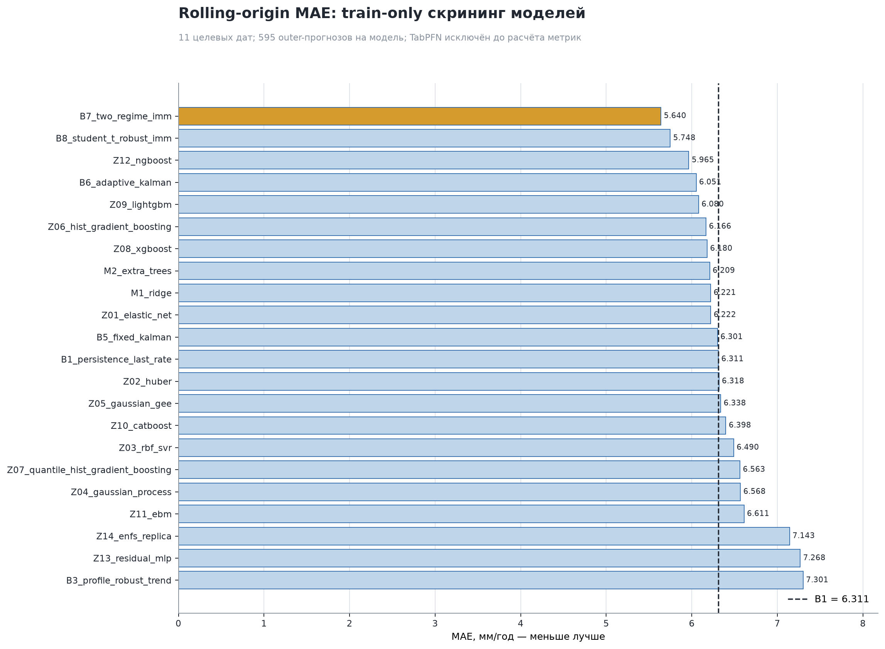
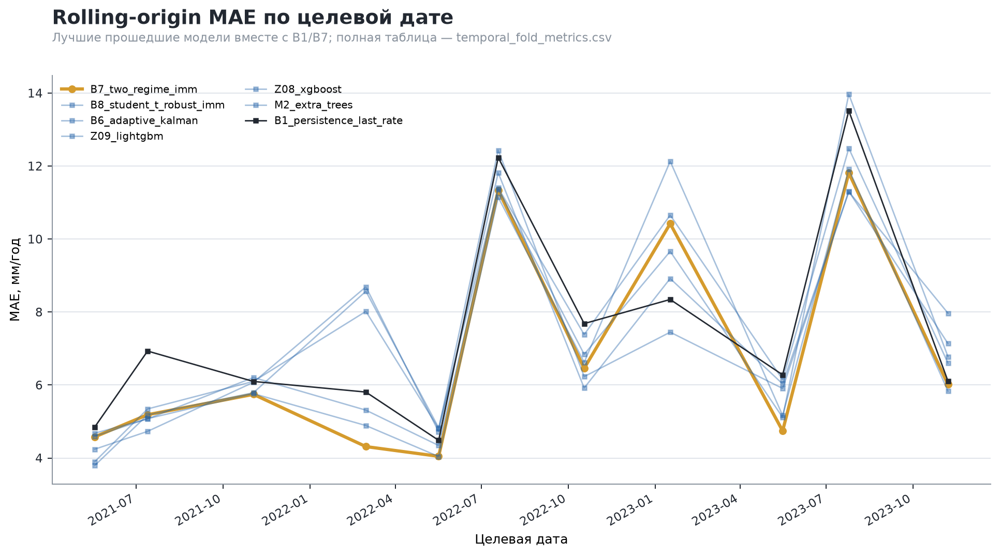
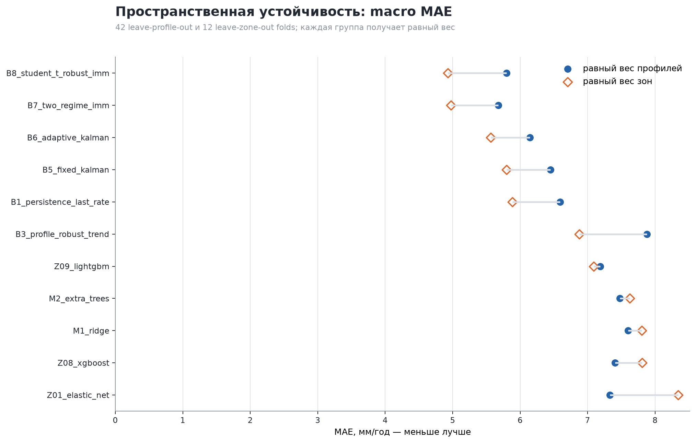
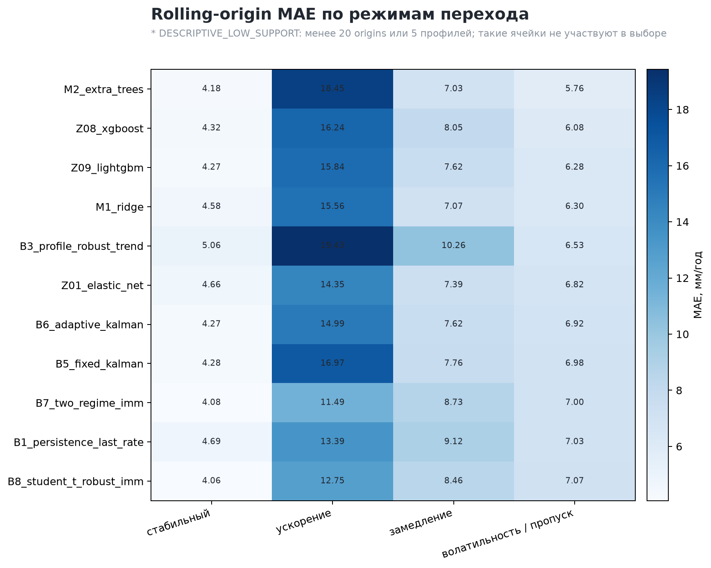
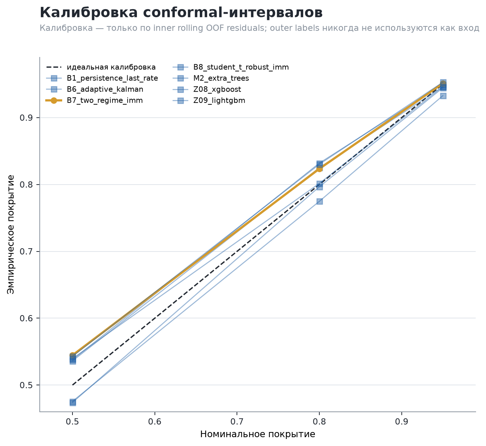
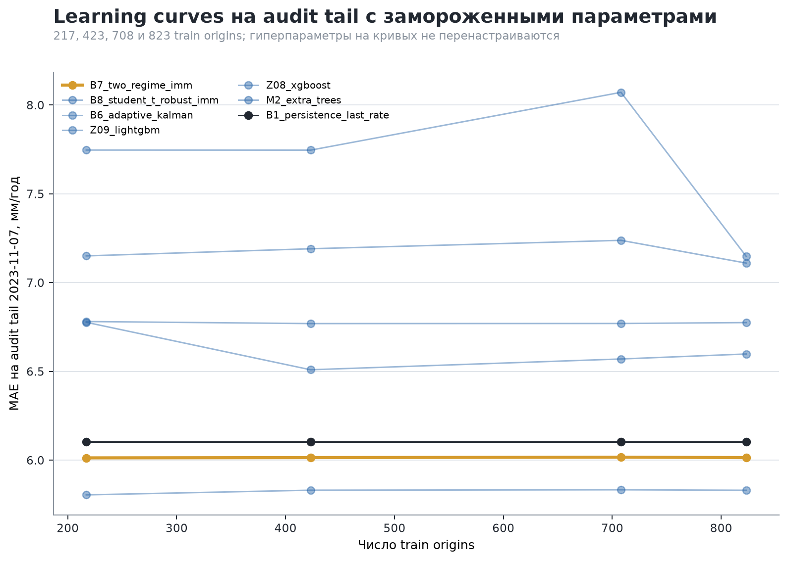
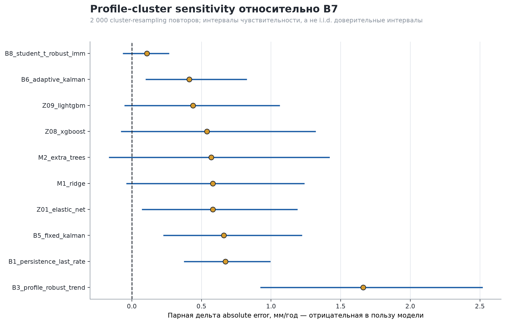

# Gate B6: расширенный train-only benchmark T1

## Техническое резюме

Gate B6 завершён со статусом **`PASS_NO_NEW_PRIMARY`**. Ни одна новая модель не
прошла все заранее замороженные eligibility gates, поэтому
`B7_two_regime_imm` остаётся единственным primary в suite v4. Это корректный
научный результат, а не software failure.

На 11 forward-only rolling-origin folds B7 получил pooled MAE **5,640
мм/год** против **6,311 мм/год** у `B1_persistence_last_rate`, то есть skill
относительно B1 составил **10,64%**. B7 лучше B1 на 10 из 11 target dates,
имеет более низкие equal-profile и equal-zone macro MAE и проходит общий
conformal coverage gate: 95%-покрытие равно **0,951**.

Все результаты имеют границу `train_only_internal_research`. Использованы
только 911 строк `t1_v1/train`; исторический validation, ранее раскрытый T1
test и отсутствующий future/external holdout не загружались. Поэтому Gate B6
не разрешает утверждение о финальном или внешнем качестве модели.

Исторический каталог содержит 23 preregistered/frozen model records. Реально
исполнены 22 модели. `Z15_tabpfn_v2_6` исключён поправкой `B6-GOV-001` по
прямому решению владельца проекта **до** принятия лицензии, загрузки весов,
создания predictions и scoring. Его научный статус — `NOT_EVALUATED`.

## 1. Главный результат broad temporal screen

Каждая исполненная модель завершила все 11 rolling folds и вернула exact
expected sample IDs. На один канонический model output приходится 595
outer-прогнозов.

| Модель | Pooled MAE, мм/год | Median fold MAE | B1 skill | Решение temporal screen |
|---|---:|---:|---:|---|
| B7 two-regime IMM | **5,640** | 5,744 | **+10,64%** | frozen comparator, advanced |
| B8 Student-t robust IMM | 5,748 | 5,764 | +8,92% | frozen comparator, advanced |
| Z12 NGBoost | 5,965 | 5,968 | +5,48% | rejected: 3 inner guardrail failures |
| B6 adaptive Kalman | 6,051 | 6,206 | +4,12% | frozen comparator, advanced |
| Z09 LightGBM | 6,080 | 6,074 | +3,67% | advanced |
| Z08 XGBoost | 6,180 | 6,230 | +2,08% | advanced |
| Z01 ElasticNet | 6,222 | 6,719 | +1,41% | advanced |
| B1 persistence | 6,311 | 6,278 | 0,00% | frozen comparator, advanced |

Низкий pooled MAE сам по себе не даёт прохода. NGBoost — показательный случай:
его итоговый MAE выглядит конкурентоспособно, но три outer folds не получили
допустимого inner-кандидата по заранее заданному probabilistic/point
guardrail. Модель поэтому остаётся в отчёте как
`REJECTED_TEMPORAL_SCREEN`, а её удачная агрегированная цифра не используется
для spatial audit или выбора primary.

Small neural и neuro-fuzzy controls не подтвердили преимущество на этих
данных: MAE residual MLP равно 7,268, ENFS replica — 7,143 мм/год. Реплика
ENFS проверяет пригодность архитектурной идеи, но не заявляется как
воспроизведение численных результатов предшествующей ВКР.

## 2. Устойчивость между target dates

Ошибка существенно меняется от кампании к кампании. B7 лучше B1 на 10 из 11
target dates; исключение — focused campaign 2023-01-17, где MAE B7 равно
10,422 против 8,344 у B1. На трудных датах 2022-07-19 и 2023-07-25 ошибка
остаётся высокой у всех моделей. Поэтому pooled ranking обязательно читается
вместе с fold range, sign consistency и пространственными проверками.

B7 также не устраняет тяжёлый хвост ошибок: P95 absolute error равен 17,538,
максимальная absolute error — 105,300 мм/год. R² остаётся только descriptive
statistic и не заменяет MAE, tail metrics и group stability.

## 3. Пространственная устойчивость

Полный robustness audit содержит 42 leave-profile-out и 12 leave-zone-out
folds для каждой из 11 advanced/frozen моделей — всего 594 folds и 5 852
prediction rows.

| Модель | Equal-profile macro MAE | Worst profile | Equal-zone macro MAE | Worst zone |
|---|---:|---:|---:|---:|
| B7 two-regime IMM | **5,676** | **17,809** | 4,975 | **8,478** |
| B8 Student-t robust IMM | 5,798 | 19,102 | **4,928** | 8,920 |
| B1 persistence | 6,592 | 22,238 | 5,883 | 9,563 |
| Z09 LightGBM | 7,187 | 18,728 | 7,093 | 14,110 |
| Z08 XGBoost | 7,407 | 21,296 | 7,807 | 15,172 |
| Z01 ElasticNet | 7,330 | 19,347 | 8,344 | 12,948 |

B7 снижает equal-profile macro MAE относительно B1 примерно на 13,9%, а
equal-zone macro MAE — на 15,4%. Он лучше B1 в трёх из четырёх зон; в GEO_SE
различие практически нулевое и слегка не в пользу B7: 4,475 против 4,465
мм/год. Из-за всего четырёх зон публикуются все значения и worst-zone, но не
псевдо-точные inferential intervals.

Новые tabular models теряют преимущество при spatial transfer. Кроме того,
один spatial inner fold XGBoost потребовал диагностический fallback без
eligible inner candidate. Это отдельно зафиксировано как
`REJECTED_SUITE_ELIGIBILITY_SPATIAL_INNER_GUARDRAIL`.

## 4. Transition-specific evidence

| Модель | Pooled transition MAE | Accelerating MAE | Volatile-or-gap MAE |
|---|---:|---:|---:|
| B7 two-regime IMM | **9,169** | **11,491** | 7,005 |
| B8 Student-t robust IMM | 9,572 | 12,748 | 7,068 |
| Z01 ElasticNet | 9,762 | 14,353 | 6,818 |
| B1 persistence | 9,990 | 13,392 | 7,027 |
| Z09 LightGBM | 10,194 | 15,837 | 6,277 |
| Z08 XGBoost | 10,403 | 16,236 | **6,080** |

B7 решает узкую исходную задачу лучше B1 на accelerating origins: улучшение
около 14,2%. На pooled transitions улучшение равно примерно 8,2%. На
volatile-or-gap B7 почти совпадает с B1, тогда как XGBoost и LightGBM дают
меньшую ошибку этого сегмента, но проигрывают B7 по rolling, profile/zone и
worst-zone gates. Таким образом, локальный успех одного сегмента не
перевешивает общий preregistered пакет устойчивости.

Показанные четыре transition segments имеют не менее 20 origins и пяти
профилей. В полном machine report любой меньший сегмент маркируется
`DESCRIPTIVE_LOW_SUPPORT` и исключается из выбора.

## 5. Интервальная калибровка

Общий scaled conformal wrapper использует только residuals inner rolling OOF
predictions. Outer labels не входят в calibration inputs. Native и
conformalized intervals хранятся раздельно; crossing native quantiles не
исправляются молча и получают статус `INVALID_QUANTILE_CROSSING` для
интервальных метрик.

| Модель | Coverage 50% | Coverage 80% | Coverage 95% | Mean width 95%, мм/год | WIS |
|---|---:|---:|---:|---:|---:|
| B7 two-regime IMM | 0,545 | 0,824 | **0,951** | 51,405 | **3,788** |
| B8 Student-t robust IMM | 0,543 | 0,830 | 0,953 | 56,527 | 3,912 |
| Z01 ElasticNet | 0,492 | 0,787 | 0,951 | 52,077 | 4,093 |
| Z09 LightGBM | 0,474 | 0,797 | 0,945 | 51,303 | 4,107 |
| B1 persistence | 0,538 | 0,832 | 0,950 | 56,429 | 4,171 |
| Z08 XGBoost | 0,476 | 0,775 | 0,933 | 50,578 | 4,240 |

B7 проходит preregistered 95%-coverage band 0,90–0,97. При этом ширина 95%
интервала остаётся большой — это честное отражение малой выборки, тяжёлых
ошибок и зависимых trajectories, а не повод сужать intervals по outer labels.

## 6. Learning curves и uncertainty сравнений

На audit tail 2023-11-07 гиперпараметры не перенастраиваются. B7 стабилен
около 6,01 мм/год на всех четырёх train windows; B8 на этой конкретной дате
лучше и остаётся около 5,83. ElasticNet улучшается с 7,40 до 6,53 при росте
train window, а tree boosters остаются заметно хуже frozen state-space
comparators. Это диагностика data sufficiency на одной дате, не новый ranking
loop.

Для paired deltas выполнено по 2 000 profile-cluster и target-date block
resamples с seed 42117, а также leave-one-profile-out jackknife. Интервалы
являются sensitivity procedures, не наивными row-level confidence intervals.

Разность absolute error `B1 − B7` равна +0,671 мм/год; profile-cluster
sensitivity interval [0,375; 0,996] полностью положителен. B7 лучше B1 в 13
из 14 профилей. Для `B8 − B7` средняя дельта +0,109, но интервал
[−0,065; 0,268] пересекает ноль: имеющихся 14 профилей недостаточно для
сильного утверждения о различии B7 и B8.

## 7. Почему новая модель не стала primary

Три новые модели прошли broad screen и получили полный spatial audit:
ElasticNet, XGBoost и LightGBM. Ни одна не прошла все suite-v4 gates.

- ElasticNet не проходит rolling/audit-tail, transition, profile/zone,
  worst-zone и sign-consistency gates.
- XGBoost не проходит rolling/audit-tail, transition, spatial stability,
  sign consistency и отдельный spatial inner guardrail.
- LightGBM улучшает B1 по pooled rolling MAE и volatile-or-gap, но остаётся
  примерно на 7,8% хуже B7 по rolling MAE, сильно деградирует на profile/zone
  transfer и не проходит sign-consistency gates.
- NGBoost не допускается к spatial audit из-за трёх inner guardrail failures,
  несмотря на хороший pooled MAE.

Прозрачный outcome — **`PASS_NO_NEW_PRIMARY`**. Suite v4 хранит ровно один
primary, `B7_two_regime_imm`; B1/B5/B6/B7/B8 остаются context comparators,
ElasticNet добавлен как лучший interpretable context-only record. Результаты
future holdout не смогут ретроспективно сменить этот primary.

## 8. TabPFN: формальное исключение

`Z15_tabpfn_v2_6` не обучался и не оценивался. Governance record подтверждает:

- `weights_downloaded=false`;
- `license_marker_present=false`;
- `execution_allowed=false`;
- external API и runtime network запрещены;
- prediction, tuning, robustness и learning shards отсутствуют;
- historical 23-model registry и frozen job manifest не переписывались;
- executable catalog содержит ровно 22 модели.

Сохранённый `requirements/b6_torch.lock.txt` является исторической частью B5
freeze и не означает runtime-разрешение TabPFN. Effective torch environment
использует `requirements/b6_torch_runtime.lock.txt`, в котором package
отсутствует. Исполняемый код не импортирует package и отклоняет historical
`local_tabpfn` spec до загрузки данных.

## 9. Воспроизводимость и проверяемые артефакты

Три изолированные среды оставляют exact `pip freeze`, wheel URLs/SHA-256,
hardware capture, smoke и determinism reports. Boosters выполнены на CPU;
GPU-среда использовалась только для residual MLP и ENFS. Aggregator не
импортирует NGBoost или PyTorch и принимает только schema-validated shards с
ожидаемыми environment/model/fold/sample hashes.

Основные артефакты:

- `artifacts/model_selection/t1_b6_expanded_v1/gate_b6_report.json`;
- `artifacts/model_selection/t1_b6_expanded_v1/validation_report.json`;
- `artifacts/model_selection/t1_b6_expanded_v1/temporal_aggregate_metrics.csv`;
- `artifacts/model_selection/t1_b6_expanded_v1/group_metrics.csv`;
- `artifacts/model_selection/t1_b6_expanded_v1/transition_metrics.csv`;
- `artifacts/model_selection/t1_b6_expanded_v1/probabilistic_metrics.csv`;
- `artifacts/model_selection/t1_b6_expanded_v1/paired_sensitivity.csv`;
- `artifacts/model_selection/t1_b6_expanded_v1/figure_manifest.json`;
- `artifacts/governance/final_candidate_suite_v4.json`;
- executed notebook `notebooks/07_gate_b6_model_comparison.ipynb`.

Notebook читает только сохранённые artifacts и готовые PNG, содержит ноль
model-training calls и проходит execution validation. Семь PNG прошли
отдельную визуальную QA; их размеры и SHA-256 находятся в
`figure_manifest.json`.

## 10. Ограничения и следующий шаг

1. 911 origins соответствуют только 98 trajectories, 14 profiles, четырём
   zones и 19 target dates; строки не являются i.i.d.
2. Четыре зоны дают полезную stress-test диагностику, но недостаточны для
   сильной cluster inference.
3. Некоторые segment/date estimates имеют тяжёлые хвосты; max error нельзя
   скрывать одной средней метрикой.
4. Current evidence полностью train-only. Оно не заменяет внешний holdout и
   не разрешает production/final claim.
5. Новый model-selection цикл требует новой preregistration и nested
   train-only evidence; текущий исторический validation и раскрытый test не
   могут использоваться для дальнейшей настройки.

Следующий научно корректный шаг — получить и **до доступа к labels** заморозить
новый future/external holdout, проверить его eligibility и один раз применить
suite v4. До появления такого пакета разрешены только protocol-preserving
исследования внутри train и подготовка Gate C, но не смена primary по уже
виденным данным.
