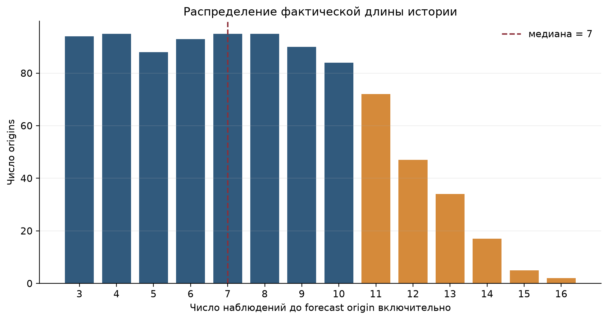
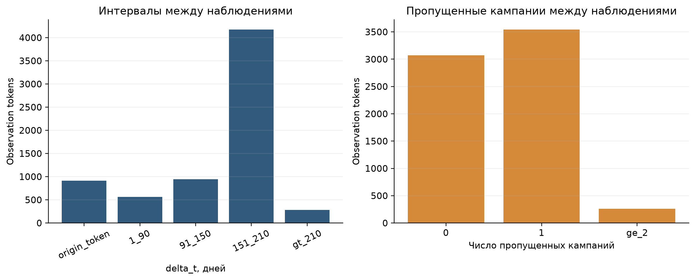
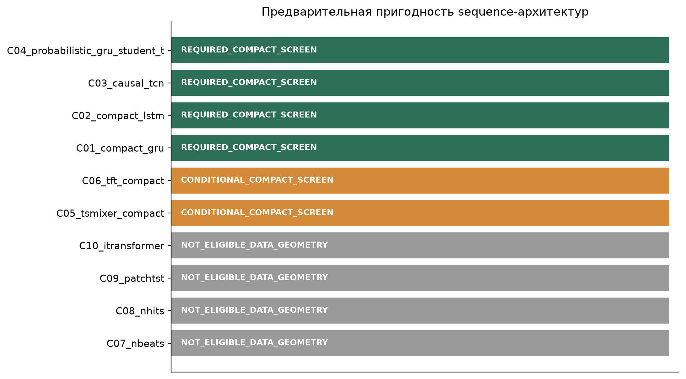
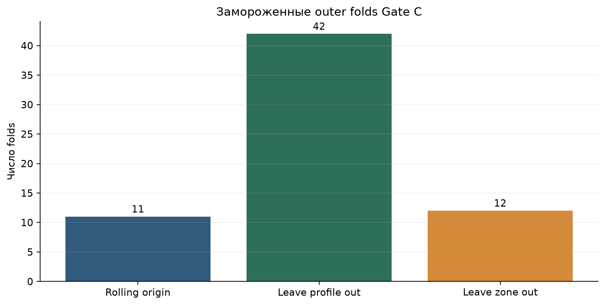

# Gate C0: аудит последовательностей и заморозка протокола T1

- Статус: `PASS_PROTOCOL_FROZEN`;
- область утверждений: `train_only_internal_research`;
- обучение моделей: `0` вызовов;
Исторический validation / раскрытый test: не загружались

## Резюме результата

Gate C0 завершён как protocol-and-data freeze до обучения deep sequence-моделей.
Для всех 911 forecast origins `t1_v1/train` построено 14 576 нормализованных
sequence rows: 16 позиций на origin с детерминированным left padding. Фактическая
история содержит от 3 до 16 наблюдений, медиана — 7. Ни одно наблюдение после
`current_date` и ни одна target observation не попали во вход.

Протокол наследует без изменения nested benchmark Gate B5:

- 11 rolling-origin outer folds;
- 42 spatio-temporal leave-profile-out folds;
- 12 spatio-temporal leave-zone-out folds;
- 195 inner folds — ровно по три внутри каждого outer train.

Все fold contracts подтвердили строгую forward-only границу и исключение
held-out profile/zone из outer train и inner tuning.

## Governance до новых моделей

Suite v4 остаётся неизменяемой историей Gate B6, primary —
`B7_two_regime_imm`. Gate C может создать suite v5 только по nested evidence
внутри `t1_v1/train` и до появления новых holdout labels. Если ни одна
sequence-модель не проходит все критерии, B7 автоматически остаётся primary.

`configs/final_holdout_v3.yaml` не менялся: он остаётся привязан к suite v4. Для
suite v5 до появления labels потребуется новая версия holdout policy и intake.
После доступа к holdout менять primary запрещено.

## Фактическая геометрия последовательностей

| Показатель | Значение |
|---|---:|
| Forecast origins | 911 |
| Траектории точек | 98 |
| Профили | 14 |
| Замороженные proxy-зоны | 4 |
| Target dates внутри train | 19 |
| Длина истории, min / median / max | 3 / 7 / 16 |
| Положительный `delta_t`, min / median / max, дней | 42 / 168 / 560 |
| Observation tokens | 6 878 |
| Origins с хотя бы одним missing-campaign gap в истории | 892 |
| Максимум пропущенных кампаний между наблюдениями | 5 |
| Truncated train sequences | 0 |
| Future observations во входах | 0 |
| Target observations во входах | 0 |

Почти равномерная масса на длинах 3–10 быстро уменьшается после 10 наблюдений:
истории длиной 15–16 представлены только семью origins. Это важнее общего числа
строк: независимая геометрия остаётся малой — 98 точек, 14 профилей и 19 train
target dates.

Основная масса интервалов лежит в диапазоне 151–210 дней, но 282 tokens имеют
интервал более 210 дней. Для 262 tokens между соседними наблюдениями пропущено
две и более кампании. Поэтому `delta_t`, uncertainty и missingness masks входят
в обязательный sequence contract; интерполяция на регулярную сетку не
вводилась.

## Исполняемый feature contract

В сеть могут поступать только шесть каналов, семантически соответствующих
уже разрешённым полям `formal_feature_contract.csv`:

1. `last_settlement_mm`;
2. `last_rate_mm_y`;
3. `current_standard_uncertainty_mm`;
4. `days_since_previous_observation`;
5. `missing_campaigns_since_previous`;
6. `current_campaign_type`.

`padding_mask`, `observation_mask` и `missing_campaign_mask` являются
structural inputs. `sample_id`, `point_id`, `profile_id`, zone/campaign IDs и
`observation_id` сохранены только как audit/resampling metadata. Runtime guard
завершает выполнение ошибкой при попытке включить их в estimator matrix.

Scaler, imputer и categorical encoder разрешено обучать только на fold role
`train`; padding rows исключаются из fit. Early stopping означает только
`inner_rolling_validation_within_t1_v1_train`, а не исторический validation и
не outer validation.

## Architecture pre-screen

Обязательный compact screen:

- `C01_compact_gru`;
- `C02_compact_lstm`;
- `C03_causal_tcn`;
- `C04_probabilistic_gru_student_t`.

Условно допустимы после проверки masked representation и лимита 100 000
параметров:

- `C05_tsmixer_compact`;
- `C06_tft_compact`, без identifier embeddings.

Статус `NOT_ELIGIBLE_DATA_GEOMETRY` получили N-BEATS, N-HiTS, PatchTST и
iTransformer. При 3–16 нерегулярных наблюдениях они потребовали бы
недоказанной регулярной интерполяции, неидентифицируемого hierarchical
downsampling или несоразмерного attention context. Это формальный результат
pre-screening, а не незавершённая реализация.

Внешние pretrained-модели отсутствуют в registry и отдельном Gate C lock-файле.

## Evaluation design

Будущий C1 выполняется в порядке:

1. compact screen на 11 rolling folds с пятью seeds `42117`–`42121`;
2. spatial audit на 42 leave-profile-out и 12 leave-zone-out folds;
3. transition audit;
4. conformal calibration только из inner rolling OOF residuals;
5. seed, complexity, RAM/VRAM и determinism audit;
6. suite v5 eligibility или B7 fallback;
7. новая holdout policy до появления labels;
8. однократная future/external holdout evaluation.

B1, B7 и B8 остаются неизменяемыми comparators. Условия suite v5 повторяют
научные guardrails B6 и добавляют seed stability: IQR MAE не более
0,50 мм/год и CV не более 10%.

## Проверки и воспроизводимость

Независимый validator выполнил 11 machine checks:

- sequence manifest и sequence rows детерминированно пересобираются;
- hashes каждой последовательности воспроизводятся;
- exact 65 outer и 195 inner folds сохранены;
- все folds forward-only;
- held profile/zone исключены;
- validation/test не загружались;
- обучения моделей не было;
- suite v4, B0–B6 и holdout v3 не изменились;
- self-digest sequence contract корректен.

Дополнительно 16 pytest tests проверяют causal boundary, target exclusion,
padding/missing masks, formal allowlist, train-only preprocessing, early
stopping scope, отсутствие manifest CLI escape hatch и B7 fallback governance.

Executed notebook:
`notebooks/08_gate_c_sequence_audit.ipynb`, статус
`PASS_EXECUTED_TOP_TO_BOTTOM`, 6 из 6 code cells, 0 error outputs.

## Научная интерпретация

Gate C0 доказывает пригодность данных и протокола для ограниченного compact
sequence screen, но не доказывает превосходство deep learning. Малое число
независимых trajectories/profile/date units и длинные нерегулярные gaps
означают, что B7 остаётся сильным и заранее защищённым fallback. Любой новый
primary должен подтвердить улучшение temporal, transition и spatial metrics
одновременно и затем пройти новый реальный holdout, который пока отсутствует.
