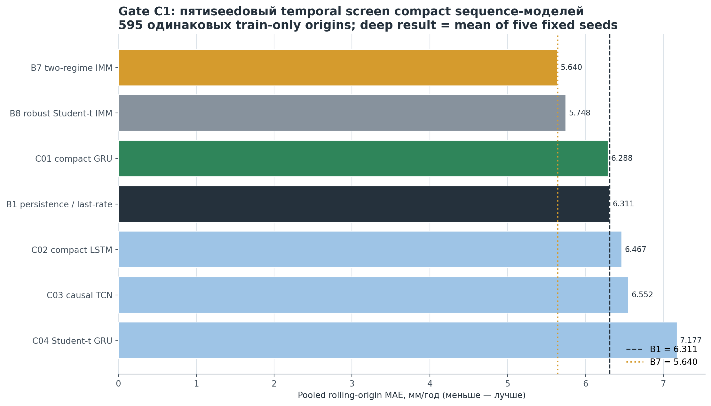
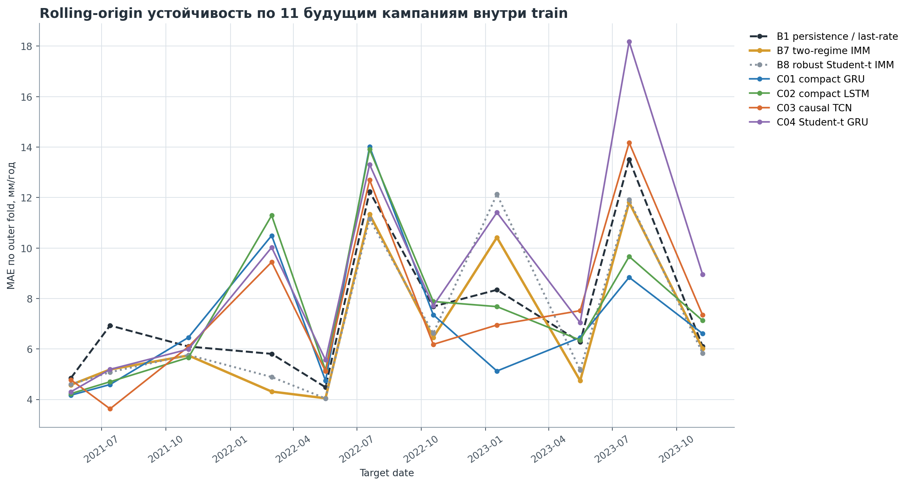
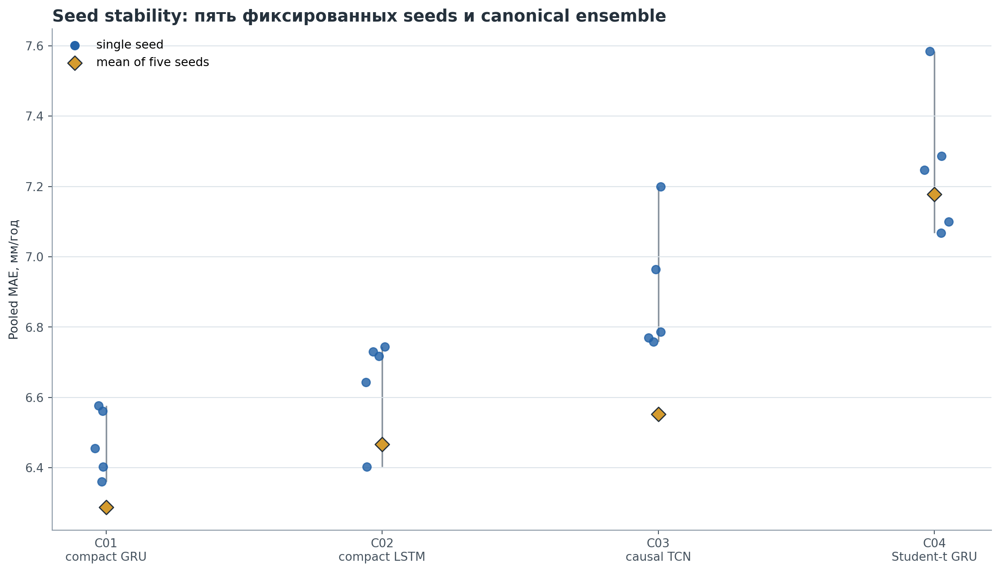
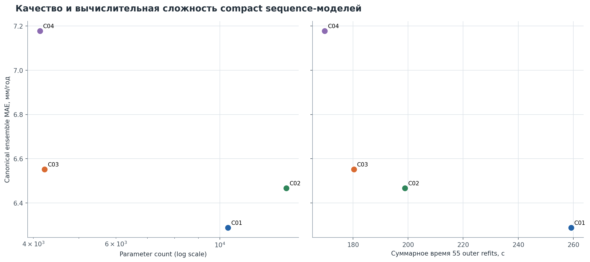

# Gate C1: пятиseedовый compact sequence temporal screen

## Краткий результат

Gate C1 завершён со статусом **`PASS_C1_TEMPORAL_SCREEN`**; независимый validator выполнил 26 проверок, failures — 0. Все четыре заранее зарегистрированные архитектуры получили терминальный научный статус. В Gate C2 допущено: **`C01_compact_gru`**.

Лучшая deep-модель по canonical mean-of-five-seeds — `C01_compact_gru` с pooled rolling MAE **6.288 мм/год**. Для контекста B1 даёт **6.311 мм/год**, а действующий primary suite v4 B7 — **5.640 мм/год**. Это не внешняя оценка и не основание для производственного заявления: научная граница результата — `train_only_internal_research`.

## 1. Научная и информационная граница

В C1 использовались только sequence manifests, построенные поверх 911 строк `t1_v1/train`. Model-facing worker не мог принимать пути к историческому validation, раскрытому test или будущему holdout. Outer-validation targets были присоединены отдельным scorer ровно после проверки и hash freeze всех 44 unlabeled shards.

- C0 content contract: `439a3031133051c0f3dd9f8d84438d2b2e73a62486d9312c8940faa8c2ffe95f`;
- C1 config SHA-256: `340f5e8ac2d6df6696e2ea0267670ec4d5d1ef1265aa1ecb1a2cebed848a9eba`;
- C1 code SHA-256: `5a84f27899c20bd37e8318cdc99009da9cb2fc71b7090dead1ca57fee9e7db6a`;
- environment SHA-256: `4a1388db6a465b41decad90e9701c9312bb7aa844e8aeb133c461ed0a4bd9258`;
- outer-label access events: `1`;
- `historical_validation_loaded=false`;
- `current_test_loaded=false`;
- `new_holdout_seen=false`;
- `profile_zone_transition_audit_executed=false`;
- `suite_v5_created=false`.

## 2. Дизайн эксперимента

Frozen plan включает 11 rolling-origin outer folds, по три forward-only inner folds, 56 grid configurations и пять seeds `42117–42121`. Полный logical tuning inventory содержит 9 240 evaluations; безопасный hash-keyed cache сохраняет полную логическую трассу, выполняя 3 640 уникальных inner fits. Затем выполнены 220 outer refits.

Canonical point prediction каждой deep-модели — арифметическое среднее пяти fixed-seed predictions. Для Student-t GRU распределения не усредняются в псевдо-Student-t: C1 публикует native diagnostics по каждому seed, а ensemble — только point mean.

## 3. Temporal результаты

На pooled temporal evidence действующий B7 остаётся сильнейшим comparator. C01 находится практически на уровне B1 и потому проходит широкий admission-порог, но этот допуск не означает превосходства над B7 или готовности стать primary.

| Модель | Статус | MAE | Median fold MAE | RMSE | Bias | B1 skill | Worst fold / B1 |
| --- | --- | --- | --- | --- | --- | --- | --- |
| `B7_two_regime_imm` | context-only | 5.640 | 5.744 | 9.983 | -0.773 | 10.6% | 1.25 |
| `B8_student_t_robust_imm` | context-only | 5.748 | 5.764 | 10.242 | -0.857 | 8.9% | 1.45 |
| `C01_compact_gru` | PASSED_TEMPORAL_SCREEN | 6.288 | 6.457 | 10.817 | -0.766 | 0.4% | 1.81 |
| `B1_persistence_last_rate` | context-only | 6.311 | 6.278 | 10.810 | -0.775 | 0.0% | 1.00 |
| `C02_compact_lstm` | REJECTED_TEMPORAL_SCREEN | 6.467 | 7.127 | 11.341 | -0.993 | -2.5% | 1.94 |
| `C03_causal_tcn` | REJECTED_TEMPORAL_SCREEN | 6.552 | 6.950 | 11.126 | -1.399 | -3.8% | 1.63 |
| `C04_probabilistic_gru_student_t` | REJECTED_TEMPORAL_SCREEN | 7.177 | 7.714 | 13.698 | -3.179 | -13.7% | 1.73 |

Показатели рассчитаны на одинаковых 595 rolling outer origins. R² остаётся описательной статистикой и не используется для admission. Поскольку target допускает отрицательные и близкие к нулю значения, MAPE/sMAPE не применялись.

### Худший outer fold каждой deep-архитектуры

| Модель | Target date | MAE | Отношение к B1 |
| --- | --- | --- | --- |
| `C01_compact_gru` | 2022-07-19 | 14.016 | 1.15 |
| `C02_compact_lstm` | 2022-07-19 | 13.908 | 1.14 |
| `C03_causal_tcn` | 2023-07-25 | 14.177 | 1.05 |
| `C04_probabilistic_gru_student_t` | 2023-07-25 | 18.173 | 1.34 |

Покампанийная траектория показывает сильную неоднородность ошибки: улучшение на отдельных датах соседствует с локальными провалами. Поэтому pooled MAE нельзя интерпретировать без fold-level guardrails.

## 4. Seed stability

| Модель | Mean seed MAE | IQR | CV | Range | Ensemble MAE | Дат лучше B1 | Дат лучше B7 |
| --- | --- | --- | --- | --- | --- | --- | --- |
| `C01_compact_gru` | 6.471 | 0.158 | 1.32% | 0.217 | 6.288 | 5 | 4 |
| `C02_compact_lstm` | 6.647 | 0.087 | 1.92% | 0.342 | 6.467 | 5 | 5 |
| `C03_causal_tcn` | 6.896 | 0.194 | 2.46% | 0.441 | 6.552 | 5 | 3 |
| `C04_probabilistic_gru_student_t` | 7.257 | 0.187 | 2.53% | 0.517 | 7.177 | 3 | 1 |

Пороги seed IQR ≤ 0,50 мм/год и CV ≤ 10% публикуются как заранее определённая диагностика будущей suite-v5 eligibility. Они не добавлялись задним числом к temporal admission C1.

Среднее пяти фиксированных seeds улучшает MAE относительно медианного одиночного seed у всех четырёх architectures; при этом C04 имеет наибольший полный seed range.

## 5. Native Student-t diagnostics

| Seed | CRPS | NLL | Coverage 50% | Coverage 80% | Coverage 95% | Mean width |
| --- | --- | --- | --- | --- | --- | --- |
| 42117 | 5.486 | 3.515 | 38.7% | 68.9% | 89.2% | 15.566 |
| 42118 | 5.772 | 3.578 | 34.5% | 67.2% | 89.7% | 16.075 |
| 42119 | 5.419 | 3.507 | 39.2% | 69.7% | 90.3% | 15.965 |
| 42120 | 5.604 | 3.552 | 37.1% | 67.2% | 88.7% | 15.459 |
| 42121 | 5.532 | 3.538 | 34.8% | 69.6% | 89.6% | 16.282 |

Эти интервалы являются native outputs C04 и пока не сопоставимы с общим conformal wrapper. Conformal calibration, mixture handling и conditional coverage остаются Gate C2.

## 6. Программный temporal admission

| Модель | Статус | Pooled ≤ 1,10 B1 | Median ≤ 1,10 B1 | Worst ≤ 2,00 B1 | Допуск C2 |
| --- | --- | --- | --- | --- | --- |
| `C01_compact_gru` | PASSED_TEMPORAL_SCREEN | PASS | PASS | PASS | да |
| `C02_compact_lstm` | REJECTED_TEMPORAL_SCREEN | PASS | FAIL | PASS | нет |
| `C03_causal_tcn` | REJECTED_TEMPORAL_SCREEN | PASS | FAIL | PASS | нет |
| `C04_probabilistic_gru_student_t` | REJECTED_TEMPORAL_SCREEN | FAIL | FAIL | PASS | нет |

Низкое качество классифицируется как `REJECTED_TEMPORAL_SCREEN`, а не как software failure. `FAIL_PROTOCOL` резервируется для leakage, hash/schema/environment mismatch или неполного незарегистрированного выполнения.

## 7. Вычислительная трасса

| Модель | Logical inner | Physical inner | Cache reuse | Outer refits | Параметры | Эпохи | Outer fit, с | Peak VRAM, MB |
| --- | --- | --- | --- | --- | --- | --- | --- | --- |
| `C01_compact_gru` | 2640 | 1040 | 1600 | 55 | 1265–10401 | 21–193 | 259.2 | 88.0 |
| `C02_compact_lstm` | 2640 | 1040 | 1600 | 55 | 1681–13857 | 13–159 | 198.9 | 88.5 |
| `C03_causal_tcn` | 2640 | 1040 | 1600 | 55 | 961–4225 | 9–171 | 180.4 | 65.7 |
| `C04_probabilistic_gru_student_t` | 1320 | 520 | 800 | 55 | 1299–4131 | 11–66 | 169.8 | 76.1 |

C01 даёт лучший deep MAE, но среди выбранных outer specifications является одновременно крупнейшей и самой дорогой по суммарному времени refit. Это допустимо для C2 screening, однако не создаёт преимущества над почти бесплатным B7 comparator.

Execution authority: `PASS`; Python `3.13.13`, Torch `2.13.0+cu130`, CUDA `13.0`, GPU `NVIDIA GeForce RTX 5070 Ti`, driver `616.56`. Полная среда, wheel hashes, GPU/driver/CUDA capture и determinism smoke сохранены рядом с C1 artifacts.

### Checkpoint policy и CUDA-ускорение

Независимая инвентаризация подтвердила **3 860** manifests: 3 640 inner fits и 220 outer refits. Каждый fit хранит пять полных training states; recovery state фиксируется после каждой завершённой стадии в 50 эпох и на terminal epoch. Inner rank 1 выбирается по frozen early-stopping metric с tie-break по более ранней эпохе. Outer refit не ранжируется по outer labels: сохраняются последние пять эпох, а выбирается заранее зафиксированная final epoch.

В matched benchmark `C01_compact_gru` / `rolling_origin_2021-05-18` на 240 одинаковых fits векторизованный CUDA-путь с fused AdamW и device-side validation снизил mean fit time с 4.449 до 3.301 с (**25.8%**, 1.35×), а median — с 3.903 до 2.482 с (**36.4%**, 1.57×). Новое время уже включает top-5 checkpoint I/O; сравнивались те же model, fold, grids, inner folds и seeds.

Полное насыщение 16 ГиБ VRAM на этой геометрии не ожидается и не является корректным критерием качества реализации: максимум зарегистрированной tensor allocation равен 88.5 MB, крупнейшая configuration содержит только 13857 параметров, длина последовательности не превышает 16, batch size заморожен на 32, а одновременно разрешён один deterministic GPU worker. Искусственное увеличение batch или параллельный запуск folds изменили бы frozen execution semantics либо ослабили воспроизводимость. Полученное ускорение связано с устранением CPU/GPU synchronization overhead, а не с попыткой занять всю память видеокарты.

## 8. Ограничения и следующий этап

C1 не проверяет leave-profile-out, leave-zone-out, transition/gap regimes или conformal calibration. Он не создаёт suite v5 и не меняет suite v4. Следующий допустимый этап — Gate C2 только для моделей из `c2_admission_manifest.json`, с B1/B7/B8 как неизменяемыми context comparators. После C2 заранее замораживается suite v5 или fallback B7, и лишь затем возможна однократная оценка на новом real future/external holdout.

## 9. Reader-facing figures

1. `artifacts/model_selection/t1_gate_c1_compact_screen_v1/figures/01_ensemble_temporal_mae.png`;
2. `artifacts/model_selection/t1_gate_c1_compact_screen_v1/figures/02_rolling_mae_by_target_date.png`;
3. `artifacts/model_selection/t1_gate_c1_compact_screen_v1/figures/03_seed_stability.png`;
4. `artifacts/model_selection/t1_gate_c1_compact_screen_v1/figures/04_mae_vs_complexity.png`.

Все рисунки построены только из сохранённых machine artifacts после независимой валидации; model-training calls при reporting равны нулю.

Protocol freeze content/config SHA-256: `340f5e8ac2d6df6696e2ea0267670ec4d5d1ef1265aa1ecb1a2cebed848a9eba`.
