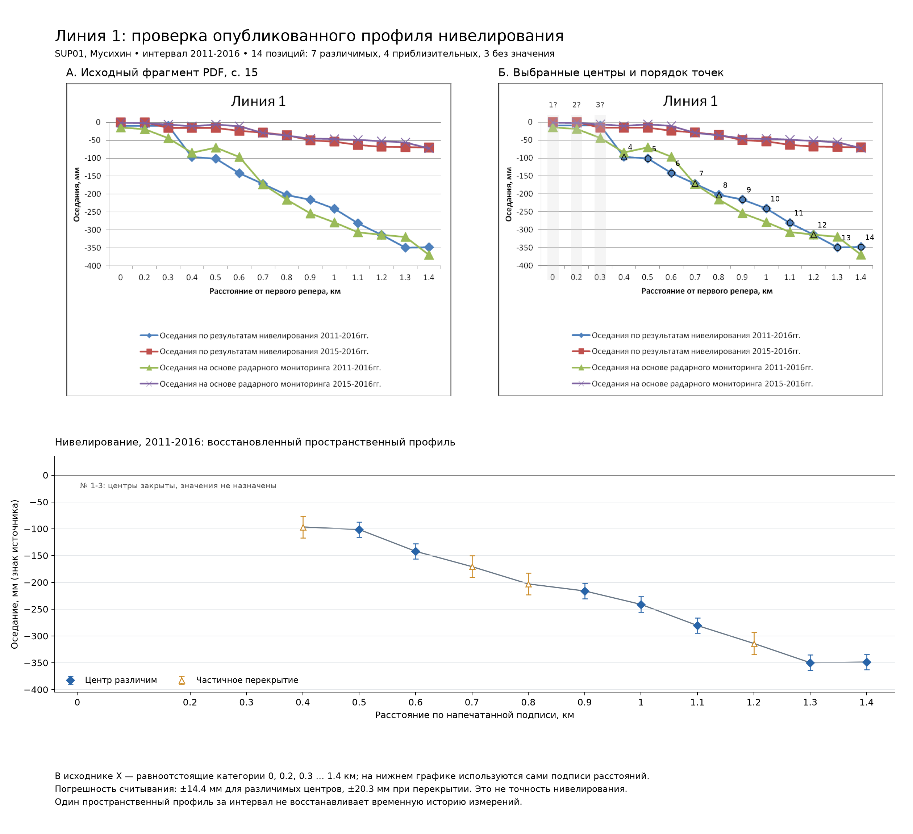

# Приёмка восстановления «Линии 1», 23 сентября 2026

**Результат: PASS для воспроизведения опубликованного пространственного профиля с явно указанными неопределённостями.** Повторное построение дало 12 файлов, побайтно совпадающих с сохранённым комплектом. Из 14 позиций численно восстановлены 11: 7 с различимым центром, 4 приблизительно; 3 оставлены без значения. Обучение, запуск сценарного генератора и эксперименты с holdout не выполнялись.

Названия сохранены: диплом «Горные и маркшейдерские работы при разработке Верхнекамского месторождения»; специальная часть «Алгоритм прогнозирования оседаний земной поверхности на ВКМ на основе маркшейдерских измерений».

Принятые исправления данных и прежний отчёт приёмки уже зафиксированы отдельным коммитом `90e2e293cf868a6ef191f2eddc0f52d46f94d4b8` (`fix: accept audited reconstruction data contract`). Проверено, что в его 36 путях нет ZIP, резервных копий и `work/`. Он включает реализацию исправлений, каталоги, тесты и связанную документацию. Исправленный выпуск не изменился. Новая фиксация содержит только этот отчёт и [машинные свидетельства приёмки](MUSIKHIN_LINE1_ACCEPTANCE_20260923.json); существующие незакоммиченные сценарные файлы в неё не входят.

## Источник и таблица

Источник: [geokniga-02obrabotka.pdf](../../inputs/sources/supplementary/geokniga-02obrabotka.pdf), страница 15, «Линия 1», синие ромбы «Оседания по результатам нивелирования 2011-2016гг.». SHA-256 PDF: `4d20f03c0c3a7bb7039c405e2aff2780a30d9f6e52e99fe5da50fa4c9ccbe947`. Исходный растр `/Image157`, 900×731 пиксель, повторно извлечён в памяти и совпал по всем RGB-пикселям с сохранённым фрагментом. Проверены также страница целиком, подписи, легенда и наложение.

Начальная оцифровка `work/handoff/reference_figures/musikhin_p15_digitized_profiles.csv` побайтно совпадает с версионированной копией [musikhin_profiles_digitization.csv](../../data/published_figure_digitization_v1/musikhin_profiles_digitization.csv): SHA-256 `2fc8ac5cd0a40eff9c230e641fe5a3c1a7e1522d41dd989d9abf7eda4af02761`. Выборка по `profile_label=1`, `method=leveling`, `observation_interval_label=2011-2016` содержит 14 строк и совпадает с сохранённым входом детальной проверки без переписывания значений.

Полная [таблица точек](../../artifacts/reconstruction/musikhin_line1_2011_2016_v1/points.csv) хранит исходные и уточнённые координаты/значения, разницу, статус, комментарий и источник. Ниже её компактное представление. Координаты отсчитываются от верхнего левого угла исходного растра с нуля: X вправо, Y вниз. Для нечитаемых центров X означает только позицию категории, Y и оседание отсутствуют.

| № на рисунке | Подпись расстояния, км | X, px | Y, px | Оседание, мм | Статус | Граница считывания, мм |
|---:|:---|---:|---:|---:|:---|:---|
| 1 | 0 | 128 | — | — | Центр закрыт | — |
| 2 | 0.2 | 183 | — | — | Центр закрыт | — |
| 3 | 0.3 | 238 | — | — | Центр закрыт | — |
| 4 | 0.4 | 294 | 172 | −96,7 | Приблизительно | ±20,3 |
| 5 | 0.5 | 350 | 176 | −101,5 | Центр различим | ±14,4 |
| 6 | 0.6 | 405 | 210 | −142,1 | Центр различим | ±14,4 |
| 7 | 0.7 | 460 | 234 | −170,7 | Приблизительно | ±20,3 |
| 8 | 0.8 | 516 | 261 | −203,0 | Приблизительно | ±20,3 |
| 9 | 0.9 | 571 | 272 | −216,1 | Центр различим | ±14,4 |
| 10 | 1 | 627 | 293 | −241,2 | Центр различим | ±14,4 |
| 11 | 1.1 | 682 | 326 | −280,6 | Центр различим | ±14,4 |
| 12 | 1.2 | 737 | 354 | −314,0 | Приблизительно | ±20,3 |
| 13 | 1.3 | 793 | 384 | −349,9 | Центр различим | ±14,4 |
| 14 | 1.4 | 848 | 383 | −348,7 | Центр различим | ±14,4 |

Отрицательный знак оседаний сохранён. Точка 12 в начальной оцифровке была пустой; оценка −314,0 мм по видимому контуру остаётся приблизительной. Уточнения в остальных численных строках относительно исходной оцифровки составляют от 0 до −4,1 мм. Центры точек 1–3 закрыты другими сериями и не интерполированы. Разность последних двух значений 1,2 мм меньше погрешности считывания: подъём между ними не установлен.

## Оси, сравнение и погрешность

Горизонтальная ось исходника — **равноотстоящие категории с подписями расстояния**: между центрами 55–56 px, хотя первая разность подписей равна 0,2 км, а остальные 0,1 км. Линейное преобразование X-пикселей в километры дало бы расхождение до 47,86 px. Оно отвергнуто; подписи и порядок сохранены отдельно. Географические координаты и точность расстояний сверх напечатанных подписей не установлены. На отдельном восстановленном графике X размещён по числам подписей; это явно отмечено в рисунке.

Вертикальная калибровка: `s_mm = -400 × (Y - 91) / (426 - 91)`. Масштаб составляет 1,19403 мм/px; остатки на девяти линиях сетки не превышают 0,747 мм. У пяти открытых синих маркеров измерено по 22 вертикальных пикселя. Консервативная граница считывания `(11 + 0,5 + 0,5) × 1,19403`, округлённая вверх, составляет ±14,4 мм. Для перекрытых маркеров добавлены 5 px неопределённости положения центра: ±20,3 мм. Добавочные 5 px — явно принятое консервативное допущение, а не измеренная статистическая дисперсия. Десятые доли миллиметра в таблице отражают вычисление по пикселям, а не точность исходного измерения.

Это границы оцифровки, не стандартное отклонение нивелирования и не 95%-интервал. Разность радарной и нивелирной кривых в оценке ошибки не используется.

Независимое по способу повторное считывание выполнено на новом рендере PDF Poppler 300 dpi: отдельная калибровка по девяти линиям сетки и середина синего вертикального сечения. Исходные Y-координаты не использовались для поиска. Для точек 5, 6, 9, 10, 13 разности «повторное минус основное», мм: `+0,877; +0,505; +0,555; +0,672; +0,446`. Максимум 0,877 мм, RMSE 0,630 мм. Это повторяемость разных методов на одном источнике, **не второй независимый наблюдатель**; проверка не снимает неоднозначность перекрытых точек. Подробности: [повторные считывания](../../artifacts/reconstruction/musikhin_line1_2011_2016_v1/repeat_readings.csv), [диагностика осей](../../artifacts/reconstruction/musikhin_line1_2011_2016_v1/axis_diagnostics.json).



Отдельные изображения: [исходный фрагмент](../../artifacts/reconstruction/musikhin_line1_2011_2016_v1/source_fragment.png), [наложение точек](../../artifacts/reconstruction/musikhin_line1_2011_2016_v1/source_overlay.png), [восстановленный график](../../artifacts/reconstruction/musikhin_line1_2011_2016_v1/reconstructed_profile.png).

## Связь с данными и генератором

| Уровень | Установленная связь и преобразование |
|:---|:---|
| Исходный генератор и `data/reconstruction_research_v1` | Численного импорта этого профиля нет. `reproduce_v3.py` строит сеть P-H/P-V/P-D из материалов Филатовой и проектных правил; `reproduce_v3_2.py` генерирует сценарную динамику. В `point_feature_lineage.csv` источник — SRC01. `src/skru1/reconstruction_data.py` проверяет целостность SUP01, но не переносит его значения в семь родительских таблиц. Соответствие реперов «Линии 1» синтетическим ID отсутствует. |
| Атлас опубликованных рисунков | Связь есть: `configs/musikhin_profiles_v1.json` → исходный CSV пакета → `scripts/reconstruct_musikhin_profiles.py:normalize_rows` → `artifacts/reconstruction/musikhin_profiles_2011_2016_v1/profile_1/points.csv`. Поле `displacement_negative_down_mm` переносится в `signed_displacement_mm`; значение по пиксельной калибровке сохраняется отдельно для проверки. |
| Реестр ограничений | `scripts/build_scenario_constraints.py:musikhin_rows` группирует точки атласа по профилю, методу и интервалу, затем берёт минимум и максимум непустых значений. Строка `MUS-P1-LEVELING-2011-2016-SIGNED-DISP` в `artifacts/reconstruction/scenario_constraints_v1/scenario_constraints.csv` содержит **[−349,3; −96,1] мм по 10 значениям исходной оцифровки**. Это реальная численная связь со справочным реестром. |
| Текущий незакоммиченный сценарный генератор | `src/skru1/scenario_simulation.py:generate_scenario_dataset`, строки 818–829, вызывает `verify_upstream` для реестра и читает membership/features/contract исправленного выпуска. `verify_upstream`, строки 69–96, проверяет хеши файлов. Значения реестра в формулы не загружаются. В `configs/scenario_simulation_v1.json` механизмы ссылаются на FIL-/SIM-, но не MUS-. `_latent_surface`, строки 203–244, использует заданную амплитуду и предположенные временные/пространственные функции. Реестр участвует в проверке целостности и provenance, а профиль не калибрует динамику, шум или временной ряд. |

**Две версии оцифровки не следует смешивать.** Детальная проверка одного профиля имеет 11 значений и диапазон [−349,9; −96,7] мм; атлас и реестр сохраняют 10 исходных значений. Их расхождение документировано, реестр автоматически не переписан. Сохранённый `dataset_linkage.json` со статусом `NO_NUMERIC_PROFILE_LINK_FOUND` относится к исходному генератору и исправленным таблицам; он не означает отсутствия более поздней связи с атласом и реестром. Хеши текущих незакоммиченных кода/конфигурации включены в машинный отчёт, сами файлы в новую фиксацию не включены.

Для сценариев профиль даёт масштаб накопленного оседания порядка сотен миллиметров, порядок точек и общий рост модуля оседания на читаемой части линии. При целевом воспроизведении именно этого профиля следует сравнивать те же позиции с учётом статусов и границ считывания; наблюдаемый диапазон не является строгим пределом всей линии из-за трёх пропусков. При работе в соглашении `positive_down_mm` потребовалось бы явно записать преобразование `s_down = -s_source`; текущий генератор такого импорта не делает.

Профиль не устанавливает форму динамики, моменты ускорений, календарь/пропуски кампаний, точность приборов, геопривязку или реальные ID сети. **Он не восстанавливает временную историю измерений внутри 2011–2016 годов.** Синтетические траектории, совместимые с одним итоговым пространственным профилем, могут существенно различаться; совпадение с графиком не доказывает полевую точность прогноза.

## Воспроизведение и проверка

Из корня репозитория; зависимости: проектное Python-окружение с NumPy, Matplotlib, Pillow и `pdftoppm` в PATH. Параметры, координаты, маска синего, калибровка и хеши входов: [musikhin_line1_digitization_v1.json](../../configs/musikhin_line1_digitization_v1.json). Скрипт проверяет входы до построения.

```powershell
.\.venv\Scripts\python.exe scripts/reconstruct_musikhin_line1.py --root . --output work/profile_line1/recheck_20260923
```

Эта команда повторно создаёт таблицу и все рисунки в `work/`. Без `--output` она строит канонический комплект `artifacts/reconstruction/musikhin_line1_2011_2016_v1/`.

В этой приёмке: 24 входа по четырём манифестам проверены; входы и выходы четырёх выпусков проверены по SHA-256; все 12 результатов повторного построения совпали побайтно; 15 проверок приёмки прошли; `tests/test_reconstruction_data.py` — **12 passed**. Полный набор тестов проекта не запускался. Для проверки исходного встроенного изображения использован `pypdf` из комплектного Python Codex; в проектном `.venv` этот дополнительный пакет отсутствует, но команда построения выше его не требует.

Все временные материалы находятся в `work/profile_line1/`. Исходный ZIP, PDF, начальная оцифровка, принятые таблицы и названия не изменены. Новых исправлений числовых данных при повторной проверке не потребовалось.
