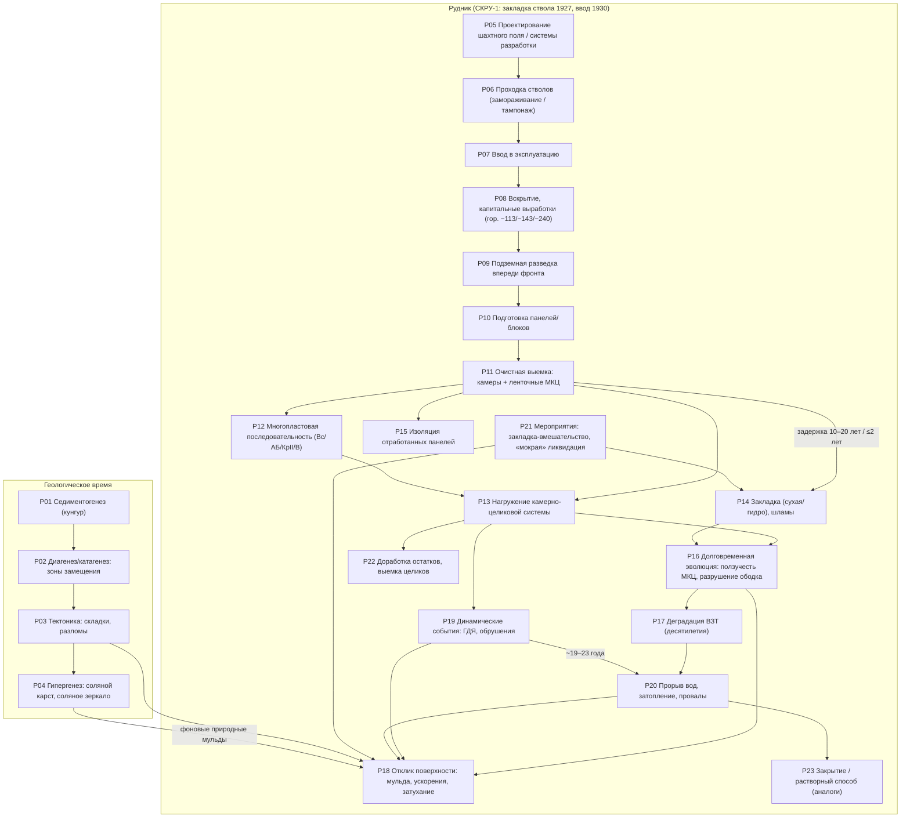
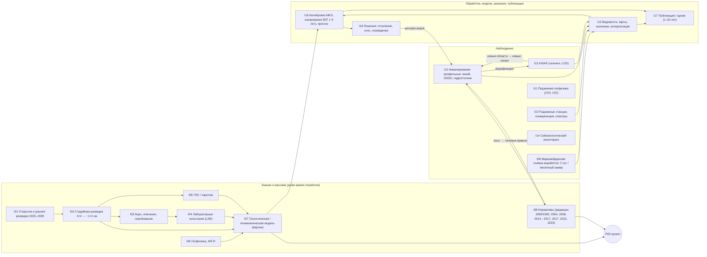

<!-- Опубликовано из PRIVATE 11_evidence_vnext/canonical/MONITORING_LIFECYCLE/MINE_LIFECYCLE_AND_INFORMATION_FLOW_RU.md (синтез Phase 1). Дословные цитаты источников — только в PRIVATE. -->
# Жизненный цикл месторождения/рудника и поток информации: ВКМКС и СКРУ-1

Поток: `MONITORING_LIFECYCLE`. Дата: 2026-09-26. Фаза: только сбор информации и архитектура. Никаких расчётов не выполнялось: ни напряжений, ни ползучести, ни интерполяции, ни пересчёта опубликованных значений. В таблицах только извлечённые и классифицированные сведения. Все значения сохраняют статус из записей‑источников (`FACT / DERIVATION / INTERPOLATION / MODEL_CHOICE / ENGINEERING_ASSUMPTION / ANALOGUE / UNKNOWN`).

Входные данные: окончательный merged‑корпус `$VKM_WORK/merged/all_records.jsonl (пересобирается из PRIVATE 11_evidence_vnext/sweep_raw, run kit merge_sweep.py)` (13 572 записи, `merge_log_final.txt`, 11:58). Поздние источники VKM‑SRC‑009, VKM‑SRC‑010 и VKM‑SRC‑024/c3 вошли в окончательный merge под своими `vn_id`, их записи учтены. Схема совместимости: `src/vkm_world` (`core/provenance.py`, `observations/catalog.py`, `chronology/events.py`, `mining/*`).

---

## 1. Главные выводы

1. **Прямых наблюдений смещений, достоверно отнесённых к СКРУ‑1, в корпусе очень мало.** Каталог содержит 489 позиций, но только 5 строк (3 набора) смещений явно отнесены к СКРУ‑1:
   * профильная линия 12, блок 201. Наблюдения с 1989 г.; на рисунке 5 эпох: 1992, 1995, 2004, 2007, 2010. Значения только графические, эпохи подтверждены визуально (VCHK‑ML‑01). Источник: VKM‑SRC‑011, с. 130–131;
   * InSAR ПНИПУ: карта 2011 г. с надписью «СКРУ‑1». Период на карте не напечатан, значения читаются только по классам (VKM‑SRC‑001, с. 12);
   * InSAR ПНИПУ: ряд одной точки за май 2011 – август 2016 и карта скоростей 2016 г. Сенсоры и положение точки не указаны (VKM‑SRC‑002, слайд 14; VCHK‑ML‑02).
2. **Частично относимые данные (атрибуция PARTIAL):**
   * линии № 1 и № 7 проходят через междушахтный целик СКРУ‑1–СКРУ‑2. Измерения есть в целике и на стороне СКРУ‑2; для стороны СКРУ‑1 модель в SRC‑012 не опирается на измерения (с. 107);
   * линии 1, 5, 6, 17 Соликамска: источник не разделяет СКРУ‑1 и СКРУ‑2;
   * линия над блоком 129 (1968–2022): рудник не назван.
3. **Поле «ОСЕДАНИЯ_2022_СКРУ1» из ВКР (0–4300 мм) — производный продукт, а не наблюдение.** Это изолинии, интерполированные в растр. Метод измерения, базовая эпоха и формат неизвестны (VCHK‑ML‑05/06). Для бенчмарка риск утечки очень высокий (DC29).
4. **InSAR на ВКМ — только сезонный и только по одной орбите (LOS).** Бесснежный сезон длится около 165–187 суток, зимой 6–7 месяцев данных нет. «Субвертикальные» смещения — это модельный пересчёт при допущении u_h ≈ 0. Мониторинг ИФЗ РАН 2020–2022 охватывает Березники и СКРУ‑2; покрытие СКРУ‑1 не указано (открытый вопрос).
5. **Нивелирование:**
   * кампании адаптивные: от 1 раза в 3 года (скорость < 20 мм/год) до ежемесячных (> 800 мм/год). Поэтому пропуски в рядах информативны;
   * на одном створе работают два исполнителя с разным классом точности (II и IV). Расхождение около 20 мм — компонент модели ошибки (конфликт MCF‑03);
   * нулевая эпоха в опубликованных графиках почти всегда не указана.
6. **Хронология выемки и закладки СКРУ‑1 известна только срезом данных предприятия** (ГИС‑слои отработки, факт. закладка на 01.10.2022, год начала отработки зоны). Без поблочных дат начала и окончания такой срез нельзя «нарезать» по времени. Это главный механизм утечки (DC14, DC16).
7. **Внешний пользователь получает данные с задержкой 1–20 лет.** Например: эпоха 2017 → статья 2022; эпохи до ~2020 → договор 2021 → статья 2022 → диссертация 2023; линия 12 (1989–2010) → отчёт 2012 → книга 2013. Внутренняя латентность у держателей в источниках не указана (UNKNOWN).

---

## 2. Классы наблюдений (каталог `monitoring_observation_catalog.csv`)

| класс (`obs_class`) | модальность схемы `Modality` | связь с латентным состоянием | строк / наборов | СКРУ‑1 |
|---|---|---|---|---|
| LEVELLING | levelling | u_z(репер,t) − u_z(репер,t0) | 52 / 37 | линия 12 (FACT, графически); линии 1, 7 у целика (PARTIAL) |
| PROFILE_LINE_STATION | profile_line | u_z + u_h вдоль линии; наклон, кривизна, ε | 15 / 3 | нормативы ВКМ; устройство станций у целиков |
| HORIZONTAL_DEFORMATION | horizontal_deformation | ε = ΔL/L | 3 / 2 | нет |
| GNSS | gnss | вектор u в пункте | 7 / 4 | нет (пункт 507 — СКРУ‑2/3) |
| INSAR | insar | u_LOS = u·ê_LOS (опорная точка, первая сцена) | 149 / 86 | 2011 карта; 2011–2016 ряд; 2016 карта |
| HYDROSTATIC_LEVELLING | hydrostatic_levelling | Δu_z внутри здания | 17 / 15 | нет (Березники) |
| UNDERGROUND_STATION / CONVERGENCE / PILLAR_DEFORMATION | underground_station / convergence | смещения контура, конвергенция, ε⊥ целика | 37 / 16 | нет |
| GPR | gpr | геометрия + ЭМ‑свойства (ε_r, v, затухание) | 51 / 22 | нет (СКРУ‑3, стволы СКРУ‑2) |
| BOREHOLE_LOGGING | borehole_logging | Vp/γ/НК — исходное состояние | 9 / 1 | 6 скважин с АК у м/ш целиков |
| SEISMIC_SURVEY / SEISMIC_MONITORING | seismic_survey / seismic_monitoring | геометрия ОГ/ПВРО; каталог событий | 25 / 2 | карта Es 2023 (продукт) |
| прочие (гравиметрия, УЗТ, осмотры, газ, закладка, опорные сети и др.) | other | см. `latent_state_link` | 104 | — |
| DERIVED_* / MODEL_OUTPUT | — | не наблюдения | 20 | поле 2022, зональная статистика ВКР |

Сводка по площадкам — в `monitoring_systems_by_site.csv` (113 групп «класс × площадка»). Хронология кампаний — в `monitoring_campaigns_timeline.csv` (38 строк, включая редакции нормативов).

**Строгая атрибуция.** СКРУ‑1 ≠ СКРУ‑2 ≠ Березники. Строки с неразделённым «Соликамском» помечены `PARTIAL (атрибуция к СКРУ‑1 не доказана)`. Данные СКРУ‑2/СКРУ‑3 помечены `NEIGHBOUR_ONLY`, Березники и прочие участки ВКМ — `VKM_ANALOGUE_ONLY`, Старобин и Гремячинское — `ANALOGUE_ONLY`.

---

## 3. Физический граф жизненного цикла

Идентификаторы узлов совпадают с `lifecycle_stages.csv`, рёбра — с `lifecycle_graph_edges.csv`.

Пояснения к узлам (подробнее — в `lifecycle_stages.csv`):
* **P14:** закладка — отдельная стадия. При традиционной технологии она отстаёт от выемки на 10–20 лет, поэтому состояние «открытая камера» длится десятилетие и больше. Степень заполнения — диапазон (Кз ≈ 0,75; зазор у кровли 0,2–1,0 м), а не точка. Для закладки до ~2002 г. степень заполнения фактически неизвестна.
* **P18:** на СКРУ‑1 оседание по линии 12 росло с 1992 по 2010 г. без стабилизации. У м/ш целика к 2020 г. накоплено 1,2–2,7 м (сторона СКРУ‑2).
* **P19–P20:** события СКРУ‑2 (обрушение 05.01.1995, провалы 2014 и 2018) относятся к соседнему руднику. Влияние прорыва СКРУ‑2 2014 г. на район СКРУ‑1 — UNKNOWN.

---

## 4. Информационный граф

Связь двух графов (рёбра с `edge_type = cross` в `lifecycle_graph_edges.csv`):
* P11 → I09: выемка фиксируется съёмкой;
* P14 → I09: закладка фиксируется актами и учётом;
* P18 → I12 и P18 → I13: оседание наблюдается нивелированием и InSAR;
* P16 → I10 и P16 → I11: деформации наблюдаются подземными станциями и геофизикой;
* P19 → I14: события регистрирует сейсмическая сеть;
* I07 и I08 → P05: знание и нормативы управляют проектированием;
* I16 → P21: зонирование ведёт к мероприятиям.

---

## 5. Семантика доступности информации

Поля `TemporalSupport` (`src/vkm_world/core/provenance.py`) для каждой величины:

| поле | смысл | пример из корпуса |
|---|---|---|
| `event_date` (`event_date_end`) | когда произошло физическое событие | выемка зоны 208 блока 18П — 1955 (данные предприятия в ВКР); обрушение СКРУ‑2 — 05.01.1995 |
| `measurement_date` | когда измерено | эпоха нивелирования линии № 1 — 09.10.20; сцены TerraSAR‑X 26.04–08.10.2021 |
| `processing_date` | когда обработано/интерпретировано | графики суммарных оседаний по линии 12 построены в 2011 г.; 3D‑модель Vp — 2019–2023 |
| `publication_date` | когда опубликовано | линия 12 — книга 2013; линия 1 — статья 2022, диссертация 2023 |
| `available_from` | самая ранняя дата, когда прогнозист мог использовать величину | для внешнего прогнозиста — не раньше `publication_date`; внутренняя доступность у держателя — UNKNOWN |

**Правило бенчмарка:** прогноз с началом t0 может использовать только данные с `available_from ≤ t0`. Если `available_from` неизвестна, величина не используется (`TemporalSupport.usable_at()` возвращает `None`; `chronology.known_at()` отбирает только события с известной доступностью).

Дополнительные правила из анализа источников (в матрице — колонки `benchmark_rule`, `leakage_mechanism`):
1. **План ≠ факт.** Годовые и полугодовые планы и календарные планы существуют ex ante и допустимы на t0 со статусом DESIGN, если утверждены до t0. Фактическую выемку берут только из маркшейдерской съёмки (2 сут; месячный замер окончателен).
2. **Срез ≠ история.** ГИС‑слои отработки и закладки (на 01.10.2022), а также кумулятивные карты («Es на 2023», «ОСЕДАНИЯ_2022») нельзя использовать для t0 раньше даты среза.
3. **Винтаж обработки InSAR.** Стековые методы (PS/SBAS) пересчитывают прошлые значения при добавлении новых сцен. Межсезонная «сшивка» полиномом (ряд СКРУ‑1 2011–2016) использует следующий сезон. На t0 допустим только продукт, обработанный по сценам, снятым не позже t0.
4. **Калибровка по цели запрещена.** Эффективные свойства МКЭ, подобранные по нивелированию (SRC‑012), и зонирование ВЗТ, обновляемое по нивелированию, содержат целевые данные.
5. **Версия геологической модели.** Зоны замещения и складчатость внутри соли известны только после вскрытия выработками. На t0 используется версия модели, существовавшая к t0.
6. **Информативные пропуски и цензура.** Частота нивелирования зависит от наблюдённой скорости; ряды прерываются сносом или отселением; первичные наряды хранятся 1 месяц. Отсутствие данных ≠ ноль.
7. **Редакции нормативов.** На t0 применяется редакция, действовавшая на t0. Нормативное ≠ измеренное.

### Примеры цепочек «событие → измерение → обработка → публикация» (из источников)

| цепочка | event | measurement | processing | publication | источник |
|---|---|---|---|---|---|
| Линия 12, СКРУ‑1 | подработка блока 201 (пласты КрII и В) | с 1989; эпохи 1992–2010 | графики 2011 | отчёт 2012 → книга 2013 | VKM‑SRC‑011 (EV‑VN‑S011‑2086, ‑2087, ‑2097) |
| Линия № 1 у целика | выемка у целиков 1974–1986+ | эпохи до 09.10.2020 | договор ПНИПУ–Уралкалий 10.02.2021 | статья 2022 → диссертация 2023 | VKM‑SRC‑012 (EV‑VN‑S012‑0736) |
| InSAR СКРУ‑1 | оседание 2011–2016 | сезоны май–окт. | сезонная обработка; полиномиальная «сшивка» | презентация, не датирована (≥2021) | VKM‑SRC‑002 (EV‑VN‑S002‑0031) |
| Архив InSAR ВКМКС | движение 2004–2008 | архивные сцены 2004–2008 | обработка 2008–2012 | автореферат 2012 | VKM‑SRC‑001 (EV‑VN‑S001‑0070) |
| БКПРУ‑4, линия 5 | выемка блока 1998 | 15.10.1997 – 13.04.2017 | ведомости | статья 2022 | VKM‑SRC‑016 (EV‑VN‑S016‑0063) |
| Березники InSAR | оседание 2020–2021 | TSX 2020, 2021 | ИФЗ РАН (GAMMA IPTA) | 2021 (ч. I), 2023 (ч. II) | VKM‑SRC‑004 (EV‑VN‑S004‑0013) |
| Прекурсор оползня (вне ВКМ) | оползень 07.06.2019 | S1 апр.–июль 2019 | ретроспективно | 2024 | VKM‑SRC‑010 (EV‑VN‑S010‑0009) |
| Планы отработки (учебник) | выемка до 01.01.2012 | годовой срез | — | учебник 2013 | VKM‑SRC‑014 (EV‑VN‑S014‑0592) |
| Данные предприятия СКРУ‑1 | выемка 1934–1991+, закладка 1943–2017 | срез 2022 (оседания), 01.10.2022 (закладка) | перепроецирование студентом 2025–2026 | ВКР 2026 | VKM‑SRC‑023 (EV‑VN‑S023‑0205, ‑0206, ‑0204) |

---

## 6. Сопоставление со схемой WorldSpec

* `ObservationSystem.modality`: см. колонку `schema_modality` каталога. Классы без аналога в `Modality` (гравиметрия, визуальные осмотры, газ, закладочный учёт) отнесены к `other`. Возможное расширение enum — решение координатора, здесь не вносится.
* `ObservationSystem.latent_state_link`: колонка `latent_state_link`.
* `ObservationDataset.values_available_in_corpus`, `is_digitized_from_figure`: колонка `values_in_corpus`. Значение `FIGURE_VALUES_DIGITIZED_APPROX` означает `is_digitized_from_figure=True` с `values_location` = locator.
* `Event` / `EventType`: колонки `worldspec_event_types` (стадии) и `worldspec_event_type` (кампании: MONITORING_CAMPAIGN, NORMATIVE_IN_FORCE). Информационные события (PUBLICATION, DATA_PROCESSING, GEOLOGICAL_MODEL_UPDATE) хранятся отдельно от физических, как того требует `chronology/events.py`.
* Статусы в каталоге взяты из записей‑источников. Позиции ANALOGUE, NON_VKM и производные продукты помечены в `usable_for_skru1`.

---

## 7. Нерешённые вопросы (UNKNOWN)

1. Сеть профильных линий СКРУ‑1: состав линий, реперы, эпохи, класс нивелирования, система высот. Держатель — маркшейдерская служба ПАО «Уралкалий»; в корпусе сети нет, кроме линии 12 и линий у целиков.
2. Метод, эпоха и формат набора «ОСЕДАНИЯ_2022_СКРУ1» (MCF‑23, VCHK‑ML‑05).
3. Покрытие СКРУ‑1 мониторингом ИФЗ РАН 2020–2022. Параметры сцен СКРУ‑1 (орбита, угол падения, опорная точка) для работ ПНИПУ 2011–2016.
4. Атрибуция линий 1, 5, 6, 17 и линии № 5 (2011) к СКРУ‑1 или СКРУ‑2; рудник блока 129 (SRC‑021) и участка 2 (SRC‑034).
5. Поблочные даты окончания выемки и даты закладки СКРУ‑1 в виде событий; степень заполнения закладки до ~2002 г.
6. Внутренняя латентность (дата обработки ведомостей, передачи InSAR‑продуктов) у всех держателей данных.
7. Горизонтальные смещения на СКРУ‑1 (для оператора LOS и оценки ошибки одной орбиты) — данных нет.
8. Работа Барях, Тенисон, Самоделкина 2021 (ГИАБ № 11, горизонтальные деформации) цитируется в SRC‑010, в реестре отсутствует. Кандидат на пополнение корпуса.

---

## 8. Файлы потока

* `monitoring_observation_catalog.csv` — 489 позиций: класс, модальность, наблюдаемая величина, метод, пространственная и временная опора, точность, datum/CRS, строгая атрибуция площадки, связь с латентным состоянием, наличие значений, пригодность для СКРУ‑1, доступность, провенанс, `quote`.
* `monitoring_systems_by_site.csv` — 113 агрегатов «класс × группа площадок».
* `monitoring_campaigns_timeline.csv` — 38 кампаний и редакций нормативов.
* `information_lifecycle_matrix.csv` — 32 класса данных: времена события, измерения, обработки и публикации; доступность, латентность, производитель, хранение, риск утечки, правило бенчмарка, статус СКРУ‑1.
* `lifecycle_stages.csv` — 42 стадии: 23 физические, 18 информационных, 1 контекстная.
* `lifecycle_graph_edges.csv` — 64 ребра: колонка `graph` = physical | information; уточнение в `edge_type` (physical / information / cross — физическое→информационное / context).
* `information_lifecycle_record_map.csv` — каждая из 346 записей `information_lifecycle` сопоставлена классу матрицы (DC01–DC32): явно, ручным переопределением или по ключевым словам.
* `lifecycle_stage_record_map.csv` — каждая из 149 записей `lifecycle_stage` сопоставлена стадии P/I/C.
* `monitoring_conflicts.csv` — 24 конфликта; оба значения сохранены, без усреднения.
* `visual_rechecks.csv` — 6 визуальных перепроверок критичных для СКРУ‑1 значений.
* Скрипты сборки: `build_catalogue.py`, `build_systems_by_site.py`, `build_lifecycle.py`, `data_*.py`. Все `vn_id` проверены на наличие в merged‑корпусе.

Цитаты (`quote`) присутствуют только в колонке `quote`. Перед публикацией в PUBLIC‑репозиторий их нужно удалить.
