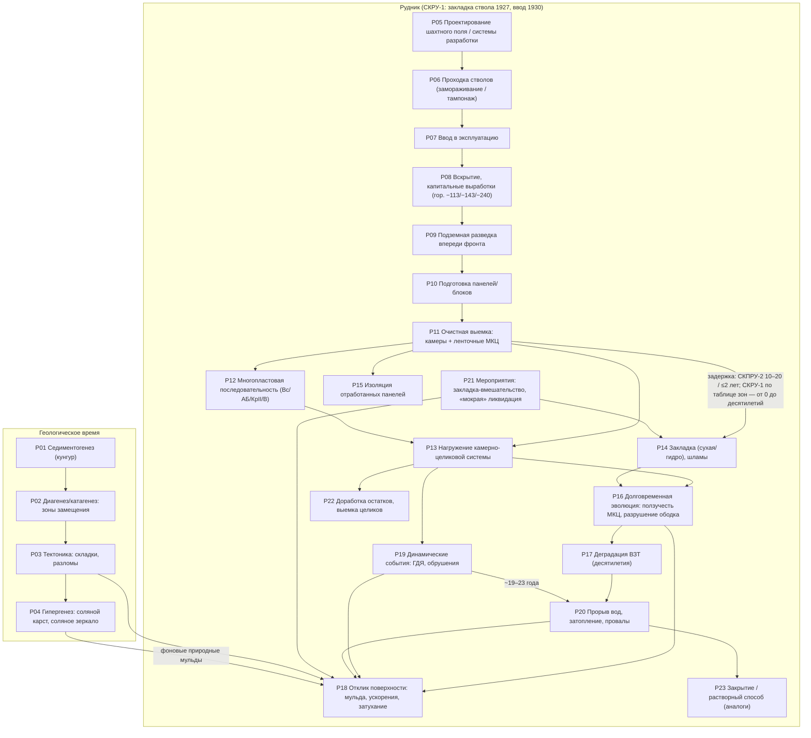
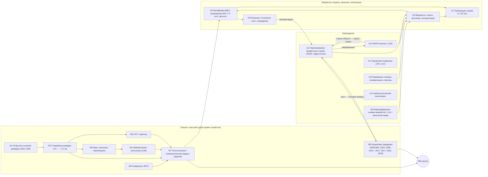

<!-- Опубликовано из PRIVATE 11_evidence_vnext/canonical/MONITORING_LIFECYCLE/MINE_LIFECYCLE_AND_INFORMATION_FLOW_RU.md (синтез Phase 1). Дословные цитаты источников — только в PRIVATE. -->
# Жизненный цикл месторождения/рудника и поток информации: ВКМКС и СКРУ-1

Поток: `MONITORING_LIFECYCLE`. Дата: 2026-09-26. Фаза: только сбор информации и архитектура. Никаких расчётов не выполнялось: ни напряжений, ни ползучести, ни интерполяции, ни пересчёта опубликованных значений. В таблицах только извлечённые и классифицированные сведения. Статусы берутся из записей‑источников (`FACT / DERIVATION / INTERPOLATION / MODEL_CHOICE / ENGINEERING_ASSUMPTION / ANALOGUE / UNKNOWN`), кроме исправлений самопроверки 26.09.2026: производные, интерполированные и модельные продукты получили INTERPOLATION или DERIVATION, учебные примеры — ANALOGUE (D‑02), откалиброванные значения — DERIVATION (D‑01). Подробности — в разделе 9.

Входные данные: окончательный merged‑корпус `$VKM_WORK/merged/all_records.jsonl` (13 572 записи, `merge_log_final.txt`, 11:58). Поздние источники VKM‑SRC‑009, VKM‑SRC‑010 и VKM‑SRC‑024/c3 вошли в окончательный merge под своими `vn_id`, их записи учтены. Схема совместимости: `src/vkm_world` (`core/provenance.py`, `observations/catalog.py`, `chronology/events.py`, `mining/*`).

---

## 1. Главные выводы

1. **Наблюдений смещений с явной подписью «СКРУ‑1» в корпусе очень мало, и вертикальные измерения из опубликованного источника среди них только одни.** Каталог содержит 504 позиции (после исправлений 26.09.2026). Подпись «СКРУ‑1» несут три набора:
   * профильная линия 12, блок 201 — нивелирование, то есть вертикальные смещения. Наблюдения с 1989 г.; на рисунке 5 эпох: 1992, 1995, 2004, 2007, 2010. Значения только графические, эпохи подтверждены визуально (VCHK‑ML‑01). Источник: VKM‑SRC‑011, с. 130–131;
   * InSAR ПНИПУ: карта «2011 г.» с надписью «СКРУ‑1» (VKM‑SRC‑001, с. 12). Это LOS‑данные одной геометрии съёмки: «оседания» получены пересчётом при допущении u_h ≈ 0 (MODEL_CHOICE). Период на рисунке не напечатан (2011 г. взят из контекста текста о работах TerraSAR‑X/TanDEM‑X). Значения по зонам в серой печати нечитаемы, поэтому числового наблюдения карта не даёт;
   * InSAR ПНИПУ: ряд одной точки за май 2011 – август 2016 и карта скоростей 2016 г. (VKM‑SRC‑002, слайд 14; VCHK‑ML‑02). Это только слайд презентации: в реестре источник помечен discovery‑only, первичная публикация не найдена (DATA_REQUEST). Данные — LOS одной орбиты. Межсезонная непрерывность ряда — полиномиальная «сшивка» (MODEL_CHOICE). Изолинии скоростей — интерполяция PS‑точек (MON‑0100‑B, INTERPOLATION). Сенсоры и положение точки не указаны. Как наблюдения СКРУ‑1 для бенчмарка эти наборы не используются, пока не получен первоисточник.
2. **Частично относимые данные (атрибуция PARTIAL):**
   * линии № 1 и № 7 проходят через междушахтный целик СКРУ‑1–СКРУ‑2. Строки каталога разделены по сторонам целика. Реперы в зоне целика (линия № 1 — реп. 1–8, линия № 7 — реп. 0…~7) имеют область `SKRU1_SKRU2_PILLAR`. Остальные реперы относятся к стороне СКРУ‑2 (`SKRU2`) и в СКРУ‑1 не переносятся. На стороне СКРУ‑1 измерений нет; единственные числа там — выход МКЭ‑модели SRC‑012 (с. 107; MON‑0040‑C, DERIVATION);
   * линии 1, 5, 6, 17 Соликамска (слайды SRC‑002, discovery‑only): источник не разделяет СКРУ‑1 и СКРУ‑2 (`SKRU1_OR_SKRU2_UNATTRIBUTED`). Совпадает ли «Линия 1» слайдов с линией № 1 диссертации SRC‑012, не установлено (MCF‑28);
   * линия над блоком 129 (1968–2022): рудник не назван.
3. **Поле «ОСЕДАНИЯ_2022_СКРУ1» из ВКР (0–4300 мм) — производный продукт, а не наблюдение.** Это изолинии, интерполированные в растр. Метод измерения, базовая эпоха и формат неизвестны (VCHK‑ML‑05/06). Для бенчмарка риск утечки очень высокий (DC29).
4. **InSAR на ВКМ — только сезонный и только по одной орбите (LOS).** Бесснежный сезон длится около 165–187 суток, зимой 6–7 месяцев данных нет. «Субвертикальные» смещения — это модельный пересчёт при допущении u_h ≈ 0. Во всех источниках ВКМ LOS делят на cos θ; форма «× cos θ» встречается только у аналога VKM‑SRC‑009 (Старобин). Для ВКМ конфликт MCF‑13 снят внешней проверкой (XF‑SF‑013). Мониторинг ИФЗ РАН 2020–2022 охватывает Березники и СКРУ‑2; покрытие СКРУ‑1 не указано (открытый вопрос).
5. **Нивелирование:**
   * кампании адаптивные: от 1 раза в 3 года (скорость < 20 мм/год) до ежемесячных (> 800 мм/год). Поэтому пропуски в рядах информативны;
   * на одном створе работают два исполнителя с разным классом точности (II и IV). Расхождение около 20 мм — компонент модели ошибки (конфликт MCF‑03);
   * нулевая эпоха в опубликованных графиках почти всегда не указана.
6. **Хронология выемки и закладки СКРУ‑1 известна только срезом данных предприятия**: ГИС‑слои отработки и фактическая закладка на 01.10.2022. В таблице зон предприятия даны интервалы выемки и закладки с точностью до года — с началом и концом, но в корпусе напечатаны лишь 14 строк, а модель ВКР использовала только дату начала. Полной таблицы в корпусе нет, поэтому срез нельзя «нарезать» по времени точнее года и за пределами напечатанных строк. Это главный механизм утечки (DC14, DC16).
7. **Внешний пользователь получает данные с задержкой 1–20 лет.** Например: эпоха 2017 → статья 2022; эпохи до ~2020 → договор 2021 → статья 2022 → диссертация 2023; линия 12 (1989–2010) → отчёт 2012 → книга 2013. Внутренняя латентность у держателей в источниках не указана (UNKNOWN).

---

## 2. Классы наблюдений (каталог `monitoring_observation_catalog.csv`)

| класс (`obs_class`) | модальность схемы `Modality` | связь с латентным состоянием | строк / наборов | СКРУ‑1 |
|---|---|---|---|---|
| LEVELLING | levelling | u_z(репер,t) − u_z(репер,t0) | 57 / 42 | линия 12 (FACT, графически); линии 1, 7: зона целика (PARTIAL) и сторона СКРУ‑2 (SKRU2) — отдельными строками |
| PROFILE_LINE_STATION | profile_line | u_z + u_h вдоль линии; наклон, кривизна, ε | 15 / 3 | нормативы ВКМ; устройство станций у целиков |
| HORIZONTAL_DEFORMATION | horizontal_deformation | ε = ΔL/L | 3 / 2 | нет |
| GNSS | gnss | вектор u в пункте | 7 / 4 | нет (пункт 507 — СКРУ‑2/3) |
| INSAR | insar | u_LOS = u·ê_LOS (опорная точка, первая сцена) | 151 / 88 | карта 2011 (LOS, без читаемых чисел); ряд 2011–2016 и карта 2016 (слайды, discovery‑only; LOS) |
| HYDROSTATIC_LEVELLING | hydrostatic_levelling | Δu_z внутри здания | 17 / 15 | нет (Березники) |
| UNDERGROUND_STATION / CONVERGENCE / PILLAR_DEFORMATION | underground_station / convergence | смещения контура, конвергенция, ε⊥ целика | 37 / 16 | нет |
| GPR | gpr | геометрия + ЭМ‑свойства (ε_r, v, затухание) | 51 / 22 | нет (СКРУ‑3, стволы СКРУ‑2) |
| BOREHOLE_LOGGING | borehole_logging | Vp/γ/НК — исходное состояние | 9 / 1 | 6 скважин с АК у м/ш целиков |
| SEISMIC_SURVEY / SEISMIC_MONITORING | seismic_survey / seismic_monitoring | геометрия ОГ/ПВРО; каталог событий | 24 / 2 | каталога событий в корпусе нет (прогнозная карта Es_max‑2023 — в строке DERIVED/MODEL_OUTPUT) |
| прочие (гравиметрия, УЗТ, осмотры, газ, закладка, опорные сети и др.) | other | см. `latent_state_link` | 106 | — |
| DERIVED_* / MODEL_OUTPUT | — | не наблюдения | 27 | поле 2022 (INTERPOLATION); зональная статистика ВКР (DERIVATION); прогнозная карта Es_max‑2023 из [33] (DERIVATION); изолинии скоростей 2016 (INTERPOLATION); модельные кривые МКЭ и нормативный прогноз по линиям № 1 и № 2 (DERIVATION) |

Сводка по площадкам — в `monitoring_systems_by_site.csv` (121 группа «класс × площадка»). Хронология кампаний — в `monitoring_campaigns_timeline.csv` (42 строки, включая редакции нормативов).

Приближённые численные значения многих наборов лежат в колонке `values_summary` каталога. Примеры: линия 12 СКРУ‑1 — MON‑0013; ряды по реперам участка 2, рудник которого не назван, — MON‑0050/0051; ряд InSAR — MON‑0101. Поточечная оцифровка в PUBLIC есть только для графиков Мусихина (`evidence/monitoring/musikhin_vkm_src002_p15_profiles.csv`). Сводки MON‑0003…0006 её дублируют и отдельными наблюдениями не загружаются.

**Строгая атрибуция.** СКРУ‑1 ≠ СКРУ‑2 ≠ Березники. Устаревшая метка `SKRU1_SKRU2` заменена по решению D‑17:
* `SKRU1_SKRU2_PILLAR` — зона междушахтного целика СКРУ‑1–СКРУ‑2; для СКРУ‑1 годится только локально или через `Transfer`;
* `SKRU1_OR_SKRU2_UNATTRIBUTED` — «Соликамск», источник не разделяет рудники; пометка `PARTIAL (атрибуция к СКРУ‑1 не доказана)`;
* `SOLIKAMSK_GROUP` — выборки и модели района трёх рудников; пометка `POOLED_SOLIKAMSK`.

Данные стороны СКРУ‑2 у целика имеют область `SKRU2`. Данные СКРУ‑2/СКРУ‑3 помечены `NEIGHBOUR_ONLY`, Березники и прочие участки ВКМ — `VKM_ANALOGUE_ONLY`, Старобин и Гремячинское — `ANALOGUE_ONLY`. Строки слайдов VKM‑SRC‑002 дополнительно помечены `DISCOVERY_ONLY`.

---

## 3. Физический граф жизненного цикла

Идентификаторы узлов совпадают с `lifecycle_stages.csv`, рёбра — с `lifecycle_graph_edges.csv`.

Пояснения к узлам (подробнее — в `lifecycle_stages.csv`):
* **P14:** закладка — отдельная стадия. На СКПРУ‑2 при традиционной технологии она отставала от выемки на 10–20 лет, при совмещённой — не более 2 лет (SRC‑037 §3.18). На СКРУ‑1 по таблице зон предприятия отставание бывает любым: от совпадающих интервалов (1989–1991 / 1989–1991) до многих десятилетий (1934–1935 / 2016–2017), как напечатано (SRC‑023 рис. 17). Общего правила нет, и состояние «открытая камера» может длиться десятилетиями. Степень заполнения — диапазон (Кз ≈ 0,75; зазор у кровли 0,2–1,0 м), а не точка. Для закладки до ~2002 г. степень заполнения фактически неизвестна.
* **P18:** на СКРУ‑1 оседание по линии 12 росло с 1992 по 2010 г. без стабилизации. У м/ш целика СКРУ‑1–СКРУ‑2 к 2020 г. накоплено 1,2–2,7 м на стороне СКРУ‑2. В зоне целика оседания составляют около 0,1–0,5 м (линии № 1 и № 7, VCHK‑ML‑07).
* **P19–P20:** события СКРУ‑2 (обрушение 05.01.1995, провалы 2014 и 2018) относятся к соседнему руднику. Влияние прорыва СКРУ‑2 2014 г. на район СКРУ‑1 — UNKNOWN.

---

## 4. Информационный граф

Связь двух графов (рёбра с `edge_type = cross` в `lifecycle_graph_edges.csv`):
* P11 → I09: выемка фиксируется съёмкой;
* P14 → I09: закладка фиксируется актами и учётом;
* P18 → I12 и P18 → I13: оседание наблюдается нивелированием и InSAR;
* P16 → I10 и P16 → I11: деформации наблюдаются подземными станциями и геофизикой;
* P19 → I14: события регистрирует сейсмическая сеть;
* I07 и I08 → P05: знание и нормативы управляют проектированием;
* I16 → P21: зонирование ведёт к мероприятиям.

---

## 5. Семантика доступности информации

Поля `TemporalSupport` (`src/vkm_world/core/provenance.py`) для каждой величины:

| поле | смысл | пример из корпуса |
|---|---|---|
| `event_date` (`event_date_end`) | когда произошло физическое событие | выемка зоны 208 блока 18П — 1955 (данные предприятия в ВКР); обрушение СКРУ‑2 — 05.01.1995 |
| `measurement_date` | когда измерено | эпоха нивелирования линии № 1 — 09.10.20; сцены TerraSAR‑X 26.04–08.10.2021 |
| `processing_date` | когда обработано/интерпретировано | графики суммарных оседаний по линии 12 построены в 2011 г.; 3D‑модель Vp — 2019–2023 |
| `publication_date` | когда опубликовано | линия 12 — книга 2013; линия 1 — статья 2022, диссертация 2023 |
| `available_from` | самая ранняя дата, когда прогнозист мог использовать величину | для внешнего прогнозиста — не раньше `publication_date`; внутренняя доступность у держателя — UNKNOWN |

**Правило бенчмарка:** прогноз с началом t0 может использовать только данные с `available_from ≤ t0`. Если `available_from` неизвестна, величина не используется (`TemporalSupport.usable_at()` возвращает `None`; `chronology.known_at()` отбирает только события с известной доступностью).

**Роль прогнозиста.** По умолчанию бенчмарк строится для внешнего исследователя (EXTERNAL) без доступа к внутренним данным предприятия (D‑03, D‑16). Для него `available_from` — дата публикации сведения. Дата измерения, съёмки, акта или внутреннего отчёта доступности не задаёт. Правила для оператора (OPERATOR) действуют, только если бенчмарк явно объявит эту роль, а без свидетельства о дате доступности дают UNKNOWN. Роль записана в колонке `forecaster_role` матрицы, правила по ролям — в `benchmark_rule` (исправление CHRONOLOGY‑022).

Дополнительные правила из анализа источников (в матрице — колонки `benchmark_rule`, `leakage_mechanism`):
1. **План ≠ факт.** Годовые и полугодовые планы и календарные планы существуют ex ante. Для роли OPERATOR они допустимы на t0 со статусом DESIGN, если утверждены до t0; внешнему исследователю планы недоступны. Фактическую выемку берут только из маркшейдерской съёмки (2 сут; месячный замер окончателен).
2. **Срез ≠ история.** ГИС‑слои отработки и закладки (на 01.10.2022), кумулятивные и прогнозные карты нельзя использовать для t0 раньше даты среза. Это относится к полю «ОСЕДАНИЯ_2022» (интерполяция) и к карте «Es_max на 2023» (прогноз [33], не наблюдение).
3. **Винтаж обработки InSAR.** Стековые методы (PS/SBAS) пересчитывают прошлые значения при добавлении новых сцен. Межсезонная «сшивка» полиномом (ряд СКРУ‑1 2011–2016) использует следующий сезон. На t0 допустим только продукт, обработанный по сценам, снятым не позже t0.
4. **Калибровка по цели запрещена.** Эффективные свойства МКЭ, подобранные по нивелированию (SRC‑012), и зонирование ВЗТ, обновляемое по нивелированию, содержат целевые данные.
5. **Версия геологической модели.** Зоны замещения и складчатость внутри соли известны только после вскрытия выработками. На t0 используется версия модели, существовавшая к t0.
6. **Информативные пропуски и цензура.** Частота нивелирования зависит от наблюдённой скорости; ряды прерываются сносом или отселением; первичные наряды хранятся 1 месяц. Отсутствие данных ≠ ноль.
7. **Редакции нормативов.** На t0 применяется редакция, действовавшая на t0. Нормативное ≠ измеренное.

### Примеры цепочек «событие → измерение → обработка → публикация» (из источников)

| цепочка | event | measurement | processing | publication | источник |
|---|---|---|---|---|---|
| Линия 12, СКРУ‑1 | подработка блока 201 (пласты КрII и В) | с 1989; эпохи 1992–2010 | графики 2011 | отчёт 2012 → книга 2013 | VKM‑SRC‑011 (EV‑VN‑S011‑2086, ‑2087, ‑2097) |
| Линия № 1 у целика | выемка у целиков 1974–1986+ | эпохи до 09.10.2020 | договор ПНИПУ–Уралкалий 10.02.2021 | статья 2022 → диссертация 2023 | VKM‑SRC‑012 (EV‑VN‑S012‑0736) |
| InSAR СКРУ‑1 | оседание 2011–2016 | сезоны май–окт. (LOS) | сезонная обработка; полиномиальная «сшивка» | слайды презентации, не датированы (≥2021); первичная публикация не найдена | VKM‑SRC‑002 (EV‑VN‑S002‑0031) |
| Архив InSAR ВКМКС | движение 2004–2008 | архивные сцены 2004–2008 | обработка 2008–2012 | автореферат 2012 | VKM‑SRC‑001 (EV‑VN‑S001‑0070) |
| БКПРУ‑4, линия 5 | выемка блока 1998 | 15.10.1997 – 13.04.2017 | ведомости | статья 2022 | VKM‑SRC‑016 (EV‑VN‑S016‑0063) |
| Березники InSAR | оседание 2020–2021 | TSX 2020, 2021 | ИФЗ РАН (GAMMA IPTA) | 2021 (ч. I), 2023 (ч. II) | VKM‑SRC‑004 (EV‑VN‑S004‑0013) |
| Прекурсор оползня (вне ВКМ) | оползень 07.06.2019 | S1 апр.–июль 2019 | ретроспективно | 2024 | VKM‑SRC‑010 (EV‑VN‑S010‑0009) |
| Планы отработки (учебник) | выемка до 01.01.2012 | годовой срез | — | учебник 2013 | VKM‑SRC‑014 (EV‑VN‑S014‑0592) |
| Данные предприятия СКРУ‑1 | 14 строк таблицы зон (11 пар блок–зона): выемка 1934–1972 и 1989–1991 (зона 101), закладка 1978–2017; строка-пример рис. 19 (1943–1944) к зоне не привязана | срез 2022 (оседания), 01.10.2022 (закладка) | перепроецирование студентом 2025–2026 | ВКР 2026 | VKM‑SRC‑023 (EV‑VN‑S023‑0205, ‑0206, ‑0204) |

---

## 6. Сопоставление со схемой WorldSpec

* `ObservationSystem.modality`: см. колонку `schema_modality` каталога. Классы без аналога в `Modality` (гравиметрия, визуальные осмотры, газ, закладочный учёт) отнесены к `other`. Возможное расширение enum — решение координатора, здесь не вносится.
* `ObservationSystem.latent_state_link`: колонка `latent_state_link`.
* `ObservationDataset.values_available_in_corpus`, `is_digitized_from_figure`: колонка `values_in_corpus`. Значение `FIGURE_VALUES_DIGITIZED_APPROX` означает `is_digitized_from_figure=True` с `values_location` = locator.
* `Event` / `EventType`: колонки `worldspec_event_types` (стадии) и `worldspec_event_type` (кампании: MONITORING_CAMPAIGN, NORMATIVE_IN_FORCE). Информационные события (PUBLICATION, DATA_PROCESSING, GEOLOGICAL_MODEL_UPDATE) хранятся отдельно от физических, как того требует `chronology/events.py`.
* Статусы в каталоге взяты из записей‑источников, кроме правил исправлений 26.09.2026 (раздел 9). Производные и модельные продукты не несут статуса наблюдения: изолинии и интерполированные поля — INTERPOLATION; зональная статистика, модельные и прогнозные выходы — DERIVATION. Позиции ANALOGUE, NON_VKM и производные продукты помечены в `usable_for_skru1`. Прогнозный продукт CMP‑026 получил `worldspec_event_type` = DATA_PROCESSING, потому что типа MODEL_OUTPUT в `EventType` нет.

---

## 7. Нерешённые вопросы (UNKNOWN)

1. Сеть профильных линий СКРУ‑1: состав линий, реперы, эпохи, класс нивелирования, система высот. Держатель — маркшейдерская служба ПАО «Уралкалий»; в корпусе сети нет, кроме линии 12 и линий у целиков.
2. Метод, эпоха и формат набора «ОСЕДАНИЯ_2022_СКРУ1» (MCF‑23, VCHK‑ML‑05).
3. Покрытие СКРУ‑1 мониторингом ИФЗ РАН 2020–2022. Параметры сцен СКРУ‑1 (орбита, угол падения, опорная точка) для работ ПНИПУ 2011–2016.
4. Атрибуция линий 1, 5, 6, 17 и линии № 5 (2011) к СКРУ‑1 или СКРУ‑2; рудник блока 129 (SRC‑021) и участка 2 (SRC‑034).
5. Поблочные даты окончания выемки и даты закладки СКРУ‑1 в виде событий; степень заполнения закладки до ~2002 г.
6. Внутренняя латентность (дата обработки ведомостей, передачи InSAR‑продуктов) у всех держателей данных.
7. Горизонтальные смещения на СКРУ‑1 (для оператора LOS и оценки ошибки одной орбиты) — данных нет.
8. Работа Барях, Тенисон, Самоделкина 2021 (ГИАБ № 11, горизонтальные деформации) цитируется в SRC‑010, в реестре отсутствует. Кандидат на пополнение корпуса.
9. Первоисточник слайдов ПНИПУ (VKM‑SRC‑002) с датами, сенсором и опорной точкой: отчёт ПНИПУ для Уралкалия или диссертация Мусихина (DATA_REQUEST). Территория карт слайда 12 — Соликамск или Березники (MCF‑26).
10. Тождество «Линии 1» слайдов ПНИПУ и профильной линии № 1 SRC‑012 (MCF‑28). Разрешит схема линий Соликамской сети со списками реперов.
11. Конец сезона InSAR‑2020 по Березникам: 11.11 или 01.11.2020 (MCF‑29).
12. Единицы карты Es_max‑2023: в ВКР — Дж/м², у первоисточника [33] — Дж/100 м². Каталог сейсмических событий СКРУ‑1 за 2000–11.2022 хранится у ГИ УрО РАН, в корпусе его нет.

---

## 8. Файлы потока

* `monitoring_observation_catalog.csv` — 504 позиции (489 + 13 частей разделённых строк + 2 новые строки MON‑0490/0491): класс, модальность, наблюдаемая величина, метод, пространственная и временная опора, точность, datum/CRS, строгая атрибуция площадки, связь с латентным состоянием, наличие значений, пригодность для СКРУ‑1, доступность, провенанс, `quote`.
* `monitoring_systems_by_site.csv` — 121 агрегат «класс × группа площадок».
* `monitoring_campaigns_timeline.csv` — 42 строки: кампании и редакции нормативов.
* `information_lifecycle_matrix.csv` — 32 класса данных: времена события, измерения, обработки и публикации; доступность, латентность и её статус (`latency_status`, `latency_method`), производитель, хранение, риск утечки, правило бенчмарка, роль прогнозиста (`forecaster_role`), статус СКРУ‑1.
* `lifecycle_stages.csv` — 42 стадии: 23 физические, 18 информационных, 1 контекстная.
* `lifecycle_graph_edges.csv` — 64 ребра: колонка `graph` = physical | information; уточнение в `edge_type` (physical / information / cross — физическое→информационное / context).
* `information_lifecycle_record_map.csv` — каждая из 346 записей `information_lifecycle` сопоставлена классу матрицы (DC01–DC32): явно, ручным переопределением или по ключевым словам.
* `lifecycle_stage_record_map.csv` — каждая из 149 записей `lifecycle_stage` сопоставлена стадии P/I/C.
* `monitoring_conflicts.csv` — 29 конфликтов; оба значения сохранены, без усреднения.
* `visual_rechecks.csv` — 7 визуальных перепроверок критичных для СКРУ‑1 значений. Ручная таблица: исходное состояние хранится в `visual_rechecks_source.csv`, правки вносит `apply_review_fixes.py`.
* Скрипты сборки: `build_catalogue.py`, `build_systems_by_site.py`, `build_lifecycle.py`, `build_il_map.py`, `build_ls_map.py`, `data_*.py`, общий модуль словарей `norm_vocab.py`, последний шаг `apply_review_fixes.py` (правки из `review_fixes.csv`). Порядок запуска — `RUN_ORDER.txt`, самопроверка — `validate_stream.py`, отчёт о различиях — `make_fix_diff.py` → `FIX_DIFF.md`. Номера строк каталога заморожены в `catalogue_id_map.csv`. Все `vn_id` проверены на наличие в merged‑корпусе.

Цитаты (`quote`) присутствуют только в колонке `quote`. Перед публикацией в PUBLIC‑репозиторий их нужно удалить.

---

## 9. Исправления по итогам самопроверки (26.09.2026)

Шесть рецензентов проверили каталоги Phase 1 и назначили потоку 22 находки. Каждая перед правкой перепроверена по источнику: рендер страниц, текстовый слой, OCR. Итог:

* 21 находка исправлена в той части, что лежит в файлах потока;
* DOCS_LEAKAGE‑022 исправлена частично: её основная часть — документы координатора;
* отклонённых после проверки нет.

Материалы:

* журнал — `FIX_LOG.csv`;
* построчные различия с PRIVATE canonical — `FIX_DIFF.md`;
* порядок пересборки — `RUN_ORDER.txt`;
* самопроверка — `validate_stream.py` (0 ошибок); два полных прогона дают побайтно одинаковые выходы.

**Как вносились правки (решение D‑14).**

* Системные ошибки исправлены в сборщиках (`norm_vocab.py`, `build_*.py`, `data_*.py`), выходы пересобраны.
* Точечные правки и разделение строк внесены в `review_fixes.csv` (243 строки). Их применяет последним шагом `apply_review_fixes.py`, который сверяет старое значение каждой ячейки.
* Номера строк не менялись (`catalogue_id_map.csv`). Части разделённой строки получили номер родителя с суффиксом (`MON‑0027‑B`). Новые строки получили номера после последнего: `MON‑0490`, `MON‑0491`, `CMP‑039`, `CMP‑040`, `MCF‑25…29`, `VCHK‑ML‑07`.

**Главные изменения данных.**

1. **Область (D‑17).** Метка `SKRU1_SKRU2` исчезла из всех таблиц потока: 52 записи перекодированы по тексту источника (`norm_vocab.SCOPE_RECODE`).
   * Линии Соликамска со слайдов ПНИПУ и из SRC‑001 — `SKRU1_OR_SKRU2_UNATTRIBUTED`.
   * Модель и выборки района трёх рудников — `SOLIKAMSK_GROUP`.
   * Наблюдательная станция и мульды стороны СКРУ‑2 — `SKRU2`.
2. **Линии № 1 и № 7 у целика (ATTRIBUTION‑017).**
   * Строки со значениями разделены по сторонам целика: MON‑0027, MON‑0028, MON‑0033, MON‑0040. Числа стороны СКРУ‑2 (до 1,21 м по линии № 1 и до 2,3 м по линии № 7) больше не стоят в строках, относимых к СКРУ‑1.
   * MON‑0036 (реп. 13–30) целиком отнесена к СКРУ‑2.
   * Перепроверка рис. 2.9 показала, что в зоне целика оседания по линии № 7 доходят до ≈0,4–0,5 м у внутренней границы целика. Прежнее чтение «<0,1 м» верно только у реп. 0–1 (VCHK‑ML‑07).
3. **Модель ≠ наблюдение (TRANSFER‑009, TRANSFER‑029, D‑01).**
   * Изолинии и интерполированные поля получили INTERPOLATION: поле «ОСЕДАНИЯ_2022», изолинии SRC‑011/012, изолинии скоростей 2016 (MON‑0100‑B).
   * Зональная статистика ВКР, модельные выходы, расчёты МКЭ, нормативный прогноз и линейные «Прогнозы» получили DERIVATION. Модельные части вынесены в отдельные строки: MON‑0033‑C, MON‑0036‑B, MON‑0037‑B, MON‑0039‑B, MON‑0040‑C.
   * Единственные числа по стороне СКРУ‑1 на рис. 4.12 — модельные.
4. **Слайды ПНИПУ — discovery‑only (PRIMARY_SECONDARY‑010, TRANSFER‑010).**
   * Все 12 строк VKM‑SRC‑002 помечены `DISCOVERY_ONLY`, их уверенность снижена на ступень.
   * Противоречие «заголовок слайда 12 — Соликамск, подписи рисунков — Березники» записано как конфликт MCF‑26.
   * Карта и ряд СКРУ‑1 описаны как LOS‑данные; «оседания» — пересчёт при u_h ≈ 0.
5. **Карта Es 2023 (PRIMARY_SECONDARY‑004).** Это прогноз алгоритма Злобиной–Шулакова 2023 [33], переоцифрованный в ВКР, а не наблюдение сейсмомониторинга. Статус DERIVATION, публично с 2023 г., держатель — ГИ УрО РАН. Единицы в ВКР (Дж/м²) расходятся с первоисточником (Дж/100 м²).
6. **Доступность информации (CHRONOLOGY‑022, ‑011, ‑025).**
   * В матрице появилась колонка `forecaster_role`; по умолчанию прогнозист внешний (EXTERNAL).
   * В 19 строках правила `benchmark_rule` переписаны: внутренние даты (съёмки, акта, ведомости, отчёта) доступность не задают. Для EXTERNAL это дата публикации, для OPERATOR без свидетельства — UNKNOWN.
   * Исправлены тексты DC14, DC16 и DC01: интервалы выемки и закладки в таблице зон есть; отставание закладки на 10–20 лет — практика СКПРУ‑2; детальная разведка старых рудников моложе их ввода.
   * Латентности получили собственный статус `latency_status`: DERIVATION или UNKNOWN.
7. **Конфликты.** Добавлены:
   * MCF‑25 — 320 и 255 мм/год в одной авторской серии;
   * MCF‑26 — территория слайда 12;
   * MCF‑27 — закрытые маркеры линии 1;
   * MCF‑28 — тождество «Линии 1» слайдов и линии № 1 диссертации не установлено;
   * MCF‑29 — конец сезона InSAR‑2020.

   Изменены два прежних конфликта. MCF‑13 для ВКМ снят внешней проверкой: LOS делят на cos θ (XF‑SF‑013). В MCF‑15 значение 10–15 мм помечено как вторичное (LIN‑11).
8. **Прочее.**
   * MON‑0433 разделена по рудникам.
   * CMP‑035 разделена по редакциям «Указаний»; добавлены CMP‑039 (ред. 2004) и CMP‑040 (ред. 2023); у CMP‑036 убрано ложное окончание действия.
   * `source_ids` дополнены источниками всех цитируемых `vn_id` (COVERAGE_DUPLICATES‑008).
   * Словари статуса и масштаба очищены: вместо `FACT (context)`, `AGGREGATE`, `VISUALLY_CONFIRMED` в колонке `status` и `NOT_APPLICABLE (…)` стоят допустимые значения.

**Что вне файлов потока.** Эти правки переданы другим исполнителям:

* координатору — текст PROJECT_STATE §3 п.6, README `evidence/monitoring` и обоснование D‑07, фиксация роли прогнозиста в VALIDATION_POLICY §5, единое правило фазы о вычитании дат;
* потокам GEOLOGY_COORDS, MINING, MECH_RHEO и PHYSICS_CAUSAL — строки CDE, CHR, MR, PC, OO и узлы `spatial_hierarchy`, названные в тех же находках.
