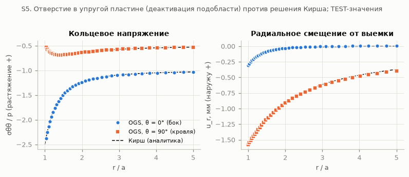
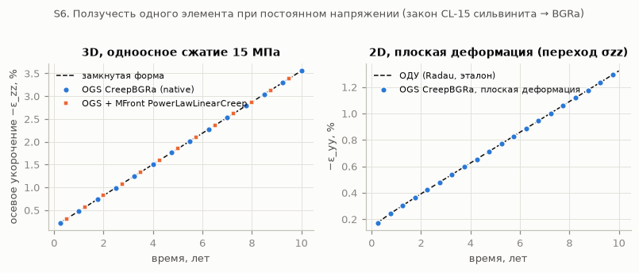

# Быстрые проверки OpenGeoSys: лестница верификации S1–S7 и проверка базовых гипотез на toy-сечении (S8)

> **ЧЕРНОВИК (28.09.2026).** Работа приостановлена пользователем: лестница S1–S6 готова, S7 — только базовый случай,
> S8 — 11 из 76 расчётов. Места ⟨…⟩ не заполнены. Состояние и порядок продолжения — [STATUS_RU.md](STATUS_RU.md).

| Поле | Значение |
|---|---|
| Дата, исполнитель | 28.09.2026, агент OGS (ветка `claude/agent-ogs-quick-checks-2026-09-28`) |
| Задача | быстрые проверки OGS по прямому запросу пользователя (Ansys/MATLAB на паузе) |
| Решатель | OpenGeoSys 6.5.9, сборка из исходников `<OGS_BUILD>` с MFront (TFEL 4.2.6-dev) |
| Входы | [inputs/](inputs/) — скрипты и `.prj` каждого шага; сетки пересоздаются скриптами |
| Квитанции | [receipts/](receipts/) — S1…S8 (sha256 входов, команда, версии, код выхода, проверки) |
| Рисунки | [figures/](figures/) |

> **Статус.** Это верификация решателя и одна derived 2D-постановка для проверочной задачи (D-18). Toy-сечение —
> **не СКРУ-1, не прогноз, не калибровка и не валидация**. Все числа S7–S8 — **результат модели**, а не наблюдение.
> Параметры toy взяты из каталогов с идентификаторами и статусами; чего нет в корпусе — помечено как сценарий или
> UNKNOWN (раздел 4.2). Полевых данных в расчётах нет, подбора под наблюдения нет.

## 0. Коротко

⟨SUMMARY⟩

## 1. Окружение

- **OGS.** Готовая сборка пользователя: `ogs version: 6.5.9`, исходники — коммит `77b4c4fd12f2fa0c5c67a81c06ce4620653a48a5`,
  параметры CMake `-DOGS_USE_MFRONT=ON -DOGS_CPU_ARCHITECTURE=native -DOGS_BUILD_GUI=OFF -DOGS_USE_PIP=OFF`
  (Release, Eigen, без PETSc и MKL). В квитанциях путь к сборке записан логическим именем `<OGS_BUILD>`, к исходникам —
  `<OGS_SRC>`, к каталогу расчётов — `<RUN_ROOT>`.
- **MFront/TFEL:** `tfel-config 4.2.6-dev (git hash: 1c931d0e1)`; поведения MFront вкомпилированы в сборку
  (`libOgsMFrontBehaviour`). Колесо `ogs` из PyPI **не устанавливалось и не использовалось** (указание пользователя):
  в `~/vkm/venv-ogs` стоят только вспомогательные пакеты — numpy 2.5.3, scipy 1.18.1, matplotlib 3.11.2,
  meshio 5.3.5 (Python 3.13.15). WSL2, Arch Linux, 28 потоков; каждый расчёт OGS — один поток.
- **Синтаксис `.prj`.** В Context7 для OpenGeoSys нашёлся только `ogs6py` (старый Python-API), поэтому теги
  проверены по документации и эталонным задачам того же дерева 6.5.9 (`Documentation/ProjectFile`,
  `Tests/Data/Mechanics`): `SMALL_DEFORMATION`, `initial_stress`, `deactivated_subdomains`, `CreepBGRa`,
  MFront `PowerLawLinearCreep`, `IterationNumberBasedTimeStepping` с `fixed_output_times`.
- **Реология.** Основная — встроенная `CreepBGRa` (ε̇ = A·exp(−Q/RT)·(σэкв/σ0)ⁿ, течение по Мизесу). Перекрёстная
  проверка — MFront `PowerLawLinearCreep` (тот же степенной закон; линейная часть выключена, A2 = 0). `Lubby2` не
  использовалась: её параметров (модули и вязкости Кельвина/Максвелла) в каталоге нет. Компилировать TFEL не
  понадобилось.
- **Время.** Лестница S1–S6 заняла ≈ 35 мин от установки до последней проверки; toy S7 и 76 расчётов S8 — ⟨TIME⟩.

## 2. Лестница верификации S1–S6

Каждый шаг: вход (`.prj` в [inputs/prj/](inputs/prj/)), команда, лог, код выхода, проверка против эталона и квитанция.
TEST-значения (S2, S5) — условные числа для проверки кода, а не свойства пород.

| Шаг | Что проверяется | Эталон | Результат (ошибка) | Итог |
|---|---|---|---|---|
| S1 | эталонная задача OGS `disc_with_hole` (SMALL_DEFORMATION, LinearElasticIsotropic, plate with a hole under traction) | эталонный .vtu из поставки OGS, `ogs -r` + vtkdiff | displacement: abs ≤ 5.55e-17, rel ≤ 1.25e-14 (допуск 1e-16/1e-16) | PASS |
| S1 | эталонная задача OGS `square_with_deactivated_hole` (SMALL_DEFORMATION, deactivated subdomain (material id 1)) | эталонный .vtu из поставки OGS, `ogs -r` + vtkdiff | displacement: abs ≤ 2.78e-17, rel ≤ 6.62e-15 (допуск 1e-14/1e-14); sigma: abs ≤ 1.82e-16, rel ≤ 1.53e-8 (допуск 1e-14/1e-14) | PASS |
| S1 | эталонная задача OGS `arehs_salt_creep_gravity` (SMALL_DEFORMATION, CreepBGRa rock salt + elastic layers under gravity, 1000 years) | эталонный .vtu из поставки OGS, `ogs -r` + vtkdiff | displacement: abs ≤ 2.06e-13, rel ≤ 1.03e-10 (допуск 1e-10/1e-10); sigma: abs ≤ 9.40e-6, rel ≤ 3.57e-7 (допуск 1e-09/5.7e-07) | PASS |
| S2 | один элемент QUAD8, плоская деформация, упругость | закон Гука (σzz = νσyy, εyy = (1−ν²)σ/E) | макс. отн. ошибка 2.24e-15 | PASS |
| S3 | слоистый столб 500 м под собственным весом (слои toy) | σv(z) = ∫ρg dz; σx = ν/(1−ν)·σv; осадка ∫σv/M dz | σyy: 2.02e-12·σv(низ); σxx: 8.65e-13·σv(низ); осадка -0.6563 м против -0.6563 м | PASS |
| S4 | начальное напряжение σh = λσv как начальное условие; λ = 0,45 / 0,6 / 0,71 / 1,0 (столб) и 0,45 (всё toy-сечение без камер) | равновесие: смещения 0, σ = σ0 | max|u| ≤ 5.47e-15 от осадки S3; σ − σ0 ≤ 1,3e-14·σv | PASS |
| S5 | круглое отверстие a = 1 м в пластине 20a, σx = −5, σy = −10 МПа; вариант «deactivated_subdomain» | решение Кирша | σθθ на контуре: 0.46 % (θ = 0°), 0.02 % (90°); u_r на контуре: 1.8 %; профиль σθθ до 5a: ≤ 1.2 % от p | PASS |
| S5 | круглое отверстие a = 1 м в пластине 20a, σx = −5, σy = −10 МПа; вариант «void_material_zero_initial_stress» | решение Кирша | σθθ на контуре: 0.46 % (θ = 0°), 0.02 % (90°); u_r на контуре: 1.8 %; профиль σθθ до 5a: ≤ 1.2 % от p | PASS |
| S6 | ползучесть одного элемента, 15 МПа, 10 лет: 3D_native_CreepBGRa_Q0 | ε = σ/E + A·exp(−Q/RT)(σ/σ0)ⁿ·t | макс. отн. ошибка ε_zz 1.04e-15 | PASS |
| S6 | ползучесть одного элемента, 15 МПа, 10 лет: 3D_native_CreepBGRa_Q54kJ_T300K | ε = σ/E + A·exp(−Q/RT)(σ/σ0)ⁿ·t | макс. отн. ошибка ε_zz 1.04e-15 | PASS |
| S6 | ползучесть одного элемента, 15 МПа, 10 лет: 3D_MFront_PowerLawLinearCreep_Q0 | ε = σ/E + A·exp(−Q/RT)(σ/σ0)ⁿ·t | макс. отн. ошибка ε_zz 4.00e-15 | PASS |
| S6 | то же, плоская деформация (переход σzz → σyy/2) | ОДУ одной точки (Radau) и установившаяся скорость (√3/2)ⁿ⁺¹A(σ/σ0)ⁿ | ε_yy(t): ≤ 0.16 %; скорость: 1.98e-6 | PASS |

Замечания:

- **S1** — «поставляемые» эталонные задачи OGS: папки скопированы из `<OGS_SRC>/Tests/Data`, OGS запускался
  с ключом `-r`, то есть выполнял сравнения `<test_definition>` (vtkdiff) с допусками разработчиков. Третья задача —
  ползучесть соли `CreepBGRa` под собственным весом (1000 лет) — проверяет ровно ту ветку кода, что нужна toy-сечению.
- **S4** проверяет и выражение начального поля самого toy (всё сечение без камер, λ = 0,45): смещения на уровне
  округления (≤ 4·10⁻¹⁵ м), то есть σv(z) = ∫γ dz и σh = λσv заданы согласованно с весом слоёв и граничными условиями.
- **S5.** Выемка задавалась двумя способами: (а) деактивацией подобласти (материал отверстия выключается на втором
  шаге; на первом шаге всё активно и смещения ≈ 2·10⁻¹⁷ м); (б) «пустотой» — отверстие остаётся в сетке с
  E = 10⁻⁵E и нулевым начальным напряжением. Оба способа совпали с решением Кирша и между собой (разница ≤ 0,01 %).
  Способ (б) использован в toy-сечении, потому что он позволяет позже «включить» закладку в тех же элементах.
  Узловые напряжения в OGS — среднее по соседним элементам, поэтому значение на самом контуре смешивает пластину и
  отверстие; контурное σθθ взято квадратичной экстраполяцией по трём узлам пластины (сырые средние — в квитанции).
  Смещение на контуре отличается от Кирша на 1,8 % из-за конечного размера пластины (20a, силовые условия на краю).
- **S6.** Для одноосного сжатия в 3D замкнутая форма точна при любом шаге по времени — совпадение на уровне 10⁻¹⁵.
  Случай с Q = 54 кДж/моль при T = 300 K проверяет член Аррениуса: в OGS газовая постоянная 8,3144621 (CODATA 2010),
  в MFront `PowerLawLinearCreep` — 8,314472; в toy Q = 0, так что это различие на результаты не влияет. В плоской
  деформации одно и то же осевое напряжение даёт переходный процесс: σzz растёт от νσ до σ/2, установившаяся скорость
  равна (√3/2)ⁿ⁺¹·A(σ/σ0)ⁿ, то есть в 2,9 раза ниже одноосной при n = 6,5 (3,68·10⁻¹¹ против 1,08·10⁻¹⁰ с⁻¹). Это важно для перевода лабораторных
  законов на плоское сечение.





## 3. Toy-сечение (S7)

### 3.1 Постановка

Плоская деформация, половина симметричной задачи: x = 0 — ось панели, x = 1500 м — правая граница, y = 0 —
поверхность, y = −500 м — низ модели. Разрез сверху вниз (по графическому чтению разреза скв. 128, блок 201):

| Слой toy | Интервал глубин, м | Материал (id) | Модель |
|---|---|---|---|
| Надсолевая несоляная толща Q + ТКТ + СМТ | 0–185,9 | 0 | упругость |
| Соль переходной пачки + ПКС | 185,9–205,4 | 1 | CreepBGRa, каменная соль |
| Карналлитовая пачка (КП) | 205,4–287,4 | 2 | CreepBGRa, каменная соль (замена) |
| Сильвинитовая пачка, пласт КрII 294,0–299,5 м (камеры и целики) | 287,4–304,4 | 3 (камеры — 4) | CreepBGRa, сильвинит |
| Подстилающая каменная соль (ПдКС) | 304,4–500 | 5 | CreepBGRa, каменная соль |

- **Выемка.** Панель из 13 камер по 16 м с ленточными целиками по 11 м (шаг 27 м, ширина панели 340 м, край панели
  в x = 170 м); за краем — сплошной пласт. Камеры длинные в третьем направлении, поэтому сечение поперёк камер —
  естественное 2D-представление (это производное представление, а не мир).
- **Ход во времени.** t = 0 — начальное поле σ0 в равновесии с весом (проверено в S4); первый шаг (1 с) — мгновенная
  выемка всей панели: камеры становятся пустотой (E = 0,1 МПа, ν = 0, ρ = 0, σ0 = 0 — способ S5b). Дальше ползучесть
  до 50 лет. Закладка — через 10 лет: у элементов камер модуль мгновенно становится модулем закладки; закон
  приращений (σ = σ_prev + C·Δε) даёт закладке нулевое начальное напряжение в момент укладки.
- **Граничные условия.** Катки на x = 0, x = 1500 м и y = −500 м, поверхность свободна, ускорение свободного падения 9,81 м/с².
- **Сетка.** QUAD8 (квадратичные перемещения), 5995 элементов, 18 314 узлов; камера — 4 элемента по ширине и 3 по
  высоте, целик — 4 × 3; размер растёт до 20–50 м к границам. Интегрирование 3 × 3. Шаги по времени
  адаптивные (IterationNumberBasedTimeStepping: 1 с → не более 0,5 года), выдача в моменты 1 с; 1, 2, 5, 10, 11, 15, 20,
  30, 40, 50 лет.
- **Оседание от выемки.** Для каждого расчёта с камерами есть «фоновый» расчёт того же начального поля и той же
  ползучести без камер. Оседание от выемки s(x, t) = −(u_y(выемка) − u_y(фон)) на поверхности. При λ ≠ 1 соль ползёт и
  без выработок (девиатор начального поля релаксирует), фон это вычитает и отдельно показывает, насколько
  нестационарна сама гипотеза.

### 3.2 Параметры и их статусы

| Величина | Значение | Основание | Источник | Статус |
|---|---|---|---|---|
| Отметка поверхности / глубины слоёв | 0 / 185,9 / 194,4 / 205,4 / 287,4 / 304,4 м | графическое чтение разреза скв. 128 (блок 201) ±3–5 м | VKM-SRC-011 рис. 4.7а; EV-VN-S011-2093 | FACT (GRAPH_DIGITIZED_APPROX) → MODEL_CHOICE для toy (одна скважина ≠ СКРУ-1) |
| Кровля пласта КрII (toy) | 294,0 м | пласт помещён внутрь сильвинитовой пачки 287,4–304,4 м | — | MODEL_CHOICE |
| Высота камеры (мощность КрII) | 5,5 м | мощность КрII 5,5 м (текст); проект: вынимаемая 4,7–8,7 м | VKM-SRC-025/-037 (CF-STR-010: 3,1–6,1); VKM-SRC-037 рис. 3.27а | FACT (регион.) → MODEL_CHOICE |
| Камера / целик / шаг | 16 / 11 / 27 м | проектная сетка КрII вне охраняемых объектов | VKM-SRC-037 рис. 3.27а (VR-04); строки ГИС VKM-SRC-023 (UNRESOLVED) | DESIGN (проект ≠ факт) |
| Панель | 13 камер, 340 м; одна панель, один пласт, мгновенная выемка | ширина панелей 300–400 м | VKM-SRC-014, VKM-SRC-037 (MC-GE-03) | MODEL_CHOICE |
| Размер модели | 1500 × 500 м (полуширина), плоская деформация | ≈5H в стороны, 200 м соли под пластом | — | MODEL_CHOICE |
| γ мергель / к. соль / сильвинит | 0,022 / 0,022 / 0,021 МН/м³ (ρ = γ/9,81) | нормативные удельные веса | VKM-SRC-012 с. 26 табл. 1.1; MR-MECH-0018/0020/0021 | NORMATIVE (FACT как напечатано) → ANALOGUE для СКРУ-1 (GAP-001) |
| E надсолевой толщи (Q+ТКТ+СМТ) | 600 МПа | нормативный модуль мергеля | MR-MECH-0064 (VKM-SRC-012 табл. 1.1) | NORMATIVE → scenario (норматив ≠ измерение) |
| E каменной соли / сильвинита | 9,5 / 10,8 ГПа | медианы LAB-строк VKM_REGIONAL (34 / 24 строки); перенос LAB→MASSIF с коэффициентом 1 | evidence/materials/mechanics_evidence_catalog.csv (youngs_modulus, LAB) | DERIVATION (медиана LAB) + ENGINEERING_ASSUMPTION (Transfer ×1; конфликт MR-CONF-002) |
| ν мергель / к. соль / сильвинит | 0,3 / 0,3 / 0,2 | нормативные | MR-MECH-0542/0539/0541 | NORMATIVE → ANALOGUE |
| Карналлитовая пачка (КП, 82 м) | свойства каменной соли | сосредоточенная замена | — | MODEL_CHOICE (быстрая ползучесть карналлита PC-15 не представлена) |
| Закон ползучести | Нортон ε̇ = k·σ^n: к. соль k = 1,32·10⁻¹³, сильвинит 2,12·10⁻¹³ МПа⁻ⁿ·сут⁻¹, n = 6,5 | откалиброванная модель Гремячинского м-ния (1100–1300 м) → OGS CreepBGRa (σ0 = 1 МПа, Q = 0, A = k/86400) | MR-RHEO-CL-15 | DERIVATION, NON_VKM_ANALOG → ANALOGUE с оговоркой Transfer (глубина, T, масштаб) |
| Множитель скорости ползучести | ×0,1 / ×1 / ×10 | разброс законов каталога при 8–15 МПа: CL-10 = CL-15 ×1,5…×25 | MR-RHEO-CL-10, CL-15 | SCENARIO (маркированный диапазон) |
| Температура | не представлена (Q = 0) | в законах ВКМ температурного члена нет; T опытов UNKNOWN | MECH_RHEO §5.2 | UNKNOWN (не заменено числом) |
| Начальное поле (σh/σv) | IS-SC-A: 1/1; IS-SC-B: 0,6 и 0,8; IS-SC-C: соль 1, надсолевая 0,43; IS-SC-D: 1,3 в плоскости / 0,8 из плоскости; IS-SC-E: 2,8 / 1,9; справочно NORMATIVE 0,45 и точка 0,71 | пять маркированных сценариев досье (сценарии не усредняются); ориентация сечения к σ1 — MODEL_CHOICE | docs/science/topic_dossiers/INITIAL_STRESS_RU.md §9, табл. IS-SC; IS-P-14, IS-P-21, IS-P-26, IS-P-29; PC-03 | MODEL_CHOICE (сценарии); λ(СКРУ-1) — UNKNOWN; 0,45 — NORMATIVE вне ансамбля |
| Закладка: время | 10 лет после выемки | «традиционно 10–20 лет» | VKM-SRC-037 (MC-BF-02, CC-18) | SCENARIO |
| Закладка: модуль | мягкая 50 МПа / жёсткая 500 МПа, ν = 0,2; полный контакт (kзап = 1) | модуль закладки в корпусе отсутствует; прочность гидрозакладки 3,5–4,0 МПа в 10 лет (LAB) | BF-0047 (прочность), BF-0064/0163 (зазор 0,8–1,0 м — не моделируется) | ENGINEERING_ASSUMPTION (scenario); модуль — UNKNOWN |
| Пустота камеры | E = 0,1 МПа, ν = 0, ρ = 0, σ0 = 0 | численная замена пустоты (10⁻⁵ от E соли) | проверено в S5b против Кирша | MODEL_CHOICE (численный приём) |

### 3.3 Базовый случай и численные проверки

⟨S7_RESULTS⟩

## 4. Матрица гипотез (S8)

### 4.1 План

Малый факторный план на том же toy-сечении, что и S7. Три фактора:

| Фактор | Уровни | Статус |
|---|---|---|
| Начальное поле, σh/σv (в плоскости / из плоскости) | IS-SC-A 1/1; IS-SC-B 0,6 и 0,8 (концы диапазона); IS-SC-D 1,3/0,8; IS-SC-E 2,8/1,9 (верхние концы) | MODEL_CHOICE-сценарии досье `docs/science/topic_dossiers/INITIAL_STRESS_RU.md` §9 (ветка координатора, коммит 792cd69); значение для СКРУ-1 — UNKNOWN; сценарии не усредняются |
| Скорость ползучести | CL-15 × 0,1 / × 1 / × 10 | SCENARIO вокруг ANALOGUE-закона |
| Закладка через 10 лет | нет / мягкая 50 МПа / жёсткая 500 МПа | SCENARIO (модуль закладки — UNKNOWN) |

Дополнительно, вне ансамбля: NORMATIVE λ = 0,45 (константа послойного расчёта кровли, IS-P-29 — не измерение) — все 9
сочетаний, как справочный ряд; подсценарий IS-SC-A с λ = 0,7 в надсолевой толще и IS-SC-C (соль 1, надсолевая
толща ν/(1 − ν) = 0,43 при ν = 0,3 toy) — по одному расчёту (×1, без закладки): они проверяют, влияет ли начальное
поле несоляной толщи. Для D и E ориентация сечения вдоль σ1 (σmax) — MODEL_CHOICE; в надсолевой толще E задано
«как в соли» — маркированное допущение (в досье это UNKNOWN). Первая партия расчётов шла по списку каталога
(λ = 0,45 / 0,6 / 0,71 / 1); после выхода досье точка 0,71 (IS-P-21, внутри IS-SC-B) снята.

Итого 76 расчётов: 6 полных строк × (9 с выемкой + 3 фоновых) и 2 × (1 + 1). Отклики: максимальное оседание
от выемки s_max в моменты 0+ (1 с), 10 и 50 лет; полуширина x50 (расстояние от оси до s = 0,5·s_max); точка
перегиба (максимум наклона); наклон; относительное укорочение центрального целика; конвергенция камеры 0; фон.

⟨S8_RESULTS⟩

## 5. Что это значит

⟨MEANING⟩

## 6. Ограничения

1. **Не СКРУ-1.** Одна скважина (скв. 128) вместо разреза поля; проектная сетка камер вместо фактической; одна панель,
   один пласт (КрII), мгновенная выемка всей панели; АБ, Вк и соседние панели не отрабатывались. История выемки и
   закладки СКРУ-1 (MINING §3.5) не использовалась.
2. **2D плоская деформация** — производное представление; трёхмерность панели (конечная длина камер, соседние панели,
   междушахтный целик) не учтена. Плоская деформация соответствует бесконечно длинной панели, поэтому оседание в
   центре больше, чем над панелью конечной длины той же ширины.
3. **Реология.** Один закон (CL-15, Гремячинское, откалиброванная эффективная модель — ANALOGUE) с общим множителем
   ×0,1/×1/×10; показатель n = 6,5 не варьировался; первичная (затухающая) ползучесть, третичная стадия, разрушение и
   дилатансия (PC-17, PC-21, PC-23) не представлены. Карналлитовая пачка заменена каменной солью (PC-15 не
   представлен). Несоляная надсолевая толща упругая (PC-16 — UNKNOWN). Температура не представлена (Q = 0).
4. **Масштаб.** Модули солей — медианы лабораторных значений с переносом LAB→MASSIF ×1 (конфликт MR-CONF-002:
   Kстр = 15 у Лебедевой уменьшил бы модули в 15 раз и увеличил бы упругую часть оседания примерно во столько же).
5. **Закладка** — упругий материал с модулем-сценарием и полным контактом с кровлей в момент укладки; зазор
   0,8–1,0 м (BF-0064, BF-0163), уплотнение и рост жёсткости (PC-37…PC-39) не моделировались: без контакта зазор не
   представить. Вес закладки не учтён (≈ 0,07 МПа на почву).
6. **Начальное поле.** Сценарии IS-SC — только изотропные по слоям отношения σh/σv; тектоническая «подпитка»
   горизонтального сжатия не задавалась, поэтому в соли сценарии D и E релаксируют (раздел 4.4). Ориентация сечения к
   σ1 — MODEL_CHOICE. Рельеф (PC-05) не учтён.
7. **Численные.** Пустота камеры — материал с E = 10⁻⁵E соли, а не удалённые элементы (эквивалентность проверена в S5);
   малые деформации и отсутствие контакта ограничивают применимость при больших конвергенциях (флаги в матрице S8).
8. **Никакой калибровки и полевой проверки** не было; оседания toy ни с какими наблюдениями не сравнивались.

## 7. Воспроизведение

```bash
# рабочая станция: OGS 6.5.9 из исходников, venv с numpy/scipy/matplotlib/meshio; расчёты — в <RUN_ROOT>
cd docs/science/ogs_checks/inputs
OQC_OGS_BUILD=<OGS_BUILD> OQC_OGS_SRC=<OGS_SRC> OQC_RUN_ROOT=<RUN_ROOT> python run_ladder.py S1 S2 S3 S4 S5 S6
python run_toy.py S7            # базовый случай и численные проверки
python run_toy.py runall        # все незавершённые расчёты S7/S8, строго по одному (MemoryMax=12G, OMP <= 8)
python run_toy.py S8all         # обработка всех 76 расчётов -> receipts/S8.json, S8_hypothesis_matrix.csv
python make_figures.py          # рисунки из квитанций
python report_tables.py         # таблицы отчёта из квитанций
```

Сетки (`.vtu`) и геометрия (`.gml`) не хранятся в репозитории: скрипты пересоздают их детерминированно, sha256 —
в квитанциях. Файлы `inputs/prj/S8/*.prj` — входы всех 76 расчётов S8.
